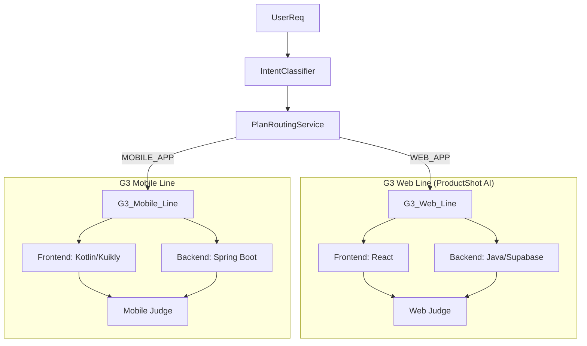

# Ingenio Architecture: The G3 Engine

> **版本**: 2.2 (Full Stack Convergence)
> **状态**: **Active Development**
> **核心变更**: 明确 G3 引擎统管 "Web (OpenLovable)" 和 "Mobile (KuiklyUI)" 双生产线。

---

## 1. 宏观架构：三大平面

Ingenio 采用 **"控制-产品-执行"** 分离的架构设计。

| 平面 | 技术栈 | 职责 |
| :--- | :--- | :--- |
| **控制面** | **JeecgBoot** | 资产管理、租户权限、计费 (Stripe)、意图路由 (Intent Routing)。 |
| **产品面** | **Next.js 15** | Smart Builder 交互界面、工厂监控屏。 |
| **执行面** | **G3 Engine** | **软件工厂核心**。负责调度 OpenLovable (Web) 和 KuiklyUI (Mobile) 生产线。 |

---

## 2. 核心机制：G3 全栈执行器

G3 引擎不再局限于生成前端代码，它是 `PlanRoutingService` 的下游执行机构，根据 **技术栈 (Tech Stack)** 选择生产线。

### 2.1 生产线 A: 敏捷 Web 应用 (Web First)
*   **适用场景**: SaaS Dashboard, 营销落地页, 简单 H5 工具。
*   **技术栈**: **React (Next.js) + Supabase** (或 Spring Boot)。
*   **🔵 Player Agent**:
    *   **前端**: **OpenLovable-CN** (Stream React Code)。
    *   **后端**: **Supabase Schema Builder** (生成 Postgres DDL & RLS)。
*   **⚖️ 裁判 (Executor)**:
    *   验证 React 语法、检查 Supabase 客户端配置。

### 2.2 生产线 B: 跨端原生应用 (Mobile First)
*   **适用场景**: 社交 App, 电商 App, 需调用原生能力 (相机/GPS) 的应用。
*   **技术栈**: **KuiklyUI (Kotlin Multiplatform) + Spring Boot**。
*   **🔵 Player Agent**:
    *   **前端**: **KuiklyUIGenerator** (生成 Kotlin DSL)。
    *   **后端**: **Java Agent** (生成 Spring Boot Controller/Service)。
*   **⚖️ 裁判 (Executor)**:
    *   验证 Kotlin 编译通过性、检查 KuiklyUI 组件规范。

---

## 3. Pilot 项目: ProductShot AI (Web Line)

作为 G3 引擎的首个验证项目，ProductShot AI 将运行在 **生产线 A (Web First)** 上。

*   **前端**: OpenLovable 生成 Next.js 组件 (`ProductUploader.tsx`)。
*   **后端**: 
    *   *Pilot阶段*: 使用 **Spring Boot** 集成 Replicate SDK (为了演示 Java/Python 协同)。
    *   *数据层*: 使用 **Supabase** 存储用户生成记录。
*   **裁判**: 
    *   G3 Executor 将同时检查前端 TSX 代码和后端 Java 代码的 API 契约一致性。

---

## 4. 关键数据流 (Unified Data Flow)

