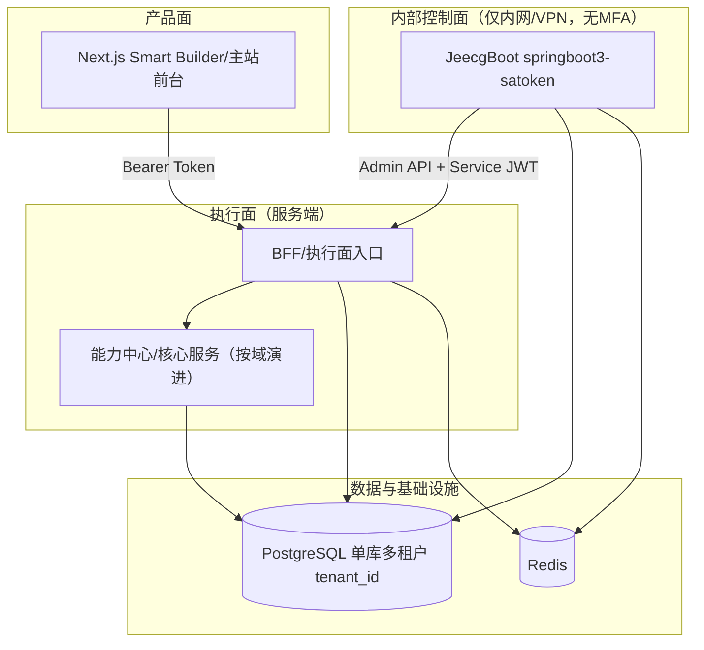

# Ingenio × JeecgBoot × Smart Builder 融合技术架构与分阶段路线图（Draft）

> 本文档基于两份已存在的方案文档进行“融合与优化”：
> - `04-JEECGBOOT_INTEGRATION_MODIFICATION_PLAN.md`：JeecgBoot 融入 Ingenio（控制面/数据面）与 Sa-Token、多租户、安全基线。
> - `03-PRODUCT_UPGRADE_PLAN_SMART_BUILDER.md`：Smart App Builder（行业模板 + AI 能力积木 + 预设 Prompt）的产品与技术分期。
>
> **目标**：在不破坏现有 C 端登录与 Bearer Token 校验的前提下，把 JeecgBoot 作为“运营主系统/配置中心（控制面）”，把 Smart Builder 的“资产化能力（模板/能力/Prompt）”纳入统一治理，并为后续 AI/支付等能力中心沉淀提供可演进的底座（单库多租户、全链路加密/脱敏、强审计）。

---

## 0. 已确认决策（2025-12-24）

- **资产归属**：模板/能力/Prompt 的写入与发布全部由 Jeecg 控制面完成；执行面只读消费 `PUBLISHED`。
- **资产作用域**：平台全局共享（不做按 tenant 私有/覆盖）。
- **多租户主键**：`tenant_id` 统一使用 UUID。
- **服务间鉴权**：Jeecg → 执行面 Admin API 使用 `Service JWT`。
- **C 端 JWT**：现有算法为 `RS256`。
- **密钥过渡**：无 KMS 的阶段，KEK 采用“文件托管”（挂载到容器/宿主机文件系统，禁止入库）。
- **访问边界**：Jeecg 仅内网/VPN，不上 MFA。
- **近期优先级**：Smart Builder 前端改版 + 资产闭环（优先于“完整运营主系统”扩建）。

## 1. 总体定位：控制面 / 产品面 / 执行面

### 1.1 三层分工（推荐）

- **控制面（Control Plane）**：JeecgBoot（springboot3-satoken）
  - 面向内部运营：租户/商户/渠道主数据、配置编排、审批发布、审计查询、密钥托管与轮换流程。
  - 产出“可发布的资产/配置”，不承载“核心交易执行”。
- **产品面（Product Plane）**：Ingenio 前端（Next.js）
  - Smart Builder 的对外体验：行业模板长廊、AI 能力元素表、Quick Starters、项目构建与预览。
- **执行面（Data/Runtime Plane）**：Ingenio 服务端（对外 API 与核心执行）
  - 执行面入口优先采用 **BFF**（你已倾向 `backend/` Nest）；核心执行逻辑（AI/支付/账号等）可按域拆分/渐进沉淀。
  - 统一落实：多租户隔离、敏感字段加密/脱敏、操作留痕、traceId 贯通。

> **关键约束**：一期不引网关、不引 MQ；后续再考虑 Higress/Shengyu 与 MQ（Kafka/Rabbit 等）。

---

## 2. 目标逻辑架构（一期形态）

### 2.1 “Jeecg 管写、BFF 管读/执行”的默认协作方式

- JeecgBoot 负责：**资产/配置治理与发布**（写操作为主）。
- BFF/执行面负责：**对外 API、业务执行、租户隔离与安全落地**（读 + 执行为主）。
- 对“会影响在线链路”的控制面操作（冻结用户、轮换密钥、生效支付路由等），建议走 **Admin API**，由执行面二次校验并产生统一审计。

---

## 3. Smart Builder（AI Trinity）与控制面资产治理的对齐

> `03-PRODUCT_UPGRADE_PLAN_SMART_BUILDER.md` 的三位一体：Body/Brain/Soul，建议落成“可治理、可版本化、可发布”的资产体系。

### 3.1 资产定义（最小集合）

- **行业骨架（Body）= Template**
  - 内容：标准业务流、数据模型、UI 结构、权限模型、生成器参数。
- **AI 能力积木（Brain）= Capability**
  - 内容：能力类型（Vision/Language/Voice/Logic）、提供商适配、调用契约（输入/输出 schema）、限额与计费维度。
- **预设 Prompt（Soul）= PromptPack**
  - 内容：Prompt 模板、变量定义、示例/评测用例、版本与灰度策略。

> **重要约束（已确认）**：上述资产为“平台全局共享”，不做租户私有化；因此建议资产表“逻辑上不依赖 tenant”，或者统一使用固定 `GLOBAL_TENANT_ID`（仅为满足既有表规范/索引策略时使用）。

### 3.2 发布态模型（避免“改了就影响线上”）

建议所有资产/配置都具备最小状态机：

- `DRAFT`（草稿）→ `REVIEWING`（审批中）→ `PUBLISHED`（已发布）→ `DEPRECATED`（弃用）

> JeecgBoot 擅长审批/流程，可直接承载该状态机；执行面只消费 `PUBLISHED`。

### 3.3 关于“Mock 数据”的优化建议

`03-PRODUCT_UPGRADE_PLAN_SMART_BUILDER.md` Phase 1 提到 Mock。结合工程规范建议调整为：

- UI 可以先行，但数据源尽量改为 **真实 API + 数据库 seed**（而不是前端静态 Mock），避免 Mock 长期遗留到联调/E2E/生产构建。

---

## 4. 身份与鉴权：保持现状 + 为 RS256 收敛预留

### 4.1 一期：三类 Token 分治（互不混用）

- **C 端用户 Token（Bearer）**：保持 Ingenio 现有签发与校验逻辑不动（兼容现状）。
- **运营后台 Token（OPS）**：JeecgBoot 自己的 Sa-Token 体系（仅内网/VPN）。
- **服务间 Token（Jeecg → 执行面 Admin API）**：使用 `Service JWT`（建议同为 RS256），独立于 C 端 Token（不复用、不混用）。

### 4.2 RS256（已确认）与 JWKS（待固化）

- 现有 C 端 JWT 已确认为 `RS256`，后续重点从“迁移算法”变为“固化规范与分发”：
  - 统一 Claim（至少 `sub/tenantId/roles/permissions`，以及推荐的 `iss/aud/jti`）。
  - 提供公钥分发能力（`JWKS`），并定义密钥轮换与回滚策略。

---

## 5. 多租户：单库多租户（tenant_id）的一致性约束

- **强制约束**：所有“面向租户的业务表”必须包含 `tenant_id`，并以其作为联合索引前缀。
- **上下文传播**：
  - C 端：`tenantId` 来自 JWT Claim。
  - Admin：`X-Tenant-Id`（或路径参数）显式传入，服务端二次校验。
- **演进路线**：先应用层强制过滤 → 后续可引 Postgres RLS（行级安全）与更强隔离策略。

---

## 6. 安全基线：字段级加密 / 脱敏 / 审计 / traceId（一期必须）

- **敏感分级（建议）**
  - P0：AI Provider Key、支付证书/私钥、渠道密钥、回调签名密钥（必须加密 + 严格审计）。
  - P1：手机号/身份证件/地址等 PII（加密或最小化存储 + 脱敏输出）。
  - P2：一般业务数据（至少脱敏日志）。
- **字段级加密**：推荐应用层信封加密（AES-256-GCM + `key_version`），避免与语言栈强绑定。
- **KEK 托管（已确认）**：无 KMS 阶段，KEK 使用“文件托管”（运维挂载），并通过 `key_version` 支持轮换；所有轮换与访问必须进入审计。
- **统一脱敏**：日志、审计 diff、接口响应统一 mask 规则。
- **操作留痕**：所有控制面操作必须落审计（含 `trace_id/tenant_id/actor/action/resource/result`）。

---

## 7. 分阶段执行路线（与两份方案对齐后的“可落地版本”）

### Phase 0：统一底座（跨 Jeecg/BFF/核心服务）

- 交付物
  - 统一 `tenantId/traceId/actor` 上下文规范（Header/Claim/日志字段）。
  - Admin API 的服务间鉴权方案定稿（建议 Service JWT + jti 撤销/过期）。
  - 敏感字段分级清单（P0/P1/P2）与加密落库格式定稿。
- 验收
  - 抽样跨租户访问被拒绝/强制过滤；审计链路能串起一次控制面操作。

### Phase 1：Smart Builder 前端改版 + 资产闭环（近期优先）

- 交付物
  - 前端：Hero/Template Gallery/Capability Showcase/Quick Starters 落地。
  - 控制面（Jeecg）：模板/能力/Prompt 的最小“编辑-审批-发布”闭环（平台全局资产）。
  - 执行面：只读查询 API（仅消费 `PUBLISHED`），并具备 cache/版本控制/灰度开关（最小可用即可）。
  - Jeecg → 执行面 Admin API 打通（`Service JWT` + 强审计），支撑资产发布与回滚。
- 验收
  - 端到端 Demo（例如“智能招聘助手”）跑通：控制面发布资产 → 前端选择模板/能力 → 执行面消费资产 → 生成/预览闭环可追溯（traceId/audit 完整）。

### Phase 2：Jeecg 运营主系统（控制面扩建，但不追求一次到位）

- 交付物
  - Jeecg：租户/商户/渠道主数据与审批流程（为支付/AI 能力中心做准备）。
  - 审计与敏感字段治理完善（字段分级落库、查询脱敏、检索盲索引策略）。
- 验收
  - 任意关键控制面操作（租户切换/主数据变更/密钥轮换/发布回滚）均可审计追溯且不串租。

### Phase 3：AI 能力中心沉淀（提供商/密钥/策略/用量）

- 交付物
  - AI Provider 与 Key 托管（P0 加密 + 轮换流程 + 严格审计）。
  - 统一 AIService 抽象层（多 Provider、策略路由、失败降级）。
  - 用量统计与限额（按 tenant/merchant/channel 或 workspace/project 维度）。
- 验收
  - Key 轮换不影响线上调用；用量可追溯；敏感字段不落日志明文。

### Phase 4：支付中心（多商户/多渠道/多租户）

- 交付物
  - 商户/渠道/路由/费率/回调验签等模型定型（控制面配置、执行面落地）。
  - 幂等、对账、补单、风控预留（风控可后置，接口与数据结构预埋）。
- 验收
  - 支付链路可按租户/商户/渠道隔离配置并稳定执行，审计可追溯。

### Phase 5：身份收敛与企业集成（后置）

- 交付物
  - 统一 Claim 与权限映射；固化 JWKS 发布与轮换（如 Phase 0/1 未完全落地）。
  - 对接企业微信/LDAP（优先 OPS 域）。
  - 视规模引入网关（Higress/Shengyu）与 MQ（从 Outbox 平滑迁移）。

---

## 8. 关键决策记录（用于锁定 Phase 0/1）

- 资产写入/发布：Jeecg 全权负责；执行面只读消费 `PUBLISHED`。
- 资产作用域：平台全局共享。
- `tenant_id`：UUID。
- 服务间鉴权：Jeecg → 执行面 Admin API 使用 `Service JWT`。
- C 端 JWT：RS256。
- KEK：文件托管（无 KMS 阶段）。
- Jeecg 访问：仅内网/VPN，不上 MFA。
- 近期优先级：Smart Builder 前端改版 + 资产闭环。
