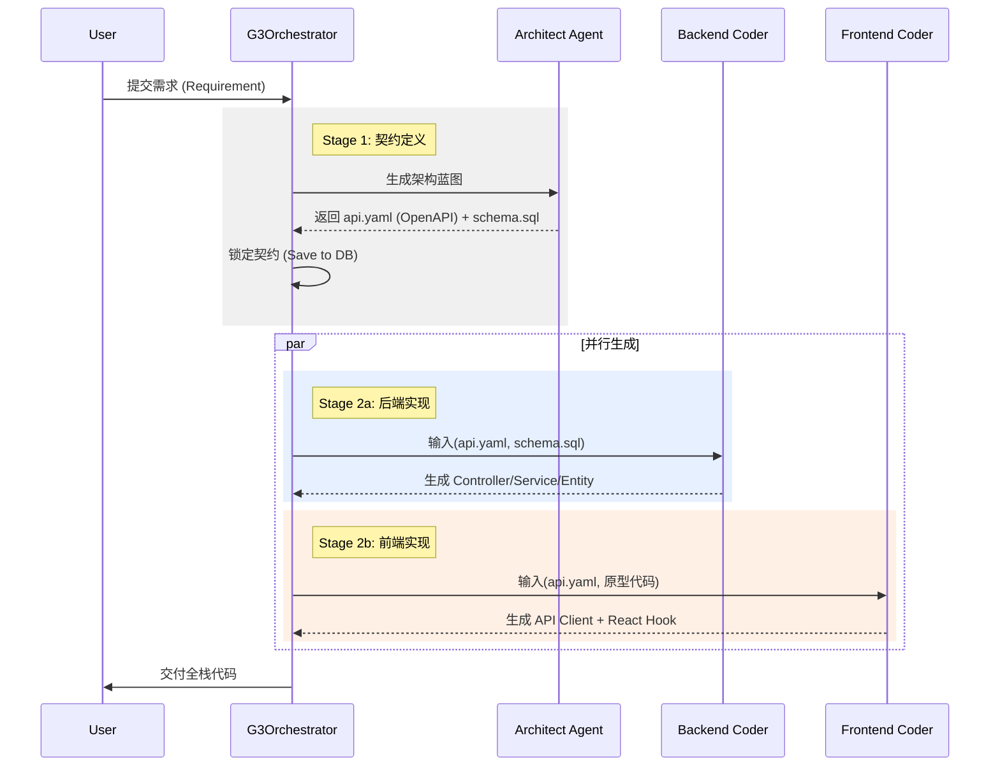
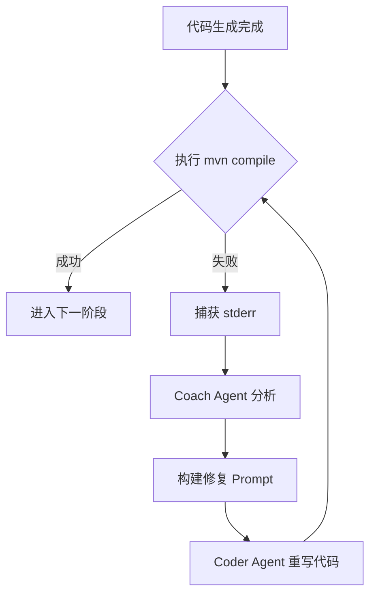

# Ingenio Phase 2 技术设计方案 (Technical Design)

**版本**: v1.0
**主题**: G3 引擎后端实装与沙箱集成 (Backend Realization & Sandbox Integration)
**依赖**: 完成 Phase 1 前端可视化改造
**目标**: 实现 **Java (Spring Boot) + React** 全栈代码的**契约驱动生成**与**沙箱自修复**。

---

## 1. 核心架构演进 (Architecture Evolution)

从 Phase 1 的 "Mock 跑通" 进化为 Phase 2 的 "真实构建"。

| 维度 | Phase 1 (Lab / Node.js) | Phase 2 (Production / Java) |
| :--- | :--- | :--- |
| **调度中心** | 前端 `g3-engine.ts` (轻量级) | 后端 `G3OrchestratorService.java` (状态机) |
| **代码检查** | 内存级 TS 语法检查 | **真实编译** (`mvn compile`, `npm build`) |
| **前后端协同** | 弱关联 (仅基于 Prompt) | **强契约** (基于 OpenAPI/Swagger YAML) |
| **运行环境** | 浏览器/Vercel | Docker 容器 / E2B 沙箱 |
| **持久化** | 临时生成，不保存 | 存入 PostgreSQL (`GenerationJob`, `Artifact`) |

---

## 2. 领域模型设计 (Domain Modeling)

在 Java 后端 (`backend/src/main/java/com/ingenio/backend/entity/`) 新增 G3 引擎专用实体。

### 2.1 任务实体 (`G3Job`)
记录一次完整的生成过程。

```java
public class G3Job {
    private String id;              // UUID
    private String appSpecId;       // 关联的需求规格
    private JobStatus status;       // QUEUED, PLANNING, CODING, TESTING, COMPLETED, FAILED
    private int currentRound;       // 当前博弈轮次 (Max 3)
    private String contractYaml;    // [核心] 架构师生成的 OpenAPI 契约
    private String dbSchemaSql;     // [核心] 架构师生成的 DB Schema
    private List<G3Log> logs;       // 执行日志
}
```

### 2.2 产物实体 (`G3Artifact`)
记录生成的文件，支持版本回溯。

```java
public class G3Artifact {
    private String id;
    private String jobId;
    private ArtifactType type;      // BACKEND_JAVA, FRONTEND_REACT, SQL_DDL
    private String filePath;        // e.g., "src/main/java/com/example/demo/service/UserService.java"
    private String content;         // 文件内容
    private String checksum;        // 内容哈希，用于检测变化
    private boolean hasErrors;      // 是否包含编译错误
    private String compilerOutput;  // 编译器的 stderr
}
```

---

## 3. 核心流程设计 (Core Workflows)

### 3.1 契约驱动工作流 (Contract-First Workflow)

这是 Phase 2 最重要的升级，解决 "生成的 React 代码调不通生成的 Java 接口" 的痛点。



### 3.2 沙箱自修复工作流 (Self-Healing Workflow)



---

## 4. 关键组件实现方案 (Component Implementation)

### 4.1 G3 调度器 (`G3OrchestratorService.java`)
*   **职责**: 管理状态机，协调 Agent 调用和沙箱执行。
*   **技术栈**: Spring State Machine (可选) 或 简单的 Java Switch-Case 状态机。
*   **逻辑**:
    ```java
    public void runJob(String jobId) {
        G3Job job = jobRepo.findById(jobId);
        
        // Step 1: Architect
        if (job.getContractYaml() == null) {
            String contract = architectAgent.designApi(job.getRequirement());
            job.setContractYaml(contract);
            save(job);
        }
        
        // Step 2: Backend Coding
        List<Artifact> javaFiles = backendCoder.generate(job.getContractYaml());
        
        // Step 3: Sandbox Verification
        TestResult result = sandboxService.runMavenBuild(javaFiles);
        
        if (!result.isSuccess()) {
            // Trigger Self-Healing
            List<Artifact> fixedFiles = coachAgent.fixBackend(javaFiles, result.getLogs());
            // Retry...
        }
    }
    ```

### 4.2 沙箱管理器 (`SandboxService.java`)
*   **职责**: 隔离执行构建命令。
*   **方案 A (推荐 - E2B)**:
    *   使用 E2B SDK (Java/Python) 创建临时云端环境。
    *   优点：无需维护 Docker 宿主机，环境预设 (Maven, Node, JDK)。
*   **方案 B (自建 - Docker)**:
    *   使用 `docker-java` 客户端控制本地/远程 Docker Daemon。
    *   挂载代码目录 -> `docker run -v ... maven:3.9-eclipse-temurin-17 mvn compile`。

### 4.3 智能体适配器 (`AgentAdapter`)
*   **职责**: 封装 LLM 调用，管理 Prompt Templates。
*   **Prompt 策略**:
    *   **Architect**: "你是一个软件架构师，请输出符合 OpenAPI 3.0 标准的 YAML..."
    *   **Backend Coder**: "你是一个 Java 专家，基于以下 schema.sql 和 api.yaml，实现 Spring Boot 代码。强制使用 MyBatis-Plus..."
    *   **Frontend Coder**: "你是一个 React 专家，基于 api.yaml 生成 TypeScript Axios Client..."

---

## 5. 实施步骤 (Execution Steps)

### Step 1: 后端基础设施 (Infrastructure)
1.  引入 `docker-java` 或 E2B SDK 依赖。
2.  创建 `G3Job` 和 `G3Artifact` 数据库表 (Liquibase/Flyway)。
3.  搭建 `G3OrchestratorService` 骨架。

### Step 2: 架构师智能体 (The Architect)
1.  编写 `ArchitectAgent`。
2.  调试 Prompt，确保能稳定生成合法的 OpenAPI YAML 和 PostgreSQL DDL。
3.  实现“契约锁定”逻辑。

### Step 3: 编码智能体 (The Coders)
1.  **Backend**: 实现基于 Freemarker 骨架 + LLM 填充逻辑的生成器。重点在于解析 `api.yaml` 自动生成 Controller 接口定义。
2.  **Frontend**: 实现基于 OpenLovable 代码 + `api.yaml` 的融合生成器。

### Step 4: 沙箱集成 (The Sandbox)
1.  实现 `runMavenBuild()` 方法。
2.  实现错误日志解析器 (Log Parser)，提取关键错误信息 (如 "Line 20: cannot find symbol")。
3.  跑通 "生成 -> 报错 -> 修复 -> 成功" 的单元测试。

---

## 6. 风险与对策 (Risks & Mitigation)

1.  **风险**: LLM 生成的 OpenAPI 契约不规范。
    *   **对策**: 引入 Java 版 Swagger Parser 库，在生成的 YAML 入库前进行校验，不通过则让 LLM 重试。
2.  **风险**: 沙箱构建过慢。
    *   **对策**: 制作预热镜像 (Pre-warmed Images)，预先下载好 Spring Boot/React 常用依赖 (Maven .m2, node_modules)。
3.  **风险**: 修复死循环 (Fix Loop)。
    *   **对策**: 设置最大重试次数 (Max Retries = 3)，若仍失败，降级交付（保留错误代码供人工修复）。
