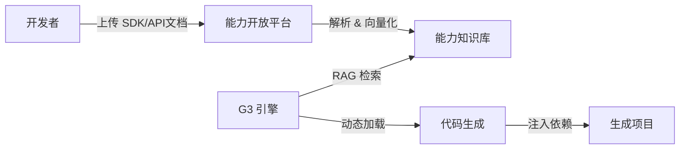

# Ingenio Phase 3 技术设计方案 (Technical Design)

**版本**: v1.0
**主题**: 生态融合与插件化架构 (Ecosystem Fusion & Plugin Architecture)
**依赖**: Phase 2 后端引擎稳定运行
**目标**: 实现 **JeecgBoot 深度集成**、**自定义能力插件化** 以及 **多模态输入支持**。

---

## 1. 核心愿景 (Vision)

如果说 Phase 2 造出了一个"能干活的程序员"，Phase 3 就是要组建一个"具备各种专业技能的团队"，并且能"听懂各种指令"。

*   **Deep Integration**: 生成的代码不再是裸奔的 Spring Boot，而是原生集成了 JeecgBoot 的用户、字典、日志、多租户体系。
*   **Plugin System**: 用户可以上传自己的 `Capability` (如：私有��付 SDK、特定硬件驱动)，G3 引擎能学会并在生成时调用。
*   **Multi-modal Input**: 支持上传图片 (UI 截图)、SQL 文件、甚至录音来生成代码。

---

## 2. 架构升级 (Architecture Upgrade)

### 2.1 插件化能力注册中心 (Capability Registry)

在 Phase 1/2 中，能力 (`Capability`) 是硬编码在 `backend/g3_context` 里的。Phase 3 将其动态化。



#### 数据库设计 (`Capability` 表升级)
```java
public class CapabilityEntity {
    private String id;
    private String name;            // e.g. "WeChat Pay"
    private String type;            // JAR, REST_API, PYTHON_SCRIPT
    private String description;     // 供 LLM 检索的语义描述
    private String interfaceSpec;   // 接口定义 (Java Interface / OpenAPI)
    private String mavenCoordinate; // e.g. "com.github.wxpay:wxpay-sdk:3.0.9"
    private String usageExample;    // Few-shot Prompt 示例
}
```

### 2.2 深度 JeecgBoot 适配器 (Jeecg Adapter)

不再生成通���的 Spring Boot 代码，而是生成 **JeecgBoot Module**。

*   **Controller**: 继承 `JeecgController<T>`, 使用 `@AutoLog`。
*   **Service**: 继承 `ServiceImpl<M, T>`, 注入 `SysBaseApi`。
*   **Frontend**: 生成 Vue3 (Vben Admin) 代码或 React (Ant Design Pro) 代码，适配 Jeecg 的 Token 鉴权机制。

---

## 3. 核心功能模块 (Core Modules)

### 3.1 动态 RAG 提示词工程 (Dynamic RAG Prompting)

当用户需求提到 "需要微信支付" 时，G3 引擎不应依赖 LLM 的通用知识（可能过时），而应从 `Capability Registry` 中检索最新的 SDK 用法。

**流程**:
1.  **Retrieval**: 根据用户需求 Embedding，在向量库中查找最相关的 Top-K 能力 (e.g., `WeChatPayCapability`, `AliPayCapability`).
2.  **Augmentation**: 将检索到的 `interfaceSpec` 和 `usageExample` 注入到 System Prompt 中。
3.  **Generation**: LLM 照着示例写代码。

### 3.2 多模态输入解析 (Multi-modal Parser)

*   **Image-to-Code**:
    *   集成 `GPT-4V` 或 `Gemini Pro Vision`。
    *   用户上传手绘草图或竞品截图 -> 识别组件布局 -> 生成 OpenLovable 原型代码 -> 进入 G3 流程。
*   **SQL-to-App**:
    *   用户上传遗留系统的 `dump.sql`。
    *   G3 解析表结构 -> 反向生成 Entity/Service/Controller -> 生成管理后台。

---

## 4. 实施路线图 (Execution Roadmap)

### Step 1: 能力开放平台 (Open Platform)
1.  开发“能力管理”后台页面：支持 CRUD 能力定义。
2.  实现“文档解析器”：上传 Markdown/JavaDoc 自动提取接口签名和使用示例。
3.  搭建向量数据库 (Milvus/Pinecone) 存储能力嵌入。

### Step 2: RAG 增强生成 (RAG Integration)
1.  改造 `ArchitectAgent` 和 `BackendCoder` 的 Prompt 构建逻辑。
2.  增加检索环节：`Requirement -> Vector Search -> Context Injection -> LLM`。

### Step 3: Jeecg 专属生成器 (Jeecg Generator)
1.  新增 `ArtifactType.JEECG_MODULE`。
2.  定制一套 FreeMarker 模板，专门生成符合 Jeecg 规范的代码结构（Controller, Mapper.xml 等）。

### Step 4: 多模态入口 (Multi-modal UI)
1.  前端上传组件集成。
2.  视觉理解 Agent 开发。

---

## 5. 价值交付 (Value Delivery)

完成 Phase 3 后，Ingenio 将实现质的飞跃：

1.  **生态护城河**: 越多的开发者上传私有能力，G3 引擎就越强大，形成网络效应。
2.  **企业级落地**: 直接生成符合 Jeecg 规范的代码，企业客户可以直接 merge 到现有大库中，无需二次重构。
3.  **极低门槛**: 拍张照就能生成应用，极大降低了非技术人员的使用门槛。
