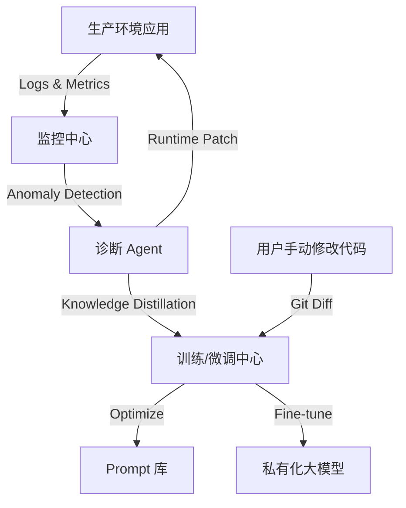

# Ingenio Phase 4 技术设计方案 (Technical Design)

**版本**: v1.0
**主题**: 自我进化与全自主研发 (Self-Evolution & Autonomous R&D)
**依赖**: Phase 3 生态融合完成
**目标**: 实现 **元编程 (Meta-Programming)**、**全自主 DevOps** 以及 **持续学习闭环**。

---

## 1. 核心愿景 (The Singularity Vision)

Phase 4 标志着 Ingenio 从一个"辅助工具"进化为一个"数字员工"。

*   **Self-Improving**: 它可以分析用户对生成代码的修改，反向优化自己的 System Prompt 和 Templates。
*   **Autonomous Operation**: 它生成的代码上线后，如果报错，它能自己看日志、自己写 Patch、自己部署，无需人类干预。
*   **Meta-Capability**: 当用户需要一个系统中不存在的能力（例如 "接入最新的 ChatGPT-5 API"）时，G3 引擎能自己阅读 API 文档，编写一个新的 `Capability` 插件并注册给自己使用。

---

## 2. 架构飞跃 (Architecture Leap)

### 2.1 元学习引擎 (Meta-Learning Engine)

建立一个反馈回路，让"运行时数据"反哺"生成时策略"。

### 2.2 全自主 DevOps (Autonomous DevOps)

不再只交付源码，而是交付**运行中的服务**。

*   **Infrastructure as Code (IaC)**: G3 生成 Terraform/K8s Manifests。
*   **CI/CD Pipeline Generation**: G3 自动生成 GitHub Actions / GitLab CI 配置文件。
*   **Auto-Scaling**: G3 编写 Prometheus 告警规则和 HPA 策略。

---

## 3. 核心功能模块 (Core Modules)

### 3.1 动态能力自构建 (Capability Self-Construction)

这是 Phase 4 最科幻的功能。

**场景**: 用户说 "我要接入某某小众银行的支付接口，这是他们的文档 URL"。

**流程**:
1.  **Crawler Agent**: 爬取文档。
2.  **Reader Agent**: 理解接口签名、加密方式。
3.  **Coder Agent**: 编写 `BankPayCapability.java` (实现 Jeecg 支付接口)。
4.  **Registrar Agent**: 将编译好的 JAR 包和 Prompt 描述注册��� `Capability Registry`。
5.  **Result**: 系统瞬间学会了新技能，下次可以直接使用。

### 3.2 影子测试 (Shadow Testing)

在代码上线前，G3 利用生成的 **Coach Agent** 进行持续的流量回放和混沌工程测试。

*   **Traffic Replay**: 复制生产流量到新生成的版本。
*   **Chaos Monkey**: 随机杀 Pod，验证高可用代码的有效性。

---

## 4. 实施路线图 (Execution Roadmap)

### Step 1: 持续反馈闭环 (Feedback Loop)
1.  对接 Gitlab Webhook，监听 Merge Request。
2.  分析 "AI 生成的代码" vs "人类最终提交的代码" 的 Diff。
3.  使用 RLHF (Reinforcement Learning from Human Feedback) 优化 Prompt 权重。

### Step 2: 运维自治 (Ops Autonomy)
1.  集成 Kubernetes Client。
2.  训练专门的 "SRE Agent" (Site Reliability Engineering)。

### Step 3: 知识蒸馏 (Knowledge Distillation)
1.  部署本地轻量化模型 (e.g., Llama-3-8B)。
2.  将 G3 在云端 (GPT-4) 积累的优质 Case 蒸馏给本地模型，降低成本，提高速度。

---

## 5. 终局 (The Endgame)

Ingenio 最终将成为企业的 **"AI CTO"**。

*   人类只负责：**定义业务目标 (OKR)** 和 **审核预算**。
*   Ingenio 负责：**架构设计 -> 代码实现 -> 测试验收 -> 上线部署 -> 故障自愈 -> 性能优化** 的全链路。

---

**文档结束**
