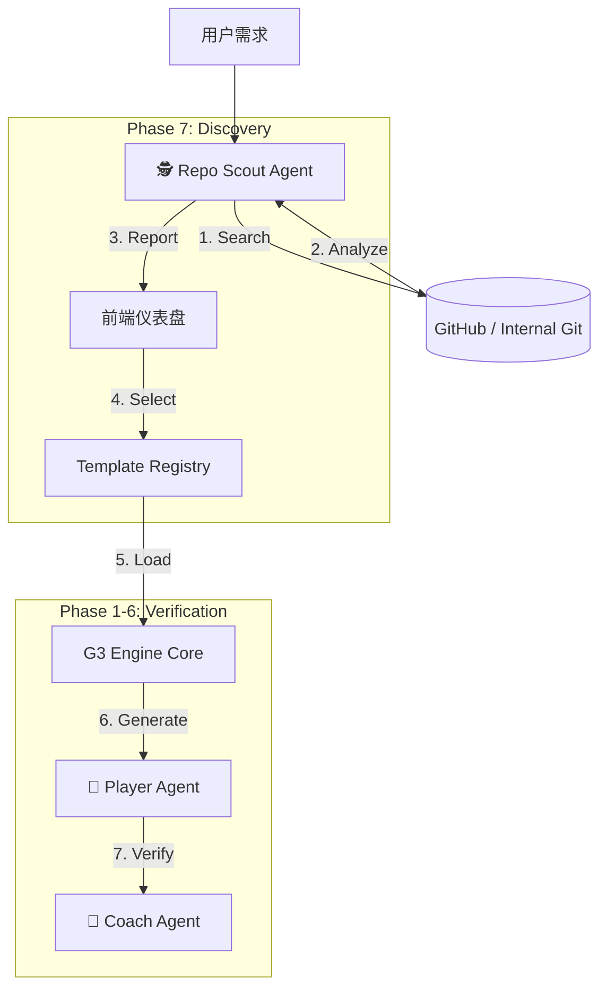

# Phase 7: Intelligent Discovery (智能选型与探索)

**版本**: v1.1
**状态**: Integrated (Frontend Connected)
**定位**: Phase -1 (Discovery) of the G3 Loop

---

## 1. 核心目标

传统的代码生成是从**零 (Empty)** 到 **一 (Code)**。
Phase 7 的目标是从 **现有 (Existing)** 到 **更优 (Better)**。

我们引入 **Repo Scout Agent (代码侦察兵)**，在生成代码之前，先去开源世界（GitHub）或公司内部库中寻找最佳的“起步依赖”或“参考实现”。

**核心价值**:
*   **不重复造轮子**: 优先复用成熟的开源模块或内部组件。
*   **架构一致性**: 自动筛选符合 JeecgBoot/Spring Boot 标准的项目。
*   **可解释性**: 为用户提供“为什么选这个库”的决策依据。

---

## 2. 架构集成

### 2.1 流程图

### 2.2 核心组件

#### Repo Scout Agent (Python)
*   **位置**: `g3-engine/agents/repo_scout.py`
*   **职责**:
    *   **Search**: 调用搜索 API 寻找候选仓库。
    *   **Deep Read**: 利用 `TemplateManager` 进行 Sparse Checkout，拉取 `pom.xml`, `package.json`, `README.md`。
    *   **Analyze**: 使用 LLM 分析技术栈匹配度（如：是否使用 MyBatis-Plus? 是否是 Vue3?）。

#### Template Manager (Python)
*   **位置**: `g3-engine/core/template_manager.py`
*   **职责**:
    *   管理本地缓存 (`.template_cache/`).
    *   处理 Git 操作 (Clone, Pull, Sparse Checkout).
    *   提供统一的文件读取接口给 Scout Agent。

#### Discovery Dashboard (Frontend)
*   **位置**: `frontend/src/app/preview-quick/[requirement]/page.tsx`
*   **功能**:
    *   流式展示搜索日志 ("Searching for payment modules...").
    *   自动提取 Scout 推荐结果。
    *   将推荐模版作为 `templateContext` 注入到后续的 AI 生成 Prompt 中。

---

## 3. 与 Phase 1-6 的衔接

Phase 1-6 建立了一套坚实的**验证体系** (Compile -> Test -> Coverage)。Phase 7 的输出将作为 Phase 1-6 的输入。

1.  **Input**: Scout 选定一个 Git 仓库作为 Base。
2.  **Process**: 
    *   G3 Player Agent 读取该仓库的代码。
    *   Player Agent 根据用户的新需求（如“修改支付回调逻辑”），对现有代码进行修改/重构。
3.  **Verification**:
    *   修改后的代码进入 **Phase 1 (CompilationValidator)** 验证编译。
    *   通过后进入 **Phase 2 (TestExecutor)** 运行原有测试 + 新增测试。
    *   ...

---

## 4. 实施状态

- [x] **Core Agent**: `RepoScoutAgent` implemented (Mock search, Real analysis structure).
- [x] **Template Engine**: `TemplateManager` implemented (Git integration).
- [x] **API**: `/api/v1/g3/scout` endpoint added to G3 Engine.
- [x] **UI Integration**: Next.js frontend integrated (`preview-quick` page captures Scout result).
- [x] **Generation Connect**: Backend (`OpenLovableController`) updated to inject `templateContext` into Prompt.
- [x] **Real Search**: Integration with GitHub Search API implemented (with fallback to Mock).

---
**Designed by Ingenio Architect**