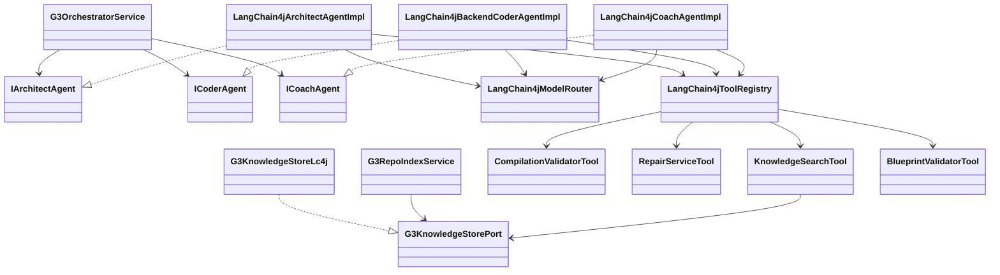

# LangChain4j 工程化落地包（G3）

## 1. 类图（建议）



## 2. 接口定义（模板）

```java
package com.ingenio.backend.langchain4j;

import com.ingenio.backend.entity.g3.G3ArtifactEntity;
import com.ingenio.backend.entity.g3.G3JobEntity;
import com.ingenio.backend.entity.g3.G3LogEntry;
import com.ingenio.backend.entity.g3.G3ValidationResultEntity;
import com.ingenio.backend.agent.g3.IArchitectAgent;
import com.ingenio.backend.agent.g3.ICoderAgent;
import com.ingenio.backend.agent.g3.ICoachAgent;
import java.util.List;
import java.util.function.Consumer;

/**
 * LangChain4jModelRouter
 * 是什么：统一模型路由器接口。
 * 做什么：按任务类型与失败次数选择模型并支持降级。
 * 为什么：保证成功率优先且成本可控。
 */
public interface LangChain4jModelRouter {
    /**
     * 选择模型
     * 是什么：模型选择方法。
     * 做什么：根据任务类型与失败上下文返回模型配置。
     * 为什么：确保高成功率场景优先高质量模型。
     */
    ModelSelection select(TaskType taskType, int attempt, FailureContext failureContext);

    /**
     * 任务类型
     * 是什么：模型路由分类枚举。
     * 做什么：区分 codegen/repair/analysis 等策略。
     * 为什么：不同任务对模型能力偏好不同。
     */
    enum TaskType { CODEGEN, REPAIR, ANALYSIS }

    /**
     * 模型选择结果
     * 是什么：模型选择返回值。
     * 做什么：包含 provider 与 model 等配置。
     * 为什么：让 Agent 能统一调用模型。
     */
    record ModelSelection(String provider, String model) { }

    /**
     * 失败上下文
     * 是什么：失败状态容器。
     * 做什么：承载错误类型与上次模型信息。
     * 为什么：用于降级与熔断决策。
     */
    record FailureContext(String lastProvider, String lastModel, String reason) { }
}

/**
 * G3KnowledgeStorePort
 * 是什么：G3 知识库访问接口。
 * 做什么：屏蔽 RAG 实现细节，统一索引与检索。
 * 为什么：支持 Redis/pgvector 等后端的可替换实现。
 */
public interface G3KnowledgeStorePort {
    /**
     * 索引 Job 产物
     * 是什么：任务级索引方法。
     * 做什么：将产物切片写入向量库。
     * 为什么：支持修复与生成上下文检索。
     */
    void ingestJob(G3JobEntity job, List<G3ArtifactEntity> artifacts);

    /**
     * 检索 Job 相关片段
     * 是什么：任务级语义检索。
     * 做什么：返回 topK 相关文档片段。
     * 为什么：提升修复与生成时的上下文命中率。
     */
    List<Object> searchJob(String query, java.util.UUID jobId, int topK);

    /**
     * 检索 Repo 相关片段
     * 是什么：仓库级语义检索。
     * 做什么：按 tenant/project 过滤检索结果。
     * 为什么：提供跨任务的资产复用能力。
     */
    List<Object> searchRepo(String query, java.util.UUID tenantId, java.util.UUID projectId, int topK);

    /**
     * 格式化检索结果
     * 是什么：上下文格式化方法。
     * 做什么：将检索结果转换为可读 Prompt 上下文。
     * 为什么：提升模型对检索片段的理解效率。
     */
    String formatForContext(List<Object> documents);
}

/**
 * LangChain4jArchitectAgentImpl
 * 是什么：LangChain4j 架构师 Agent 实现。
 * 做什么：生成 OpenAPI 契约与数据库 Schema。
 * 为什么：替换旧实现以获得工具调用与结构化输出能力。
 */
public class LangChain4jArchitectAgentImpl implements IArchitectAgent {
    /**
     * 设计接口
     * 是什么：架构设计入口。
     * 做什么：生成契约与 Schema 并返回结构化结果。
     * 为什么：确保编排层可复用现有流程与落库逻辑。
     */
    @Override
    public ArchitectResult design(G3JobEntity job, Consumer<G3LogEntry> logConsumer) {
        return ArchitectResult.failure("TODO");
    }

    /**
     * 执行接口
     * 是什么：Agent 执行入口。
     * 做什么：生成产物并返回可落库的列表。
     * 为什么：与编排层的统一调用方式保持一致。
     */
    @Override
    public List<G3ArtifactEntity> execute(G3JobEntity job, Consumer<G3LogEntry> logConsumer) {
        throw new UnsupportedOperationException("TODO");
    }
}

/**
 * LangChain4jBackendCoderAgentImpl
 * 是什么：LangChain4j 后端编码 Agent 实现。
 * 做什么：生成实体/Mapper/DTO/Service/Controller 产物。
 * 为什么：引入工具编排与结构化输出，提升成功率。
 */
public class LangChain4jBackendCoderAgentImpl implements ICoderAgent {
    /**
     * 生成接口
     * 是什么：编码生成入口。
     * 做什么：生成后端产物并返回结构化结果。
     * 为什么：保证产物可直接进入验证与修复流程。
     */
    @Override
    public CoderResult generate(G3JobEntity job, int generationRound, Consumer<G3LogEntry> logConsumer) {
        return CoderResult.failure("TODO");
    }
}

/**
 * LangChain4jCoachAgentImpl
 * 是什么：LangChain4j 教练 Agent 实现。
 * 做什么：分析编译错误并生成修复产物。
 * 为什么：用工具调用闭环修复，提高收敛速度。
 */
public class LangChain4jCoachAgentImpl implements ICoachAgent {
    /**
     * 修复接口
     * 是什么：自动修复入口。
     * 做什么：分析错误并产出修复文件。
     * 为什么：缩短修复闭环并提升通过率。
     */
    @Override
    public CoachResult fix(
            G3JobEntity job,
            List<G3ArtifactEntity> errorArtifacts,
            List<G3ValidationResultEntity> validationResults,
            com.ingenio.backend.entity.g3.G3SessionMemory sessionMemory,
            Consumer<G3LogEntry> logConsumer) {
        return CoachResult.failure("TODO");
    }
}
```

## 3. Tool 注册模板（LangChain4j）

```java
package com.ingenio.backend.langchain4j.tool;

import com.ingenio.backend.service.CompilationValidator;
import dev.langchain4j.agent.tool.Tool;
import org.springframework.stereotype.Component;

/**
 * CompilationValidatorTool
 * 是什么：编译验证工具封装。
 * 做什么：提供代码编译验证能力给 Agent 调用。
 * 为什么：将现有验证逻辑复用为工具，提升自动修复效率。
 */
@Component
public class CompilationValidatorTool {
    private final CompilationValidator validator;

    public CompilationValidatorTool(CompilationValidator validator) {
        this.validator = validator;
    }

    /**
     * 验证代码
     * 是什么：编译验证入口。
     * 做什么：返回编译结果与错误摘要。
     * 为什么：为修复循环提供结构化反馈。
     */
    @Tool("验证生成代码是否可编译，并返回错误摘要")
    public String validate(String projectPath) {
        return validator.validate(projectPath).toString();
    }
}
```

```java
package com.ingenio.backend.langchain4j;

import com.ingenio.backend.langchain4j.tool.CompilationValidatorTool;
import com.ingenio.backend.langchain4j.tool.RepairServiceTool;
import com.ingenio.backend.langchain4j.tool.KnowledgeSearchTool;
import com.ingenio.backend.langchain4j.tool.BlueprintValidatorTool;
import org.springframework.context.annotation.Bean;
import org.springframework.context.annotation.Configuration;
import java.util.List;

/**
 * LangChain4jToolConfig
 * 是什么：LangChain4j 工具注册配置。
 * 做什么：统一输出 Tool 列表供 Agent 装配。
 * 为什么：避免分散注册导致工具不可用或遗漏。
 */
@Configuration
public class LangChain4jToolConfig {
    /**
     * 工具清单
     * 是什么：LangChain4j Tool 列表。
     * 做什么：集中注册并注入 Agent。
     * 为什么：提升工具可发现性与一致性。
     */
    @Bean
    public List<Object> langchain4jTools(
            CompilationValidatorTool compilationValidatorTool,
            RepairServiceTool repairServiceTool,
            KnowledgeSearchTool knowledgeSearchTool,
            BlueprintValidatorTool blueprintValidatorTool) {
        return List.of(
                compilationValidatorTool,
                repairServiceTool,
                knowledgeSearchTool,
                blueprintValidatorTool);
    }
}
```

## 4. RAG 接入模板（Uniaix + Doubao Embedding）

```java
package com.ingenio.backend.langchain4j.rag;

import dev.langchain4j.model.embedding.EmbeddingModel;
import dev.langchain4j.model.output.Response;
import dev.langchain4j.data.embedding.Embedding;

/**
 * UniaixEmbeddingModelAdapter
 * 是什么：Uniaix Embedding 适配器。
 * 做什么：将 Uniaix Embedding 响应适配为 LangChain4j 的 EmbeddingModel。
 * 为什么：当 OpenAI 兼容接口不一致时提供稳定适配能力。
 */
public class UniaixEmbeddingModelAdapter implements EmbeddingModel {
    /**
     * 向量化接口
     * 是什么：Embedding 生成入口。
     * 做什么：将文本转换为向量并返回标准结果。
     * 为什么：确保 RAG 检索与向量存储可用。
     */
    @Override
    public Response<Embedding> embed(String text) {
        throw new UnsupportedOperationException("TODO");
    }
}
```

## 5. 配置开关模板

```java
package com.ingenio.backend.langchain4j;

import org.springframework.boot.autoconfigure.condition.ConditionalOnProperty;
import org.springframework.context.annotation.Configuration;

/**
 * LangChain4jAgentSwitch
 * 是什么：Agent 引擎切换开关。
 * 做什么：根据配置选择 LangChain4j 或旧实现。
 * 为什么：保证可回滚与灰度发布。
 */
@Configuration
@ConditionalOnProperty(name = "ingenio.g3.agent.engine", havingValue = "lc4j")
public class LangChain4jAgentSwitch {
}
```

## 6. 结构化输出模型（示例）

```java
package com.ingenio.backend.langchain4j.model;

import java.util.List;

/**
 * CodeGenerationResult
 * 是什么：代码生成结构化输出模型。
 * 做什么：承载生成文件、依赖与摘要信息。
 * 为什么：减少解析错误并提升产物落库稳定性。
 */
public record CodeGenerationResult(
        List<GeneratedFile> files,
        String pomFragment,
        String summary) {
}

/**
 * GeneratedFile
 * 是什么：生成文件结构。
 * 做什么：描述文件路径与内容。
 * 为什么：便于直接转换为 G3ArtifactEntity。
 */
public record GeneratedFile(String path, String content, String language) {
}
```

## 7. 实施注意事项（补充）

- **Redis Stack**：向量检索依赖 RediSearch，Docker 使用 `redis/redis-stack-server`。
- **Embedding 维度**：`doubao-embedding-text-240715` 维度为 2048，需配置 `INGENIO_G3_RAG_EMBEDDING_DIMENSION=2048`。
- **JSON 修复**：Coder 阶段对 Gemini/DeepSeek 增加严格 JSON 约束与二次修复，提升解析成功率。
