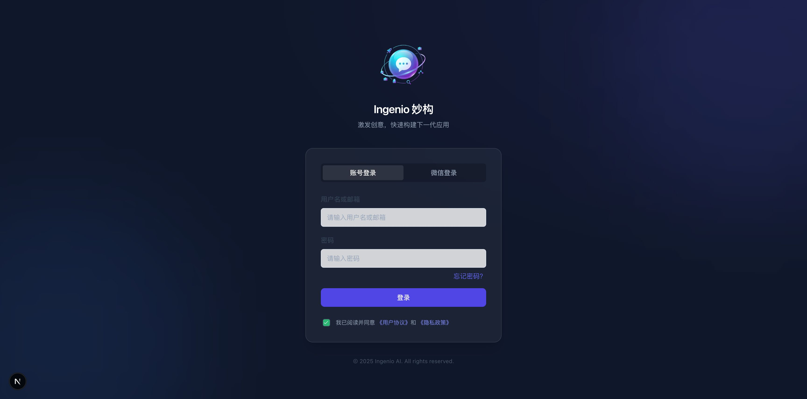
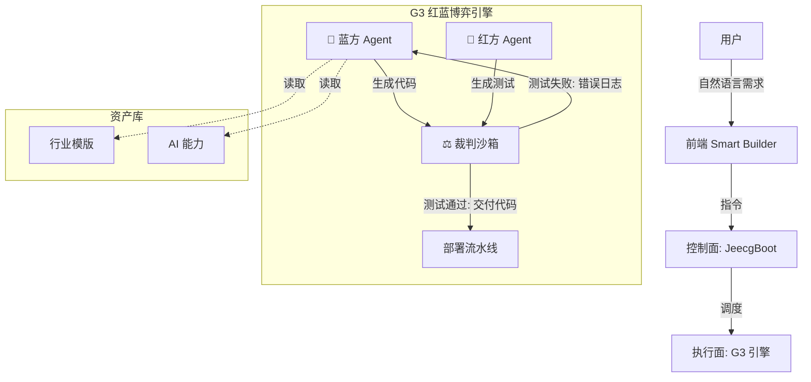

<div align="center">

# Ingenio (妙构)

**企业级 AI 原生应用孵化器**

**不仅仅是快，更是精妙**

通过 **G3 红蓝博弈引擎 (Red-Blue Game Engine)**，交付高质量、自修复、符合企业标准的 Java 全栈应用。

[特性](#-功能特性) • [架构](#-技术架构) • [快速开始](#-快速开始) • [文档](#-文档索引) • [社区](#-社区)

</div>

---

## 📖 项目简介

Ingenio (妙构) 是一个颠覆性的 AI 编程平台。不同于市面上仅生成 "Demo 级" 代码的工具，Ingenio 引入了 **"虚拟研发团队"** 概念，通过 **G3 引擎** 的红蓝博弈机制，实现代码的自我验证与修复，最终交付可直接用于生产环境的 **Spring Boot + Next.js** 全栈应用。

我们致力于解决 AI 编程中的 "Day 2" 问题 —— **可维护性、安全性与企业合规性**。

### 核心价值主张

- **G3 红蓝博弈** - 内置 "Player (开发)" 与 "Coach (测试)" 智能体，自动进行攻击性测试与修复，确保代码健壮性。
- **Java 全栈标准** - 生成符合企业主流规范的 Spring Boot (Java 17+) 后端与 Next.js 前端，告别 "玩具代码"。
- **JeecgBoot 控制面** - 深度集成 JeecgBoot 低代码平台，复用现有企业资产（用户、支付、权限），避免重复造轮子。
- **Smart Builder** - 可视化资产组装平台，支持行业模版 (Templates) 与 AI 能力 (Capabilities) 的积木式构建。
- **自修复交付** - 代码在交付给人类前，已经在沙箱中经过了数轮自动化测试与修复循环。

---

## 📸 产品截图

<div align="center">

### 首页 - Smart Builder



</div>

---

## ✨ 核心特性

### 🎮 G3 红蓝博弈引擎 (The G3 Engine)

Ingenio 的心脏是一个闭环的博弈系统：

1.  **🔵 蓝方 (Player Agent)**: 负责理解需求，基于标准模版 (Skeleton) 编写业务逻辑 (Soul)。
2.  **🔴 红方 (Coach Agent)**: 负责 "找茬"，生成边界条件、SQL 注入、高并发等攻击性测试用例。
3.  **⚖️ 裁判 (Executor)**: 在沙箱中执行测试。如果失败，蓝方必须修复代码，直到通过裁判的验收。

### 🧩 Smart Builder 资产体系

- **行业模版长廊**: 开箱即用的业务场景模版（电商、SaaS、预约系统等）。
- **AI 能力积木**: 封装好的第三方能力（Stripe 支付、阿里云短信、OCR 识别），一键集成。
- **Prompt 资产化**: 将优秀的 Prompt 封装为可复用的资产包。

### 🛡️ 企业级架构保障

- **Spring Boot 3.4+**: 紧跟最新技术栈，支持虚拟线程。
- **多租户架构**: 原生支持 SaaS 场景的数据隔离。
- **安全合规**: 内置 Sa-Token 鉴权、敏感数据脱敏、API 签名校验。

---

## 🏗️ 技术架构

### 宏观架构



### 技术栈

#### 执行面 (Runtime Plane) - Java 后端
- **框架**: Java 17+ / Spring Boot 3.4.0
- **ORM**: MyBatis-Plus 3.5.8
- **数据库**: PostgreSQL 15+
- **鉴权**: Sa-Token (JWT)
- **缓存**: Redis 7+

#### 产品面 (Product Plane) - 前端
- **框架**: Next.js 15 + React 19
- **样式**: Tailwind CSS + Shadcn/ui
- **状态**: Zustand
- **构建**: Turbopack

#### 智能层 (Intelligence Layer)
- **编排**: AgentScope (Python)
- **模型**: 兼容 OpenAI API 标准 (Qwen, DeepSeek, Claude)

---

## 🔗 依赖项目

Ingenio 依赖以下开源项目，请确保已了解其部署方式：

| 项目 | 说明 | 仓库 |
|-----|------|------|
| **open-lovable-cn** | 前端代码沙箱生成引擎，负责实时预览与代码修复 | [jiaweifreshair/open-lovable-cn](https://github.com/jiaweifreshair/open-lovable-cn) |
| **JeecgBoot-ai-global** | 企业级控制面，提供用户管理、支付、权限等基础能力 | [jiaweifreshair/JeecgBoot-ai-global](https://github.com/jiaweifreshair/JeecgBoot-ai-global) |

---

## 🚀 快速开始

### 前置要求

- **Java 17+**
- **Node.js 20+** (pnpm)
- **Docker & Docker Compose**
- **Python 3.10+** (用于 G3 AgentScope)

### 1. 克隆并配置环境变量

```bash
git clone https://github.com/jiaweifreshair/Ingenio.git
cd Ingenio

# 复制环境变量模板并填写配置
cp .env.example .env
cp backend/.env.example backend/.env
# 编辑 backend/.env，填写数据库、AI API Key 等配置
```

### 2. 启动基础设施

```bash
docker-compose up -d
# 启动 PostgreSQL, Redis, MinIO
```

### 3. 后端启动 (Spring Boot)

```bash
# 推荐：使用启动脚本（自动加载环境变量）
./scripts/start-backend.sh

# 或手动启动
cd backend && source .env && mvn spring-boot:run -Dspring-boot.run.profiles=local
```

### 4. 前端启动 (Next.js)

```bash
cd frontend
pnpm install
pnpm dev
```

访问 `http://localhost:3000` 开始体验。

---

## 📚 文档索引

> **完整文档索引**: [docs/README.md](docs/README.md)

### 核心规划文档
- `01-INGENIO_SMART_BUILDER_DEVELOPMENT_PLAN.md`: 总体开发蓝图
- `08-G3_ENGINE_IMPLEMENTATION_PLAN.md`: **G3 引擎实施方案 (必读)**
- `09-G3_ENGINE_INTEGRATION_ARCHITECTURE.md`: 后端集成架构

### 开发与规范
- `GEMINI.md`: AI 助手开发指南
- `docs/development/CODING_STANDARDS.md`: 代码规范

---

## 🤝 社区

<div align="center">

### 微信交流群：AI工具探索

扫码加入，与开发者一起探讨 AI 编程、Vibe Coding 与工程化实践。


> 二维码定期更新，如已过期请提 Issue 或联系维护者。

</div>

---

## 🤝 贡献与社区

Ingenio 妙构 是一个致力于提升软件工程交付质量的开源项目。

- **GitHub**: https://github.com/jiaweifreshair/Ingenio
- **Issue**: 欢迎提交 Bug 报告和特性建议

---

<div align="center">

**Made with ❤️ by Ingenio Team**

*Red-Blue Game for Better Code.*

</div>
