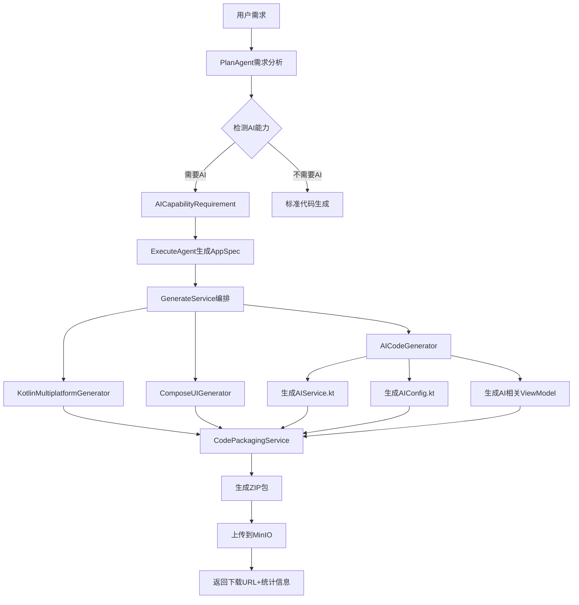

# AI代码集成 API 参考文档

> **版本**: 1.0.0
> **最后更新**: 2025-11-11
> **作者**: Ingenio Backend Team

## 目录

1. [概述](#概述)
2. [架构设计](#架构设计)
3. [API响应扩展](#api响应扩展)
4. [使用示例](#使用示例)
5. [前端集成](#前端集成)
6. [最佳实践](#最佳实践)

---

## 概述

AICodeGenerator集成功能使Ingenio能够自动生成包含AI能力的Kotlin Multiplatform应用代码。当PlanAgent检测到用户需求中包含AI功能（如聊天机器人、RAG检索、图像识别等）时，系统会自动生成相应的AI集成代码。

### 核心特性

- **自动AI能力检测**: PlanAgent分析需求，识别11种AI能力类型
- **智能代码生成**: 根据AI能力自动生成AIService、AIConfig等文件
- **完整代码打包**: 生成ZIP包，包含所有Kotlin代码、配置文件和文档
- **文件统计分析**: 提供详细的文件类型统计和AI集成文件数量
- **前端可视化**: CodeDownloadPanel组件展示代码信息和AI集成标识

### 支持的AI能力类型

| 类型 | 说明 | 生成的文件 |
|-----|------|-----------|
| `CHATBOT` | 对话机器人 | AIService.kt, ChatViewModel.kt |
| `QA_SYSTEM` | 问答系统 | QAService.kt, QuestionProcessor.kt |
| `RAG` | 检索增强生成 | RAGService.kt, VectorStore.kt |
| `IMAGE_RECOGNITION` | 图像识别 | ImageAIService.kt, ImageProcessor.kt |
| `VOICE_ASSISTANT` | 语音助手 | VoiceAIService.kt, STTService.kt |
| `CONTENT_GENERATION` | 内容生成 | ContentAIService.kt, PromptBuilder.kt |
| `SENTIMENT_ANALYSIS` | 情感分析 | SentimentService.kt |
| `TEXT_CLASSIFICATION` | 文本分类 | ClassifierService.kt |
| `RECOMMENDATION` | 智能推荐 | RecommendService.kt |
| `SEMANTIC_SEARCH` | 语义搜索 | SemanticSearchService.kt |
| `CODE_ASSISTANT` | 代码助手 | CodeAIService.kt |

---

## 架构设计

### AI代码生成流程



### 生成文件结构

```
MyAIApp/
├── data/
│   ├── model/
│   │   ├── User.kt
│   │   └── Message.kt
│   └── repository/
│       ├── UserRepository.kt
│       └── MessageRepository.kt
├── presentation/
│   ├── viewmodel/
│   │   ├── UserViewModel.kt
│   │   └── ChatViewModel.kt
│   └── screen/
│       ├── UserListScreen.kt
│       └── ChatScreen.kt
├── ai/                              # AI集成目录
│   ├── AIService.kt                 # 核心AI服务
│   ├── AIConfig.kt                  # AI配置
│   ├── QwenChatClient.kt            # 七牛云Qwen API客户端
│   ├── ChatViewModel.kt             # 聊天ViewModel
│   └── README.md                    # AI使用说明
├── build.gradle.kts
└── README.md
```

---

## API响应扩展

### GenerateFullResponse 新增字段

#### 完整响应结构

```java
@Data
@Builder
public class GenerateFullResponse {
    // ... 原有字段 ...

    /**
     * 代码下载URL（指向MinIO的ZIP文件）
     */
    private String codeDownloadUrl;

    /**
     * 代码生成摘要（新增）
     * 包含生成的文件统计信息
     */
    private CodeGenerationSummary codeSummary;

    /**
     * 生成的文件清单（新增）
     * 列出所有生成的文件路径
     */
    private List<String> generatedFileList;

    // ... 其他字段 ...
}
```

#### CodeGenerationSummary 结构

```java
@Data
@Builder
@NoArgsConstructor
@AllArgsConstructor
public static class CodeGenerationSummary {

    /**
     * 总文件数
     */
    private Integer totalFiles;

    /**
     * 数据库Schema文件数
     */
    private Integer databaseSchemaFiles;

    /**
     * 数据模型文件数（data class）
     */
    private Integer dataModelFiles;

    /**
     * Repository文件数
     */
    private Integer repositoryFiles;

    /**
     * ViewModel文件数
     */
    private Integer viewModelFiles;

    /**
     * UI界面文件数
     */
    private Integer uiScreenFiles;

    /**
     * AI集成文件数（重点新增）
     * 包括AIService、AIConfig、AI相关ViewModel等
     */
    private Integer aiIntegrationFiles;

    /**
     * 配置文件数
     */
    private Integer configFiles;

    /**
     * 文档文件数
     */
    private Integer documentFiles;

    /**
     * 总文件大小（字节）
     */
    private Long totalSize;

    /**
     * ZIP文件名
     */
    private String zipFileName;
}
```

### 响应示例

#### 包含AI集成的响应

```json
{
  "code": 200,
  "message": "成功",
  "data": {
    "appSpecId": "550e8400-e29b-41d4-a716-446655440000",
    "isValid": true,
    "qualityScore": 85,
    "status": "completed",
    "codeDownloadUrl": "http://localhost:9000/ingenio/generated-code/ChatApp-1699999999-abc123.zip",
    "codeSummary": {
      "totalFiles": 15,
      "databaseSchemaFiles": 1,
      "dataModelFiles": 3,
      "repositoryFiles": 3,
      "viewModelFiles": 3,
      "uiScreenFiles": 6,
      "aiIntegrationFiles": 4,
      "configFiles": 2,
      "documentFiles": 1,
      "totalSize": 125678,
      "zipFileName": "ChatApp-1699999999-abc123.zip"
    },
    "generatedFileList": [
      "com/example/chatapp/data/model/User.kt",
      "com/example/chatapp/data/model/Message.kt",
      "com/example/chatapp/data/repository/UserRepository.kt",
      "com/example/chatapp/data/repository/MessageRepository.kt",
      "com/example/chatapp/presentation/viewmodel/UserViewModel.kt",
      "com/example/chatapp/presentation/viewmodel/MessageViewModel.kt",
      "com/example/chatapp/presentation/viewmodel/ChatViewModel.kt",
      "com/example/chatapp/presentation/screen/UserListScreen.kt",
      "com/example/chatapp/presentation/screen/ChatScreen.kt",
      "com/example/chatapp/ai/AIService.kt",
      "com/example/chatapp/ai/AIConfig.kt",
      "com/example/chatapp/ai/QwenChatClient.kt",
      "com/example/chatapp/ai/README.md",
      "build.gradle.kts",
      "README.md"
    ],
    "planResult": {
      "modules": [...],
      "aiCapability": {
        "needsAI": true,
        "capabilities": ["CHATBOT", "SENTIMENT_ANALYSIS"],
        "complexity": "SIMPLE",
        "suggestedModel": "qwen-max",
        "estimatedCost": 0.5
      }
    },
    "durationMs": 45000,
    "generatedAt": "2025-11-11T10:30:00Z"
  }
}
```

#### 不包含AI集成的响应

```json
{
  "code": 200,
  "message": "成功",
  "data": {
    "appSpecId": "660e8400-e29b-41d4-a716-446655440000",
    "isValid": true,
    "qualityScore": 90,
    "status": "completed",
    "codeDownloadUrl": "http://localhost:9000/ingenio/generated-code/TaskApp-1699999999-def456.zip",
    "codeSummary": {
      "totalFiles": 11,
      "databaseSchemaFiles": 1,
      "dataModelFiles": 2,
      "repositoryFiles": 2,
      "viewModelFiles": 2,
      "uiScreenFiles": 4,
      "aiIntegrationFiles": 0,
      "configFiles": 2,
      "documentFiles": 1,
      "totalSize": 85432,
      "zipFileName": "TaskApp-1699999999-def456.zip"
    },
    "generatedFileList": [
      "com/example/taskapp/data/model/Task.kt",
      "com/example/taskapp/data/repository/TaskRepository.kt",
      "com/example/taskapp/presentation/viewmodel/TaskViewModel.kt",
      "com/example/taskapp/presentation/screen/TaskListScreen.kt",
      "build.gradle.kts",
      "README.md"
    ],
    "planResult": {
      "modules": [...],
      "aiCapability": {
        "needsAI": false
      }
    },
    "durationMs": 30000,
    "generatedAt": "2025-11-11T10:35:00Z"
  }
}
```

---

## 使用示例

### 后端调用示例

#### 1. 创建生成请求（包含AI能力）

```java
@PostMapping("/generate")
public Result<GenerateFullResponse> generate(
        @RequestBody @Valid GenerateFullRequest request
) {
    // 用户需求包含AI功能描述
    request.setUserRequirement(
        "创建一个AI聊天助手应用，支持智能对话和情感分析，用户可以和AI进行自然语言交流"
    );
    request.setModel("qwen-max");
    request.setGeneratePreview(true); // 启用代码生成

    // 调用生成服务
    GenerateFullResponse response = generateService.generateFull(request);

    return Result.success(response);
}
```

#### 2. 获取代码统计信息

```java
// 检查是否包含AI集成
if (response.getCodeSummary() != null &&
        response.getCodeSummary().getAiIntegrationFiles() > 0) {

    log.info("检测到AI集成文件: {} 个",
            response.getCodeSummary().getAiIntegrationFiles());

    // 过滤AI相关文件
    List<String> aiFiles = response.getGeneratedFileList().stream()
            .filter(path -> path.contains("/ai/") ||
                           path.contains("AIService") ||
                           path.contains("AIConfig"))
            .collect(Collectors.toList());

    log.info("AI文件列表: {}", aiFiles);
}
```

#### 3. 下载代码ZIP包

```java
// 使用codeDownloadUrl直接下载
String downloadUrl = response.getCodeDownloadUrl();
// http://localhost:9000/ingenio/generated-code/ChatApp-1699999999-abc123.zip

// 或者通过MinIO客户端下载
InputStream inputStream = minioService.downloadFile(
    response.getCodeSummary().getZipFileName()
);
```

### 前端调用示例

#### 1. 调用生成API

```typescript
import { generateAppSpec, type GenerateRequest } from '@/lib/api/generate';

async function handleGenerate() {
  const request: GenerateRequest = {
    requirement: '创建一个AI聊天助手应用',
    tenantId: 'tenant-123',
    userId: 'user-456',
    model: 'qwen-max',
  };

  const response = await generateAppSpec(request);

  if (response.success && response.data) {
    console.log('生成成功:', response.data);
    console.log('下载URL:', response.data.codeDownloadUrl);
    console.log('AI文件数:', response.data.codeSummary?.aiIntegrationFiles);
  }
}
```

#### 2. 显示代码下载面板

```tsx
import { CodeDownloadPanel } from '@/components/wizard/code-download-panel';

function WizardCompletePage({ taskStatus }: { taskStatus: TaskStatusResponse }) {
  return (
    <div>
      {/* 其他内容 */}

      {/* 代码下载面板 */}
      {taskStatus.downloadUrl && (
        <CodeDownloadPanel
          codeDownloadUrl={taskStatus.downloadUrl}
          codeSummary={taskStatus.codeSummary}
          generatedFileList={taskStatus.generatedFileList}
        />
      )}
    </div>
  );
}
```

---

## 前端集成

### TypeScript类型定义

#### 完整类型定义

```typescript
// frontend/src/lib/api/generate.ts

/**
 * 代码生成摘要接口（匹配后端CodeGenerationSummary）
 */
export interface CodeGenerationSummary {
  /** 总文件数 */
  totalFiles: number;
  /** 数据库Schema文件数 */
  databaseSchemaFiles: number;
  /** 数据模型文件数 */
  dataModelFiles: number;
  /** Repository文件数 */
  repositoryFiles: number;
  /** ViewModel文件数 */
  viewModelFiles: number;
  /** UI界面文件数 */
  uiScreenFiles: number;
  /** AI集成文件数 */
  aiIntegrationFiles: number;
  /** 配置文件数 */
  configFiles: number;
  /** 文档文件数 */
  documentFiles: number;
  /** 总文件大小（字节） */
  totalSize: number;
  /** ZIP文件名 */
  zipFileName: string;
}

/**
 * 生成响应数据（扩展版本）
 */
export interface GenerateResponse {
  appSpecId: string;
  isValid: boolean;
  qualityScore: number;
  status: string;
  codeDownloadUrl?: string;
  codeSummary?: CodeGenerationSummary;
  generatedFileList?: string[];
  planResult?: PlanResult;
  validateResult?: ValidateResult;
  durationMs: number;
  generatedAt: string;
}
```

### CodeDownloadPanel组件使用

#### 基本使用

```tsx
import { CodeDownloadPanel } from '@/components/wizard/code-download-panel';

<CodeDownloadPanel
  codeDownloadUrl="http://localhost:9000/ingenio/generated-code/ChatApp-123.zip"
  codeSummary={{
    totalFiles: 15,
    aiIntegrationFiles: 4,
    dataModelFiles: 3,
    // ... 其他统计
  }}
  generatedFileList={[
    'com/example/chatapp/ai/AIService.kt',
    'com/example/chatapp/ai/AIConfig.kt',
    // ... 其他文件
  ]}
/>
```

#### 特性说明

- **自动AI识别**: 组件自动识别AI文件（路径包含`/ai/`、`AIService`、`AIConfig`等）
- **高亮显示**: AI文件使用紫色背景和Bot图标特殊标识
- **文件图标**: 根据文件类型显示不同图标（数据库、Repository、UI等）
- **可折叠列表**: 文件列表可展开/折叠，节省空间
- **响应式布局**: 支持桌面端和移动端

---

## 最佳实践

### 1. AI能力检测

**推荐做法**：
```java
// 在PlanAgent中添加明确的AI能力检测提示
String systemPrompt = """
如果用户需求包含以下任何关键词，请设置needsAI=true：
- 聊天、对话、机器人
- 问答、智能回答
- 推荐、个性化
- 图像识别、OCR
- 语音助手、语音识别
- 内容生成、文本生成
- 情感分析、文本分类
- 语义搜索、RAG
""";
```

### 2. 文件统计准确性

**确保统计准确**：
```java
// GenerateService.buildCodeSummary()
int aiIntegrationFiles = (int) generatedFiles.keySet().stream()
    .filter(path ->
        path.contains("/ai/") ||          // AI目录
        path.contains("AIService") ||     // AI服务
        path.contains("AIConfig") ||      // AI配置
        path.contains("ChatClient") ||    // 聊天客户端
        path.contains("RAGService")       // RAG服务
    )
    .count();
```

### 3. 错误处理

**AI代码生成失败不阻塞流程**：
```java
try {
    Map<String, String> aiFiles = aiCodeGenerator.generateAICode(...);
    allFiles.putAll(aiFiles);
    log.info("AI代码生成成功: {}个文件", aiFiles.size());
} catch (Exception e) {
    log.error("AI代码生成失败，跳过AI集成", e);
    // 不抛出异常，继续生成其他代码
}
```

### 4. 前端容错处理

**优雅处理缺失数据**：
```tsx
{taskStatus?.codeSummary?.aiIntegrationFiles > 0 && (
  <Badge variant="secondary" className="bg-purple-100">
    <Sparkles className="w-3 h-3 mr-1" />
    包含AI集成
  </Badge>
)}

{/* 即使没有AI集成也能正常显示 */}
```

### 5. 性能优化

**大文件列表优化**：
```tsx
import { ScrollArea } from '@/components/ui/scroll-area';

{/* 超过100个文件时使用虚拟滚动 */}
{generatedFileList.length > 100 ? (
  <VirtualScrollArea>
    {generatedFileList.map(file => <FileItem key={file} />)}
  </VirtualScrollArea>
) : (
  <ScrollArea className="h-64">
    {generatedFileList.map(file => <FileItem key={file} />)}
  </ScrollArea>
)}
```

---

## 常见问题

### Q1: AI集成文件数量为0但需求明确包含AI功能？

**原因**: PlanAgent可能未正确检测到AI能力需求

**解决方案**:
1. 检查PlanAgent的system prompt是否包含AI关键词列表
2. 确认用户需求描述包含明确的AI功能关键词
3. 查看日志：`log.info("检测到AI能力需求")` 是否输出

### Q2: 下载的ZIP包中没有AI文件？

**原因**: AI代码生成可能失败但流程继续

**解决方案**:
1. 查看日志是否有 `"AI代码生成失败，跳过AI集成"` 错误
2. 检查AICodeGenerator的实现和模板文件
3. 验证AICapabilityRequirement数据是否正确传递

### Q3: 前端显示的文件统计数量不正确？

**原因**: 统计逻辑可能有遗漏

**解决方案**:
1. 检查 `buildCodeSummary()` 方法的过滤条件
2. 确认所有生成器都将文件添加到 `allFiles` Map
3. 验证文件路径命名是否符合过滤规则

### Q4: 如何自定义AI文件识别规则？

**方案**: 修改 `isAIFile()` 函数：
```typescript
function isAIFile(filePath: string): boolean {
  const lowerPath = filePath.toLowerCase();
  return (
    lowerPath.includes('/ai/') ||
    lowerPath.includes('aiservice') ||
    lowerPath.includes('aiconfig') ||
    lowerPath.includes('aiclient') ||
    // 添加自定义规则
    lowerPath.includes('chatbot') ||
    lowerPath.includes('rag')
  );
}
```

---

## 相关文档

- [AI代码生成器设计文档](../design/AI_CODE_INTEGRATION_DESIGN.md)
- [Kotlin Multiplatform代码生成API](CODE_GENERATION_API.md)
- [PlanAgent需求分析API](PLAN_AGENT_API.md)
- [GenerateService服务文档](../services/GENERATE_SERVICE.md)

---

**Made with ❤️ by Ingenio Team**
