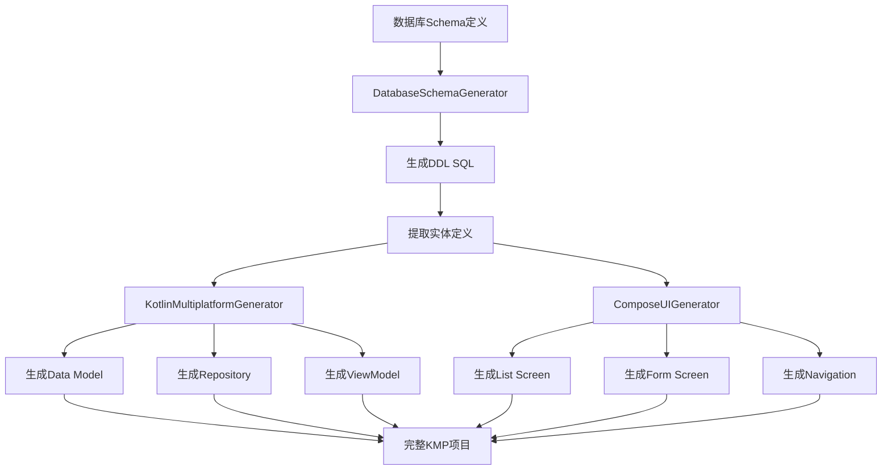

# Kotlin Multiplatform 代码生成器 API 参考文档

> **版本**: 1.0.0
> **最后更新**: 2025-11-09
> **作者**: Ingenio Backend Team

## 目录

1. [概述](#概述)
2. [架构设计](#架构设计)
3. [核心组件](#核心组件)
4. [SQL类型映射](#sql类型映射)
5. [代码生成示例](#代码生成示例)
6. [项目结构](#项目结构)
7. [API接口](#api接口)
8. [最佳实践](#最佳实践)
9. [常见问题](#常见问题)

---

## 概述

Kotlin Multiplatform代码生成器是一个自动化工具，能够从数据库Schema定义生成完整的跨平台应用代码，支持Android、iOS和Web平台。该工具基于Compose Multiplatform框架，遵循Material 3设计规范。

### 核心特性

- **三层架构生成**: 自动生成Data Model、Repository、ViewModel三层代码
- **类型安全映射**: 17种SQL类型到Kotlin类型的精确映射
- **Supabase集成**: 生成基于Supabase PostgREST的Repository代码
- **Compose UI**: 生成Material 3风格的Compose Multiplatform UI组件
- **完整CRUD**: 自动生成增删改查全套功能代码
- **分页支持**: 内置分页查询和无限滚动加载
- **错误处理**: 完整的异常处理和用户友好的错误提示

---

## 架构设计

### 三层代码生成架构

```
┌─────────────────────────────────────────────────────────────┐
│                    Presentation Layer                        │
│  ┌─────────────┐  ┌──────────────┐  ┌──────────────────┐   │
│  │   Screen    │  │   ViewModel  │  │   Navigation     │   │
│  │  (Compose)  │  │   (State)    │  │   (Routes)       │   │
│  └─────────────┘  └──────────────┘  └──────────────────┘   │
└─────────────────────────────────────────────────────────────┘
                              ↓
┌─────────────────────────────────────────────────────────────┐
│                      Domain Layer                            │
│  ┌──────────────────────────────────────────────────────┐   │
│  │              Data Models (data class)                │   │
│  │        Serializable + Validation                     │   │
│  └──────────────────────────────────────────────────────┘   │
└─────────────────────────────────────────────────────────────┘
                              ↓
┌─────────────────────────────────────────────────────────────┐
│                       Data Layer                             │
│  ┌──────────────────────────────────────────────────────┐   │
│  │       Repository (Supabase PostgREST Client)         │   │
│  │    CRUD + Pagination + Real-time Sync                │   │
│  └──────────────────────────────────────────────────────┘   │
└─────────────────────────────────────────────────────────────┘
                              ↓
┌─────────────────────────────────────────────────────────────┐
│                    Supabase Backend                          │
│              PostgreSQL + PostgREST + Realtime               │
└─────────────────────────────────────────────────────────────┘
```

### 代码生成流程



---

## 核心组件

### 1. KotlinMultiplatformGenerator

核心代码生成引擎，负责生成数据模型、Repository和ViewModel。

**包路径**: `com.ingenio.backend.service.KotlinMultiplatformGenerator`

#### 主要方法

##### generateDataModel()

```java
public String generateDataModel(Map<String, Object> entity)
```

**功能**: 生成Kotlin数据模型（data class）

**输入参数**:
```json
{
  "tableName": "user_profile",
  "attributes": [
    {
      "name": "id",
      "type": "UUID",
      "nullable": false,
      "comment": "用户ID"
    },
    {
      "name": "username",
      "type": "VARCHAR(50)",
      "nullable": false,
      "comment": "用户名"
    },
    {
      "name": "age",
      "type": "INTEGER",
      "nullable": true,
      "comment": "年龄"
    }
  ]
}
```

**输出示例**:
```kotlin
package com.ingenio.generated.data.model

import kotlinx.serialization.Serializable
import kotlinx.datetime.LocalDateTime

/**
 * UserProfile 数据模型
 * 表名: user_profile
 */
@Serializable
data class UserProfile(
    /** 用户ID */
    val id: String,
    /** 用户名 */
    val username: String,
    /** 年龄 */
    val age: Int?
)
```

##### generateRepository()

```java
public String generateRepository(Map<String, Object> entity)
```

**功能**: 生成基于Supabase的Repository类，提供完整的CRUD操作

**生成的方法**:
- `getAll()`: 获取所有记录
- `getById(id)`: 根据ID获取单条记录
- `create(item)`: 创建新记录
- `update(id, item)`: 更新记录
- `delete(id)`: 删除记录
- `getPage(page, pageSize)`: 分页查询

**输出示例**:
```kotlin
package com.ingenio.generated.data.repository

import com.ingenio.generated.data.model.UserProfile
import io.github.jan.supabase.SupabaseClient
import io.github.jan.supabase.postgrest.from
import io.github.jan.supabase.postgrest.query.Columns

/**
 * UserProfile Repository
 * 基于Supabase PostgREST自动生成的CRUD接口
 */
class UserProfileRepository(
    private val supabase: SupabaseClient
) {

    /**
     * 获取所有UserProfile
     */
    suspend fun getAll(): List<UserProfile> {
        return supabase.from("user_profile").select().decodeList()
    }

    /**
     * 根据ID获取UserProfile
     */
    suspend fun getById(id: String): UserProfile? {
        return supabase.from("user_profile")
            .select {
                filter {
                    eq("id", id)
                }
            }
            .decodeSingleOrNull()
    }

    /**
     * 创建UserProfile
     */
    suspend fun create(item: UserProfile): UserProfile {
        return supabase.from("user_profile")
            .insert(item)
            .decodeSingle()
    }

    /**
     * 更新UserProfile
     */
    suspend fun update(id: String, item: UserProfile): UserProfile {
        return supabase.from("user_profile")
            .update(item) {
                filter {
                    eq("id", id)
                }
            }
            .decodeSingle()
    }

    /**
     * 删除UserProfile
     */
    suspend fun delete(id: String) {
        supabase.from("user_profile").delete {
            filter {
                eq("id", id)
            }
        }
    }

    /**
     * 分页查询UserProfile
     */
    suspend fun getPage(page: Int, pageSize: Int = 20): List<UserProfile> {
        val start = page * pageSize
        return supabase.from("user_profile")
            .select {
                range(start.toLong(), (start + pageSize - 1).toLong())
            }
            .decodeList()
    }
}
```

##### generateViewModel()

```java
public String generateViewModel(Map<String, Object> entity)
```

**功能**: 生成ViewModel，管理UI状态和业务逻辑

**状态管理**:
- `items: StateFlow<List<T>>`: 数据列表
- `isLoading: StateFlow<Boolean>`: 加载状态
- `error: StateFlow<String?>`: 错误信息
- `currentPage: StateFlow<Int>`: 当前页码

**业务方法**:
- `loadItems()`: 加载数据列表
- `create(item)`: 创建记录
- `update(id, item)`: 更新记录
- `delete(id)`: 删除记录
- `loadNextPage()`: 加载下一页
- `refresh()`: 刷新列表

**输出示例**:
```kotlin
package com.ingenio.generated.presentation.viewmodel

import androidx.lifecycle.ViewModel
import androidx.lifecycle.viewModelScope
import com.ingenio.generated.data.model.UserProfile
import com.ingenio.generated.data.repository.UserProfileRepository
import kotlinx.coroutines.flow.MutableStateFlow
import kotlinx.coroutines.flow.StateFlow
import kotlinx.coroutines.flow.asStateFlow
import kotlinx.coroutines.launch

/**
 * UserProfile ViewModel
 * 管理UserProfile的业务逻辑和UI状态
 */
class UserProfileViewModel(
    private val repository: UserProfileRepository
) : ViewModel() {

    private val _items = MutableStateFlow<List<UserProfile>>(emptyList())
    val items: StateFlow<List<UserProfile>> = _items.asStateFlow()

    private val _isLoading = MutableStateFlow(false)
    val isLoading: StateFlow<Boolean> = _isLoading.asStateFlow()

    private val _error = MutableStateFlow<String?>(null)
    val error: StateFlow<String?> = _error.asStateFlow()

    private val _currentPage = MutableStateFlow(0)
    val currentPage: StateFlow<Int> = _currentPage.asStateFlow()

    init {
        loadItems()
    }

    /**
     * 加载UserProfile列表
     */
    fun loadItems() {
        viewModelScope.launch {
            _isLoading.value = true
            _error.value = null
            try {
                val result = repository.getAll()
                _items.value = result
            } catch (e: Exception) {
                _error.value = "加载失败: ${e.message}"
            } finally {
                _isLoading.value = false
            }
        }
    }

    /**
     * 创建UserProfile
     */
    fun create(item: UserProfile) {
        viewModelScope.launch {
            _isLoading.value = true
            _error.value = null
            try {
                repository.create(item)
                loadItems() // 重新加载列表
            } catch (e: Exception) {
                _error.value = "创建失败: ${e.message}"
            } finally {
                _isLoading.value = false
            }
        }
    }

    /**
     * 更新UserProfile
     */
    fun update(id: String, item: UserProfile) {
        viewModelScope.launch {
            _isLoading.value = true
            _error.value = null
            try {
                repository.update(id, item)
                loadItems() // 重新加载列表
            } catch (e: Exception) {
                _error.value = "更新失败: ${e.message}"
            } finally {
                _isLoading.value = false
            }
        }
    }

    /**
     * 删除UserProfile
     */
    fun delete(id: String) {
        viewModelScope.launch {
            _isLoading.value = true
            _error.value = null
            try {
                repository.delete(id)
                loadItems() // 重新加载列表
            } catch (e: Exception) {
                _error.value = "删除失败: ${e.message}"
            } finally {
                _isLoading.value = false
            }
        }
    }

    /**
     * 加载下一页
     */
    fun loadNextPage() {
        viewModelScope.launch {
            _isLoading.value = true
            _error.value = null
            try {
                val nextPage = _currentPage.value + 1
                val result = repository.getPage(nextPage)
                _items.value = _items.value + result
                _currentPage.value = nextPage
            } catch (e: Exception) {
                _error.value = "加载失败: ${e.message}"
            } finally {
                _isLoading.value = false
            }
        }
    }

    /**
     * 刷新列表
     */
    fun refresh() {
        _currentPage.value = 0
        loadItems()
    }
}
```

##### generateBuildConfig()

```java
public String generateBuildConfig(List<Map<String, Object>> entities)
```

**功能**: 生成Kotlin Multiplatform项目的Gradle配置文件

**输出**: `build.gradle.kts` 配置，包括：
- Kotlin Multiplatform插件配置（v1.9.20）
- Android和iOS目标配置
- Compose Multiplatform依赖（v1.5.10）
- Supabase客户端依赖（v2.0.0）
- kotlinx-coroutines、kotlinx-serialization等核心依赖

---

### 2. ComposeUIGenerator

UI代码生成器，负责生成Compose Multiplatform界面代码。

**包路径**: `com.ingenio.backend.service.ComposeUIGenerator`

#### 主要方法

##### generateListScreen()

```java
public String generateListScreen(Map<String, Object> entity)
```

**功能**: 生成列表界面（Screen），包含以下组件：
- TopAppBar：标题栏
- FloatingActionButton：添加按钮
- LazyColumn：列表容器
- Card组件：列表项卡片
- 加载指示器
- 空状态视图
- 错误视图
- 删除确认对话框

**特性**:
- 下拉刷新
- 分页加载（触底加载更多）
- 编辑/删除操作
- Material 3设计风格
- 响应式布局

##### generateFormScreen()

```java
public String generateFormScreen(Map<String, Object> entity)
```

**功能**: 生成表单界面，用于创建或编辑记录

**生成的表单字段类型**:
- `String` → `OutlinedTextField`：文本输入框
- `Int/Long` → `OutlinedTextField`：数字输入框
- `Boolean` → `Switch`：开关组件
- 其他类型 → `OutlinedTextField`：通用输入框

**特性**:
- 自动字段验证
- 创建/编辑模式切换
- 返回导航
- 表单提交处理

##### generateNavigation()

```java
public String generateNavigation(List<Map<String, Object>> entities)
```

**功能**: 生成导航配置，包括：
- 路由定义（Routes object）
- NavGraph配置
- 界面跳转逻辑

**生成的路由**:
- `{table}_list`：列表页路由
- `{table}_form/{itemId}`：表单页路由（支持new参数）

---

### 3. DatabaseSchemaGenerator

数据库Schema生成器，负责生成DDL SQL脚本。

**包路径**: `com.ingenio.backend.service.DatabaseSchemaGenerator`

#### 主要方法

##### generate()

```java
public GeneratedSchemaEntity generate(
    StructuredRequirementEntity requirement,
    GenerationTaskEntity task
)
```

**功能**: 从结构化需求生成数据库Schema

**处理流程**:
1. 提取实体列表
2. 生成DDL SQL脚本
3. 创建Schema实体
4. 保存到数据库

**输出**: DDL SQL脚本示例
```sql
-- Auto-generated DDL by Ingenio NL2Backend
-- Generated at: 2025-11-09T10:30:00

-- 用户表
CREATE TABLE user_profile (
    id UUID PRIMARY KEY,
    username VARCHAR(50) NOT NULL,
    email VARCHAR(100) NOT NULL,
    age INTEGER,
    created_at TIMESTAMP DEFAULT CURRENT_TIMESTAMP
);
COMMENT ON TABLE user_profile IS '用户表';
```

---

## SQL类型映射

### 完整映射表（17种类型）

| SQL类型 | Kotlin类型 | 说明 |
|---------|-----------|------|
| `BIGINT`, `INT8` | `Long` | 64位整数 |
| `INTEGER`, `INT`, `SERIAL` | `Int` | 32位整数 |
| `SMALLINT`, `INT2` | `Short` | 16位整数 |
| `DOUBLE PRECISION`, `FLOAT8` | `Double` | 64位浮点数 |
| `REAL`, `FLOAT4` | `Float` | 32位浮点数 |
| `NUMERIC`, `DECIMAL` | `Double` | 高精度小数 |
| `VARCHAR`, `TEXT`, `CHAR` | `String` | 字符串 |
| `BOOLEAN`, `BOOL` | `Boolean` | 布尔值 |
| `TIMESTAMP` | `LocalDateTime` | 时间戳（含日期和时间） |
| `DATE` | `LocalDate` | 日期 |
| `TIME` | `LocalTime` | 时间 |
| `UUID` | `String` | UUID字符串 |
| `JSON`, `JSONB` | `Map<String, Any>` | JSON对象 |
| `ARRAY` | `List<String>` | 数组（默认String数组） |

### 类型映射代码实现

```java
private String mapSqlTypeToKotlin(String sqlType) {
    String upperType = sqlType.toUpperCase();

    // 整数类型
    if (upperType.contains("BIGINT") || upperType.contains("INT8")) {
        return "Long";
    }
    if (upperType.contains("INTEGER") || upperType.contains("INT") ||
            upperType.contains("SERIAL")) {
        return "Int";
    }
    if (upperType.contains("SMALLINT") || upperType.contains("INT2")) {
        return "Short";
    }

    // 浮点类型
    if (upperType.contains("DOUBLE") || upperType.contains("FLOAT8")) {
        return "Double";
    }
    if (upperType.contains("REAL") || upperType.contains("FLOAT4")) {
        return "Float";
    }
    if (upperType.contains("NUMERIC") || upperType.contains("DECIMAL")) {
        return "Double";
    }

    // 字符串类型
    if (upperType.contains("VARCHAR") || upperType.contains("TEXT") ||
            upperType.contains("CHAR")) {
        return "String";
    }

    // 布尔类型
    if (upperType.contains("BOOLEAN") || upperType.contains("BOOL")) {
        return "Boolean";
    }

    // 时间类型
    if (upperType.contains("TIMESTAMP")) {
        return "LocalDateTime";
    }
    if (upperType.contains("DATE")) {
        return "LocalDate";
    }
    if (upperType.contains("TIME")) {
        return "LocalTime";
    }

    // UUID类型
    if (upperType.contains("UUID")) {
        return "String"; // Kotlin中用String表示UUID
    }

    // JSON类型
    if (upperType.contains("JSON") || upperType.contains("JSONB")) {
        return "Map<String, Any>"; // 或使用JsonElement
    }

    // 数组类型
    if (upperType.contains("ARRAY")) {
        return "List<String>"; // 默认String数组，可根据需要调整
    }

    // 默认String类型
    log.warn("未识别的SQL类型: {}，使用默认String类型", sqlType);
    return "String";
}
```

### 可空性处理

```kotlin
// nullable = true
val age: Int?

// nullable = false
val username: String
```

---

## 代码生成示例

### 示例：博客系统

#### 输入Schema定义

```json
{
  "tableName": "blog_post",
  "displayName": "博客文章",
  "attributes": [
    {
      "name": "id",
      "type": "UUID",
      "nullable": false,
      "primaryKey": true,
      "comment": "文章ID"
    },
    {
      "name": "title",
      "type": "VARCHAR(200)",
      "nullable": false,
      "comment": "标题"
    },
    {
      "name": "content",
      "type": "TEXT",
      "nullable": false,
      "comment": "内容"
    },
    {
      "name": "author_id",
      "type": "UUID",
      "nullable": false,
      "comment": "作者ID"
    },
    {
      "name": "view_count",
      "type": "INTEGER",
      "nullable": true,
      "comment": "浏览次数"
    },
    {
      "name": "is_published",
      "type": "BOOLEAN",
      "nullable": false,
      "comment": "是否发布"
    },
    {
      "name": "created_at",
      "type": "TIMESTAMP",
      "nullable": false,
      "comment": "创建时间"
    }
  ]
}
```

#### 生成的Data Model

```kotlin
package com.ingenio.generated.data.model

import kotlinx.serialization.Serializable
import kotlinx.datetime.LocalDateTime

/**
 * BlogPost 数据模型
 * 表名: blog_post
 */
@Serializable
data class BlogPost(
    /** 文章ID */
    val id: String,
    /** 标题 */
    val title: String,
    /** 内容 */
    val content: String,
    /** 作者ID */
    val author_id: String,
    /** 浏览次数 */
    val view_count: Int?,
    /** 是否发布 */
    val is_published: Boolean,
    /** 创建时间 */
    val created_at: LocalDateTime
)
```

#### 生成的List Screen（部分）

```kotlin
@Composable
fun BlogPostListScreen(
    viewModel: BlogPostViewModel,
    onItemClick: (String) -> Unit = {},
    onCreateClick: () -> Unit = {}
) {
    val items by viewModel.items.collectAsState()
    val isLoading by viewModel.isLoading.collectAsState()
    val error by viewModel.error.collectAsState()

    var showDeleteDialog by remember { mutableStateOf<String?>(null) }

    Scaffold(
        topBar = {
            TopAppBar(
                title = { Text("博客文章") },
                colors = TopAppBarDefaults.topAppBarColors(
                    containerColor = MaterialTheme.colorScheme.primaryContainer,
                    titleContentColor = MaterialTheme.colorScheme.onPrimaryContainer
                )
            )
        },
        floatingActionButton = {
            FloatingActionButton(onClick = onCreateClick) {
                Icon(Icons.Default.Add, contentDescription = "添加博客文章")
            }
        }
    ) { padding ->
        // ... 列表内容
    }
}

@Composable
private fun BlogPostCard(
    item: BlogPost,
    onClick: () -> Unit,
    onEdit: () -> Unit,
    onDelete: () -> Unit,
    modifier: Modifier = Modifier
) {
    Card(
        modifier = modifier
            .fillMaxWidth()
            .clickable(onClick = onClick),
        elevation = CardDefaults.cardElevation(defaultElevation = 2.dp)
    ) {
        Row(
            modifier = Modifier
                .fillMaxWidth()
                .padding(16.dp),
            horizontalArrangement = Arrangement.SpaceBetween,
            verticalAlignment = Alignment.CenterVertically
        ) {
            Column(modifier = Modifier.weight(1f)) {
                Text(
                    text = item.title ?: "未命名",
                    style = MaterialTheme.typography.titleMedium
                )
                item.content?.let { secondary ->
                    Text(
                        text = secondary.toString(),
                        style = MaterialTheme.typography.bodyMedium,
                        color = MaterialTheme.colorScheme.onSurfaceVariant
                    )
                }
            }

            Row(horizontalArrangement = Arrangement.spacedBy(8.dp)) {
                IconButton(onClick = onEdit) {
                    Icon(
                        Icons.Default.Edit,
                        contentDescription = "编辑",
                        tint = MaterialTheme.colorScheme.primary
                    )
                }
                IconButton(onClick = onDelete) {
                    Icon(
                        Icons.Default.Delete,
                        contentDescription = "删除",
                        tint = MaterialTheme.colorScheme.error
                    )
                }
            }
        }
    }
}
```

---

## 项目结构

### 完整的KMP项目结构

```
my-kmp-app/
├── shared/                                    # 共享模块
│   ├── src/
│   │   ├── commonMain/
│   │   │   └── kotlin/
│   │   │       └── com/ingenio/generated/
│   │   │           ├── data/
│   │   │           │   ├── model/             # 数据模型
│   │   │           │   │   ├── BlogPost.kt
│   │   │           │   │   ├── UserProfile.kt
│   │   │           │   │   └── Comment.kt
│   │   │           │   └── repository/        # Repository层
│   │   │           │       ├── BlogPostRepository.kt
│   │   │           │       ├── UserProfileRepository.kt
│   │   │           │       └── CommentRepository.kt
│   │   │           ├── presentation/
│   │   │           │   ├── viewmodel/         # ViewModel层
│   │   │           │   │   ├── BlogPostViewModel.kt
│   │   │           │   │   ├── UserProfileViewModel.kt
│   │   │           │   │   └── CommentViewModel.kt
│   │   │           │   ├── screen/            # UI Screen
│   │   │           │   │   ├── BlogPostListScreen.kt
│   │   │           │   │   ├── BlogPostFormScreen.kt
│   │   │           │   │   ├── UserProfileListScreen.kt
│   │   │           │   │   └── UserProfileFormScreen.kt
│   │   │           │   └── navigation/        # 导航配置
│   │   │           │       └── AppNavigation.kt
│   │   │           └── di/                    # 依赖注入
│   │   │               └── AppModule.kt
│   │   ├── androidMain/                       # Android平台
│   │   │   └── kotlin/
│   │   └── iosMain/                           # iOS平台
│   │       └── kotlin/
│   └── build.gradle.kts                       # 构建配置
├── androidApp/                                # Android应用
│   ├── src/
│   │   └── main/
│   │       ├── kotlin/
│   │       ├── res/
│   │       └── AndroidManifest.xml
│   └── build.gradle.kts
├── iosApp/                                    # iOS应用
│   └── iosApp.xcodeproj/
├── gradle/
│   └── libs.versions.toml                     # 依赖版本管理
├── settings.gradle.kts
└── build.gradle.kts
```

### 文件命名规范

| 类型 | 命名规则 | 示例 |
|-----|---------|------|
| Data Model | `{TableName}PascalCase` | `BlogPost.kt`, `UserProfile.kt` |
| Repository | `{TableName}Repository` | `BlogPostRepository.kt` |
| ViewModel | `{TableName}ViewModel` | `BlogPostViewModel.kt` |
| List Screen | `{TableName}ListScreen` | `BlogPostListScreen.kt` |
| Form Screen | `{TableName}FormScreen` | `BlogPostFormScreen.kt` |
| Navigation | `AppNavigation` | `AppNavigation.kt` |

---

## API接口

### HTTP API端点

虽然代码生成器本身是服务层组件，但可以通过以下HTTP接口触发代码生成：

#### POST /api/generate/appspec

**描述**: 生成完整的AppSpec，包括代码生成

**请求体**:
```json
{
  "requirement": "创建一个博客系统，包含文章、用户、评论三个模块",
  "tenantId": "tenant-123",
  "userId": "user-456",
  "projectType": "web",
  "constraints": [
    "使用PostgreSQL数据库",
    "支持分页查询"
  ]
}
```

**响应**:
```json
{
  "success": true,
  "data": {
    "appId": "app-789",
    "schema": {
      "tables": [
        {
          "tableName": "blog_post",
          "attributes": [...]
        }
      ],
      "ddlSql": "CREATE TABLE ..."
    },
    "generatedCode": {
      "dataModels": ["BlogPost.kt", ...],
      "repositories": ["BlogPostRepository.kt", ...],
      "viewModels": ["BlogPostViewModel.kt", ...],
      "screens": ["BlogPostListScreen.kt", ...]
    }
  },
  "metadata": {
    "requestId": "req-001",
    "agentType": "execute",
    "timestamp": "2025-11-09T10:30:00Z",
    "latencyMs": 3500
  }
}
```

**认证**: 需要JWT Token

**权限**: `appspec:generate`

---

## 最佳实践

### 1. 数据模型设计

#### ✅ 推荐做法

```kotlin
// 使用明确的类型
@Serializable
data class BlogPost(
    val id: String,              // UUID使用String
    val title: String,           // 必填字段非空
    val viewCount: Int?,         // 可选字段可空
    val createdAt: LocalDateTime // 使用kotlinx-datetime
)
```

#### ❌ 避免做法

```kotlin
// 不要使用Any类型
data class BlogPost(
    val id: Any,                 // ❌ 类型不明确
    val data: Map<String, Any>   // ❌ 过于宽泛
)
```

### 2. Repository使用

#### ✅ 推荐做法

```kotlin
class BlogPostViewModel(
    private val repository: BlogPostRepository
) : ViewModel() {

    fun loadItems() {
        viewModelScope.launch {
            _isLoading.value = true
            try {
                val items = repository.getAll()
                _items.value = items
            } catch (e: Exception) {
                _error.value = "加载失败: ${e.message}"
                log.error("加载失败", e)
            } finally {
                _isLoading.value = false
            }
        }
    }
}
```

#### ❌ 避免做法

```kotlin
// 不要在UI层直接处理异常
fun loadItems() {
    viewModelScope.launch {
        val items = repository.getAll() // ❌ 没有异常处理
        _items.value = items
    }
}
```

### 3. UI组件设计

#### ✅ 推荐做法

```kotlin
@Composable
fun BlogPostListScreen(
    viewModel: BlogPostViewModel,
    onItemClick: (String) -> Unit,  // 接收回调参数
    onCreateClick: () -> Unit
) {
    val items by viewModel.items.collectAsState()

    // 使用when处理不同状态
    when {
        isLoading && items.isEmpty() -> LoadingView()
        error != null -> ErrorView(error, onRetry)
        items.isEmpty() -> EmptyView(onAddClick)
        else -> ItemList(items, onItemClick)
    }
}
```

#### ❌ 避免做法

```kotlin
@Composable
fun BlogPostListScreen(viewModel: BlogPostViewModel) {
    // ❌ 没有状态处理
    LazyColumn {
        items(viewModel.items.value) { item ->
            Text(item.title)
        }
    }
}
```

### 4. 分页加载

#### ✅ 推荐做法

```kotlin
LazyColumn {
    items(items, key = { it.id ?: "" }) { item ->
        BlogPostCard(item)
    }

    // 触底加载更多
    item {
        LaunchedEffect(Unit) {
            if (!isLoading) {
                viewModel.loadNextPage()
            }
        }
    }
}
```

### 5. 错误处理

#### ✅ 推荐做法

```kotlin
suspend fun create(item: BlogPost): Result<BlogPost> {
    return try {
        val result = repository.create(item)
        Result.success(result)
    } catch (e: HttpException) {
        Result.failure(AppException("网络错误: ${e.message}"))
    } catch (e: Exception) {
        Result.failure(AppException("未知错误: ${e.message}"))
    }
}
```

### 6. 依赖注入

#### ✅ 推荐做法

```kotlin
// 使用Koin或Hilt
val appModule = module {
    single { SupabaseClient.create() }
    single { BlogPostRepository(get()) }
    viewModel { BlogPostViewModel(get()) }
}
```

### 7. 测试

#### ✅ 推荐做法

```kotlin
class BlogPostRepositoryTest {
    @Test
    fun `should fetch all blog posts`() = runTest {
        val repository = BlogPostRepository(mockSupabase)
        val result = repository.getAll()

        assertEquals(3, result.size)
        assertEquals("Post 1", result[0].title)
    }
}
```

---

## 常见问题

### Q1: 如何处理自定义SQL类型？

**A**: 修改 `mapSqlTypeToKotlin()` 方法，添加新的类型映射：

```java
if (upperType.contains("CUSTOM_TYPE")) {
    return "CustomKotlinType";
}
```

### Q2: 如何生成关联查询代码？

**A**: 当前版本不直接支持，需要手动在Repository中添加：

```kotlin
suspend fun getPostsWithComments(): List<PostWithComments> {
    return supabase.from("blog_post")
        .select(columns = Columns.raw("*, comments(*)"))
        .decodeList()
}
```

### Q3: 如何自定义UI组件样式？

**A**: 修改 `generateListScreen()` 或 `generateFormScreen()` 的模板代码，调整：
- 颜色主题（Material 3 ColorScheme）
- 间距（dp值）
- 字体样式（Typography）

### Q4: 如何处理文件上传？

**A**: 需要手动集成Supabase Storage：

```kotlin
suspend fun uploadAvatar(file: ByteArray): String {
    return supabase.storage.from("avatars")
        .upload("user_${userId}.jpg", file)
}
```

### Q5: 如何实现实时同步？

**A**: 集成Supabase Realtime：

```kotlin
val channel = supabase.realtime.channel("blog_posts")
channel.on<PostgresAction.Insert>("INSERT") { payload ->
    // 处理新记录
}
channel.subscribe()
```

### Q6: 如何处理大数据量分页？

**A**: 使用游标分页代替偏移分页：

```kotlin
suspend fun getPageByCursor(
    cursor: String?,
    limit: Int = 20
): List<BlogPost> {
    return supabase.from("blog_post")
        .select {
            if (cursor != null) {
                filter { gt("id", cursor) }
            }
            limit(limit.toLong())
        }
        .decodeList()
}
```

### Q7: 如何支持多租户？

**A**: 在Repository中添加租户过滤：

```kotlin
suspend fun getAll(): List<BlogPost> {
    return supabase.from("blog_post")
        .select {
            filter {
                eq("tenant_id", tenantId)
            }
        }
        .decodeList()
}
```

### Q8: 生成的代码如何版本控制？

**A**: 每次生成时创建新版本快照：

```java
entity.setVersion(previousVersion + 1);
entity.setGeneratedAt(LocalDateTime.now());
```

### Q9: 如何处理JSON字段？

**A**: 使用 `JsonElement` 或自定义数据类：

```kotlin
@Serializable
data class BlogPost(
    val id: String,
    val metadata: JsonElement  // 灵活的JSON字段
)

// 或使用强类型
@Serializable
data class Metadata(
    val tags: List<String>,
    val category: String
)

@Serializable
data class BlogPost(
    val id: String,
    val metadata: Metadata  // 强类型JSON
)
```

### Q10: 如何自定义表单验证？

**A**: 在ViewModel中添加验证逻辑：

```kotlin
fun create(item: BlogPost) {
    if (item.title.length < 5) {
        _error.value = "标题至少5个字符"
        return
    }

    viewModelScope.launch {
        try {
            repository.create(item)
        } catch (e: Exception) {
            _error.value = "创建失败: ${e.message}"
        }
    }
}
```

---

## 附录

### A. Supabase客户端初始化

```kotlin
val supabase = createSupabaseClient(
    supabaseUrl = "https://your-project.supabase.co",
    supabaseKey = "your-anon-key"
) {
    install(Postgrest)
    install(Realtime)
    install(Storage)
}
```

### B. 依赖版本

| 依赖 | 版本 | 说明 |
|-----|------|------|
| Kotlin | 1.9.20 | Kotlin语言版本 |
| Compose Multiplatform | 1.5.10 | UI框架 |
| Supabase-kt | 2.0.0 | Supabase客户端 |
| kotlinx-coroutines | 1.7.3 | 协程库 |
| kotlinx-serialization | 1.6.0 | 序列化库 |
| kotlinx-datetime | 0.4.1 | 日期时间库 |
| androidx.lifecycle | 2.6.2 | ViewModel库 |

### C. 相关链接

- [Kotlin Multiplatform官方文档](https://kotlinlang.org/docs/multiplatform.html)
- [Compose Multiplatform文档](https://www.jetbrains.com/lp/compose-multiplatform/)
- [Supabase Kotlin客户端](https://github.com/supabase-community/supabase-kt)
- [Material 3设计规范](https://m3.material.io/)

---

**文档版本**: 1.0.0
**生成时间**: 2025-11-09
**维护团队**: Ingenio Backend Team
**反馈邮箱**: backend@ingenio.com
