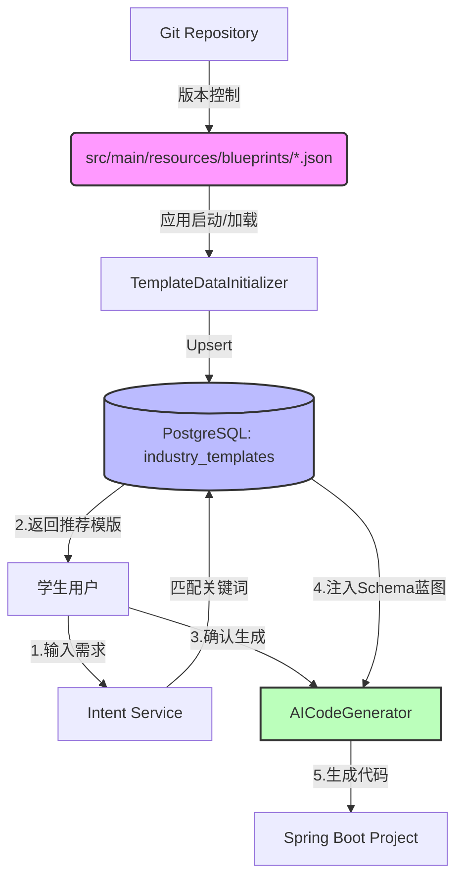

# 工程化蓝图驱动 (Blueprint-Driven) 架构方案

> **目标**：为学生用户提供“有边界、高质量、可运行”的代码生成体验。
> **核心策略**：从“元数据模版”升级为“可执行蓝图”，通过 JSON 文件管理标准架构，消除生成过程中的不确定性。

---

## 1. 核心概念：模版蓝图 (Template Blueprint)

我们将引入 **Blueprint** 概念。它不是一段模糊的描述，而是一份**机器可读的契约文档**。

### 1.1 蓝图的构成
一个标准的蓝图文件（JSON格式）包含以下四个部分：

| 部分 | 描述 | 作用 |
| :--- | :--- | :--- |
| **Meta (元数据)** | ID, Name, Version, Keywords | 用于前端搜索和意图匹配 |
| **Constraints (约束)** | 架构模式(MVC), 数据库类型, 认证方式 | 锁定技术栈，防止AI自由发挥引入复杂依赖 |
| **Schema (骨架)** | 预定义的表结构、字段类型、主外键关系 | **核心！** 强制AI基于此结构生成代码，保证逻辑自洽 |
| **Features (功能)** | 核心业务功能列表 | 指导生成 Service 层逻辑 |

### 1.2 为什么适合学生？
*   **降低门槛**：学生不需要懂复杂的数据库设计，系统直接提供“专家级”设计。
*   **保证运行**：因为 Schema 是预先验证过的，生成的代码几乎不可能出现“表关联错误”或“字段缺失”。
*   **适度自由**：学生可以在这个骨架上修改 UI 文案、增加非核心字段，满足个性化需求。

---

## 2. 架构设计与数据流

### 2.1 系统架构图



### 2.2 关键数据流变化

*   **Before (现状)**:
    *   用户输入 -> 匹配模版(仅元数据) -> 生成器(忽略模版，自由发挥) -> **风险：结构不可控**
*   **After (蓝图方案)**:
    *   用户输入 -> 匹配模版(含蓝图) -> 生成器(**强制加载蓝图Schema**) -> **结果：结构稳定，逻辑清晰**

---

## 3. 实施细节

### 3.1 数据库变更
在 `industry_templates` 表中新增 `blueprint_spec` 字段，存储 JSON 结构。

```sql
-- V22__add_blueprint_to_templates.sql
ALTER TABLE industry_templates ADD COLUMN blueprint_spec JSONB;
COMMENT ON COLUMN industry_templates.blueprint_spec IS '模版蓝图：包含Schema、API定义和生成约束';
```

### 3.2 蓝图文件规范 (Example: `marketplace.json`)
这将是我们系统的**核心资产**。

```json
{
  "id": "campus-marketplace",
  "name": "校园二手交易平台",
  "category": "电商",
  "keywords": ["二手", "闲鱼", "校园", "交易"],
  "constraints": {
    "techStack": "SpringBoot + MyBatisPlus + PostgreSQL",
    "auth": "JWT"
  },
  "schema": [
    {
      "table": "users",
      "columns": [
        {"name": "id", "type": "Long", "key": "PK"},
        {"name": "username", "type": "String"},
        {"name": "student_id", "type": "String", "comment": "学号"}
      ]
    },
    {
      "table": "products",
      "columns": [
        {"name": "id", "type": "Long", "key": "PK"},
        {"name": "seller_id", "type": "Long", "key": "FK"},
        {"name": "price", "type": "BigDecimal"}
      ]
    }
  ]
}
```

### 3.3 代码生成逻辑优化
`AICodeGenerator` 将新增一个 `PromptStrategy`：

*   **自由模式 (Freedom Mode)**: 当没有模版 ID 时，使用通用 System Prompt。
*   **蓝图模式 (Blueprint Mode)**: 当传入模版 ID 时，将 `blueprint_spec` 序列化为 Markdown 表格，拼接到 System Prompt 中，并追加指令：
    > "必须严格实现上述数据库设计。禁止修改核心表名。允许根据用户需求添加非核心字段。"

---

## 4. 执行计划 (Action Plan)

我们将在接下来的对话中按此顺序执行：

### Phase 1: 基础设施建设 (Infrastructure)
1.  [x] **设计方案确认** (当前步骤)
2.  [ ] **数据库迁移**: 创建 Flyway 脚本，添加 `blueprint_spec` 字段。
3.  [ ] **文件结构**: 创建 `backend/src/main/resources/blueprints/` 目录。

### Phase 2: 黄金模版制作 (Content)
4.  [ ] **编写模版**: 制作第一个高质量模版 `marketplace.json` (校园二手交易)，包含完整的表结构设计。
5.  [ ] **编写模版**: 制作第二个模版 `blog.json` (个人博客)，覆盖 CMS 场景。

### Phase 3: 逻辑集成 (Integration)
6.  [ ] **加载器升级**: 修改 `TemplateDataInitializer`，使其能读取 JSON 并存入数据库。
7.  [ ] **生成器升级**: 修改 `AICodeGenerator`，在生成 Prompts 时注入蓝图信息。

---

**下一步**：我将开始执行 **Phase 1 & 2**，创建目录、数据库迁移脚本以及第一个黄金模版文件。
