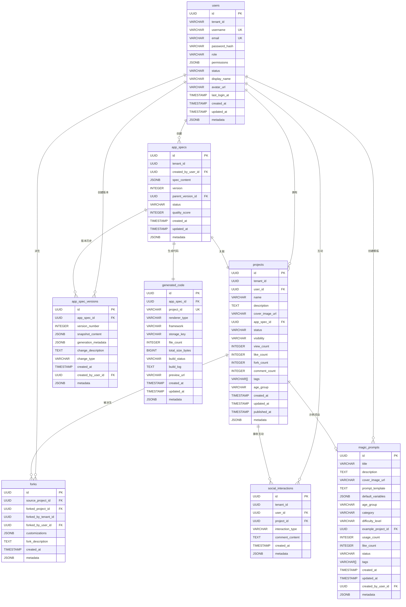

# Ingenio 数据库Schema设计文档

## 概述

Ingenio平台使用PostgreSQL 15.x作为主数据库，支持AI驱动的自然语言编程和学生创作社区功能。

## ER图



## 表设计详情

### 1. users（用户表）
**用途**: 管理用户认证信息和基本资料

**核心字段**:
- `id`: UUID主键
- `tenant_id`: 租户ID（用于租户隔离）
- `username`, `email`: 唯一标识
- `password_hash`: bcrypt密码哈希
- `role`: 角色（admin/user/viewer）
- `permissions`: JSONB权限列表

**索引**:
- `idx_users_tenant_id`
- `idx_users_username`
- `idx_users_email`
- `idx_users_status`

---

### 2. app_specs（AppSpec规范表）
**用途**: 存储AI生成的应用规范（AppSpec JSON）

**核心字段**:
- `spec_content`: JSONB完整AppSpec（包含pages/dataModels/flows/permissions）
- `version`: 版本号
- `parent_version_id`: 父版本ID（版本链）
- `status`: draft/validated/generated/published
- `quality_score`: 0-100分（ValidateAgent评分）

**特殊索引**:
- `idx_app_specs_spec_content`: GIN索引（JSONB查询优化）

---

### 3. app_spec_versions（AppSpec版本表）
**用途**: 记录每次AI生成的完整推理过程（**时光机调试核心**）

**核心字段**:
- `snapshot_content`: JSONB快照
- `generation_metadata`: JSONB AI推理元数据
  ```json
  {
    "planAgent": { "understanding": "...", "decisions": [...] },
    "executeAgent": { "reasoning": "...", "codeChoices": [...] },
    "validateAgent": { "checks": [...], "warnings": [...] },
    "userInput": "原始需求",
    "timestamp": "2024-01-01T00:00:00Z",
    "modelVersion": "deepseek-chat-v1",
    "confidence": 0.95
  }
  ```
- `change_type`: user_edit/ai_generation/rollback/fork

**特殊索引**:
- `idx_app_spec_versions_generation_metadata`: GIN索引（时光机查询优化）
- `idx_app_spec_versions_unique_version`: 唯一索引（app_spec_id + version_number）

---

### 4. generated_code（生成代码记录表）
**用途**: 存储KuiklyUI渲染器生成的代码文件信息

**核心字段**:
- `project_id`: 唯一项目标识
- `renderer_type`: kuikly-ui/react-next/vue-vite（扩展性）
- `framework`: taro/next/nuxt
- `storage_key`: MinIO存储路径
- `build_status`: pending/building/success/failed
- `preview_url`: 预览地址

---

### 5. projects（项目表）
**用途**: 学生创作的项目（社区展示和分享）

**核心字段**:
- `visibility`: private/public/unlisted
- `status`: draft/published/archived
- `age_group`: elementary/middle_school/high_school/university
- `tags`: VARCHAR[]标签数组
- `view_count`, `like_count`, `fork_count`, `comment_count`: 社交统计

**特殊索引**:
- `idx_projects_tags`: GIN索引（标签搜索）
- `idx_projects_name_search`: GIN全文搜索索引
- `idx_projects_description_search`: GIN全文搜索索引

---

### 6. forks（派生关系表）
**用途**: 记录项目的派生（Fork）关系

**核心字段**:
- `source_project_id`: 源项目
- `forked_project_id`: 派生项目
- `customizations`: JSONB定制化修改
- `fork_description`: 派生说明

**唯一约束**:
- `idx_forks_unique_fork`: 防止重复派生（source_project_id + forked_by_user_id）

---

### 7. social_interactions（社交互动表）
**用途**: 记录点赞、收藏、评论等社交互动

**核心字段**:
- `interaction_type`: like/favorite/comment/view
- `comment_content`: 评论内容（仅评论类型）

**特殊索引**:
- `idx_social_interactions_user_project_type`: 复合索引（查询用户是否点赞）
- `idx_social_interactions_unique_like_favorite`: 部分唯一索引（防止重复点赞/收藏）
- `idx_social_interactions_comment_search`: GIN全文搜索索引

---

### 8. magic_prompts（魔法提示词模板表）
**用途**: 针对不同年龄段学生的快速启动模板

**核心字段**:
- `prompt_template`: 包含变量占位符的模板
- `default_variables`: JSONB预填充变量
- `age_group`: elementary/middle_school/high_school/university
- `category`: education/game/productivity/creative/social
- `difficulty_level`: beginner/intermediate/advanced
- `example_project_id`: 示例项目ID

**特殊索引**:
- `idx_magic_prompts_tags`: GIN索引（标签搜索）
- `idx_magic_prompts_title_search`: GIN全文搜索索引

---

## 数据库特性使用

### 1. PostgreSQL UUID主键
所有表使用`UUID`作为主键，通过`gen_random_uuid()`生成。

### 2. JSONB字段
高效存储和查询JSON数据：
- `app_specs.spec_content`: AppSpec完整JSON
- `app_spec_versions.generation_metadata`: AI推理过程
- `projects.metadata`: 项目元数据
- 配合GIN索引实现高效查询

### 3. 数组类型
- `projects.tags`: VARCHAR[]标签数组
- `magic_prompts.tags`: VARCHAR[]标签数组
- 使用GIN索引优化数组搜索

### 4. 全文搜索
使用`to_tsvector`和`plainto_tsquery`实现全文搜索：
- 项目名称和描述搜索
- 魔法提示词标题和描述搜索
- 评论内容搜索

### 5. 自动更新时间戳
使用触发器`update_updated_at_column()`自动更新`updated_at`字段。

---

## 迁移脚本

### 迁移脚本清单
```
001_create_users_table.sql
002_create_app_specs_table.sql
003_create_app_spec_versions_table.sql
004_create_generated_code_table.sql
005_create_projects_table.sql
006_create_forks_table.sql
007_create_social_interactions_table.sql
008_create_magic_prompts_table.sql
```

### 回滚脚本清单
每个迁移脚本都有对应的`.down.sql`回滚脚本。

---

## 性能优化建议

### 1. 索引优化
- **GIN索引**: JSONB字段、数组字段、全文搜索
- **复合索引**: 高频查询组合（user_id + project_id + interaction_type）
- **部分索引**: 条件唯一约束（like/favorite去重）

### 2. 查询优化
- 使用分页查询避免大数据量加载
- JSONB字段使用`->`、`->>`操作符精确查询
- 全文搜索使用`@@`操作符配合GIN索引

### 3. 连接池配置
```yaml
spring:
  datasource:
    hikari:
      maximum-pool-size: 20
      minimum-idle: 5
      connection-timeout: 30000
      idle-timeout: 600000
      max-lifetime: 1800000
```

---

## 数据安全

### 1. 租户隔离
- 所有多租户表包含`tenant_id`字段
- 查询时强制添加租户ID过滤

### 2. 软删除
- 使用`status`字段标记删除（archived）
- 不直接DELETE记录（保留审计追踪）

### 3. 敏感数据
- `password_hash`: bcrypt加密
- 不记录明文密码
- API Token等敏感信息存储在`metadata`的加密字段

---

## 扩展性设计

### 1. 渲染器扩展
`generated_code.renderer_type`支持：
- 当前：`kuikly-ui`
- 未来：`react-next`, `vue-vite`, `flutter`

### 2. 框架扩展
`generated_code.framework`支持：
- 当前：`taro`
- 未来：`next`, `nuxt`, `remix`

### 3. 元数据扩展
所有表包含`metadata` JSONB字段，支持：
- 动态字段扩展
- 实验性功能配置
- 第三方集成数据

---

## 数据迁移策略

### 开发环境
```bash
# 执行迁移
psql -U postgres -d ingenio_dev -f migrations/001_create_users_table.sql

# 回滚迁移
psql -U postgres -d ingenio_dev -f migrations/001_create_users_table.down.sql
```

### 生产环境
使用Flyway或Liquibase进行版本化迁移管理。

---

## 备份策略

### 1. 全量备份
每日凌晨3点执行全量备份：
```bash
pg_dump -U postgres ingenio_prod > backup_$(date +%Y%m%d).sql
```

### 2. 增量备份
使用PostgreSQL WAL归档实现增量备份。

### 3. 关键数据实时备份
- `app_spec_versions`: 时光机调试核心数据
- `generation_metadata`: AI推理过程
- 定期导出到MinIO对象存储

---

## 监控指标

### 1. 性能指标
- 查询响应时间P95 < 50ms
- 连接池使用率 < 80%
- 慢查询日志（> 100ms）

### 2. 容量指标
- 表大小监控
- JSONB字段平均大小
- 索引命中率 > 95%

### 3. 业务指标
- 项目创建数/日
- AppSpec版本数平均值
- 社交互动活跃度

---

## 常见查询示例

### 1. 查询用户的所有项目（分页）
```sql
SELECT * FROM projects
WHERE user_id = ?
ORDER BY created_at DESC
LIMIT 20 OFFSET 0;
```

### 2. 全文搜索公开项目
```sql
SELECT * FROM projects
WHERE to_tsvector('simple', name || ' ' || description) @@ plainto_tsquery('simple', '搜索关键词')
  AND visibility = 'public'
  AND status = 'published'
ORDER BY created_at DESC;
```

### 3. 查询AppSpec的完整版本历史（时光机）
```sql
SELECT * FROM app_spec_versions
WHERE app_spec_id = ?
ORDER BY version_number DESC;
```

### 4. 查询用户是否已点赞某项目
```sql
SELECT EXISTS(
  SELECT 1 FROM social_interactions
  WHERE user_id = ?
    AND project_id = ?
    AND interaction_type = 'like'
);
```

---

## 总结

Ingenio数据库Schema设计充分利用PostgreSQL的高级特性：
- ✅ UUID主键保证分布式唯一性
- ✅ JSONB字段实现灵活的数据存储
- ✅ GIN索引优化JSONB和数组查询
- ✅ 全文搜索支持中文分词
- ✅ 租户隔离保证多租户数据安全
- ✅ 扩展性设计支持未来功能演进
- ✅ 时光机调试的核心数据结构（generation_metadata）

数据库设计遵循SOLID原则和规范化设计，为Ingenio平台的AI驱动自然语言编程功能提供了坚实的数据基础。
