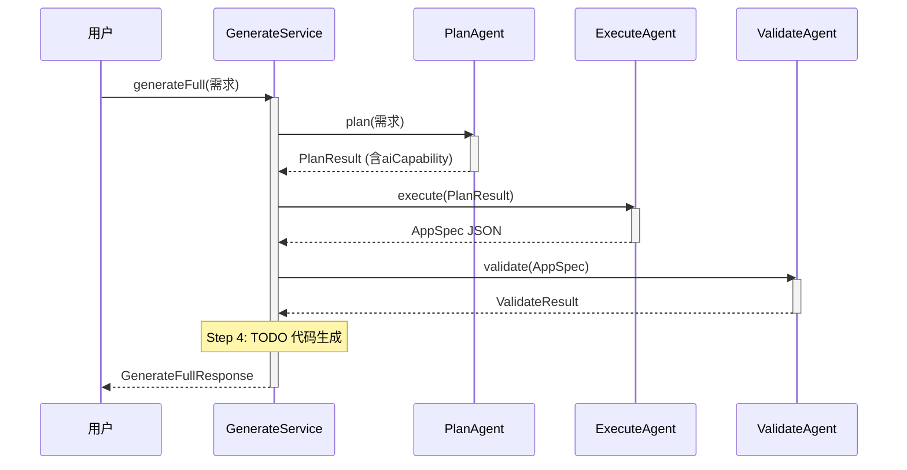
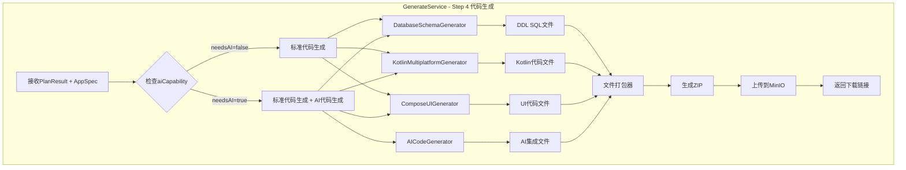
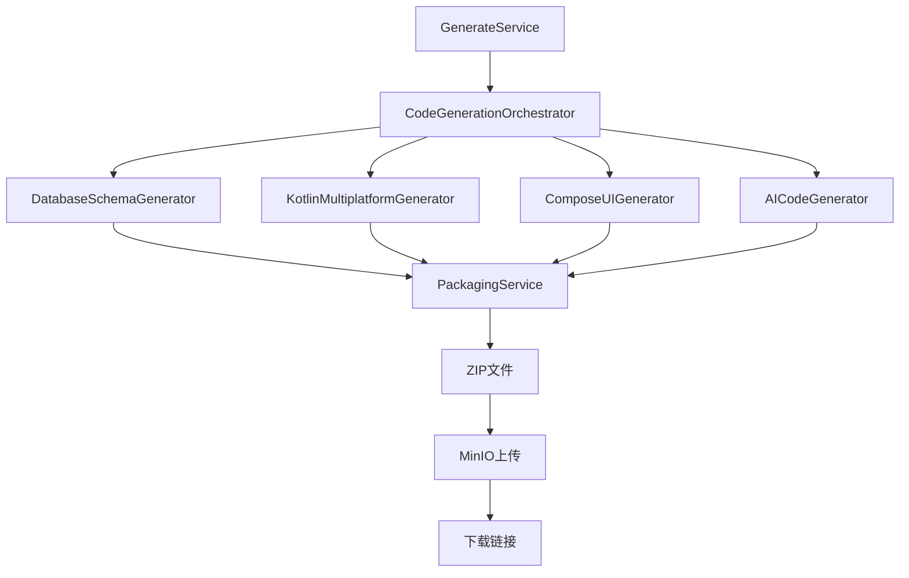

# AI代码生成集成设计文档

> **版本**: v1.0.0
> **作者**: Ingenio Team
> **日期**: 2025-11-09
> **状态**: Draft - 待评审

---

## 1. 背景和目标

### 1.1 问题描述

当前Ingenio系统已经实现了以下功能：
- ✅ PlanAgent可以检测需求中的AI能力（aiCapability字段）
- ✅ AICodeGenerator可以生成KuiklyUI的AI集成代码（6个文件）
- ❌ 但AI代码生成器**未集成到实际的代码生成流程中**

GenerateService.java的line 104有明确的TODO注释：
```java
// TODO: 实现代码生成逻辑（调用Kuikly代码生成器）
```

### 1.2 目标

将AICodeGenerator集成到GenerateService的完整代码生成流程中，实现：

1. **自动检测AI能力**: 根据PlanResult.aiCapability自动判断是否需要生成AI代码
2. **统一代码生成**: 集成DatabaseSchemaGenerator、KotlinMultiplatformGenerator、ComposeUIGenerator、AICodeGenerator
3. **代码打包**: 将所有生成的文件（DDL、Kotlin代码、AI代码）打包为ZIP供用户下载
4. **前端展示**: 前端可以展示AI代码文件清单和预览

---

## 2. 现有架构分析

### 2.1 三Agent工作流



### 2.2 现有Generator服务

| Generator | 输入 | 输出 | 用途 |
|-----------|------|------|------|
| **DatabaseSchemaGenerator** | StructuredRequirementEntity | GeneratedSchemaEntity (DDL) | 生成PostgreSQL表结构 |
| **KotlinMultiplatformGenerator** | Map<String, Object> entity | String kotlinCode | 生成data class/Repository/ViewModel |
| **ComposeUIGenerator** | Map<String, Object> entity | String uiCode | 生成Compose Multiplatform UI |
| **AICodeGenerator** | AICapabilityRequirement + packageName + appName | Map<String, String> files | 生成KuiklyUI AI集成代码 |

### 2.3 数据流分析

**当前问题**：
- ExecuteAgent输出AppSpec JSON（配置格式）
- Generator输出Kotlin源码文件（文本格式）
- **两者格式不统一，需要桥接层**

---

## 3. 集成方案设计

### 3.1 方案A：在GenerateService中统一编排（推荐）

**核心思想**: 在GenerateService的Step 4实现完整的代码生成逻辑，编排所有Generator。

#### 架构图



#### 实现步骤

**Step 4.1: 生成数据库Schema**
```java
// 从AppSpec提取实体定义
List<Map<String, Object>> entities = extractEntities(appSpecJson);

// 生成DDL SQL
String ddlSql = databaseSchemaGenerator.generateDDL(entities);
generatedFiles.put("database/schema.sql", ddlSql);
```

**Step 4.2: 生成Kotlin Multiplatform代码**
```java
for (Map<String, Object> entity : entities) {
    // 数据模型
    String dataModel = kmpGenerator.generateDataModel(entity);
    generatedFiles.put(getDataModelPath(entity), dataModel);

    // Repository
    String repository = kmpGenerator.generateRepository(entity);
    generatedFiles.put(getRepositoryPath(entity), repository);

    // ViewModel
    String viewModel = kmpGenerator.generateViewModel(entity);
    generatedFiles.put(getViewModelPath(entity), viewModel);
}
```

**Step 4.3: 生成UI代码**
```java
for (Map<String, Object> entity : entities) {
    // 列表界面
    String listScreen = composeUIGenerator.generateListScreen(entity);
    generatedFiles.put(getListScreenPath(entity), listScreen);

    // 表单界面
    String formScreen = composeUIGenerator.generateFormScreen(entity);
    generatedFiles.put(getFormScreenPath(entity), formScreen);
}

// 导航配置
String navigation = composeUIGenerator.generateNavigation(entities);
generatedFiles.put("navigation/AppNavigation.kt", navigation);
```

**Step 4.4: 如果需要AI能力，生成AI代码**
```java
if (planResult.getAiCapability() != null &&
    Boolean.TRUE.equals(planResult.getAiCapability().getNeedsAI())) {

    String packageName = extractPackageName(appSpecJson);
    String appName = (String) appSpecJson.get("appName");

    // 调用AICodeGenerator生成AI集成代码
    Map<String, String> aiFiles = aiCodeGenerator.generateAICode(
        planResult.getAiCapability(),
        packageName,
        appName
    );

    // 合并到生成文件中
    generatedFiles.putAll(aiFiles);

    log.info("AI代码生成完成: 共{}个文件", aiFiles.size());
}
```

**Step 4.5: 打包所有文件**
```java
// 创建临时目录
Path tempDir = Files.createTempDirectory("ingenio-code-");

// 写入所有文件
for (Map.Entry<String, String> entry : generatedFiles.entrySet()) {
    Path filePath = tempDir.resolve(entry.getKey());
    Files.createDirectories(filePath.getParent());
    Files.writeString(filePath, entry.getValue());
}

// 打包为ZIP
String zipFileName = "generated-code-" + UUID.randomUUID() + ".zip";
Path zipPath = zipService.createZip(tempDir, zipFileName);

// 上传到MinIO
String downloadUrl = minioService.uploadFile(zipPath, "generated-code/" + zipFileName);

log.info("代码打包完成: url={}", downloadUrl);
return downloadUrl;
```

#### 优势

1. ✅ **遵循现有架构**: GenerateService已经是主编排器
2. ✅ **最小侵入性**: 无需修改PlanAgent/ExecuteAgent
3. ✅ **清晰的责任划分**:
   - PlanAgent: 需求分析和AI能力检测
   - ExecuteAgent: AppSpec JSON生成
   - GenerateService: 代码文件生成编排
   - AICodeGenerator: AI代码文件生成
4. ✅ **易于扩展**: 未来添加新Generator只需注入并调用

---

### 3.2 方案B：创建独立的CodeGenerationOrchestrator（备选）

**核心思想**: 创建专门的代码生成编排服务，解耦代码生成逻辑。

#### 架构图



#### 实现示例

```java
@Service
@RequiredArgsConstructor
public class CodeGenerationOrchestrator {

    private final DatabaseSchemaGenerator schemaGenerator;
    private final KotlinMultiplatformGenerator kmpGenerator;
    private final ComposeUIGenerator composeGenerator;
    private final AICodeGenerator aiCodeGenerator;
    private final PackagingService packagingService;

    public CodeGenerationResult generate(PlanResult planResult, Map<String, Object> appSpec) {
        Map<String, String> allFiles = new HashMap<>();

        // 1. 生成数据库Schema
        allFiles.putAll(generateDatabaseSchema(appSpec));

        // 2. 生成Kotlin代码
        allFiles.putAll(generateKotlinCode(appSpec));

        // 3. 生成UI代码
        allFiles.putAll(generateUICode(appSpec));

        // 4. 如果需要AI，生成AI代码
        if (needsAICode(planResult)) {
            allFiles.putAll(generateAICode(planResult, appSpec));
        }

        // 5. 打包并上传
        String downloadUrl = packagingService.packageAndUpload(allFiles);

        return CodeGenerationResult.builder()
                .totalFiles(allFiles.size())
                .downloadUrl(downloadUrl)
                .fileStats(calculateStats(allFiles))
                .build();
    }

    private Map<String, String> generateAICode(PlanResult planResult, Map<String, Object> appSpec) {
        String packageName = extractPackageName(appSpec);
        String appName = (String) appSpec.get("appName");

        return aiCodeGenerator.generateAICode(
            planResult.getAiCapability(),
            packageName,
            appName
        );
    }

    private boolean needsAICode(PlanResult planResult) {
        return planResult.getAiCapability() != null &&
               Boolean.TRUE.equals(planResult.getAiCapability().getNeedsAI());
    }
}
```

#### 优劣分析

**优势**:
- ✅ 职责更清晰：代码生成逻辑独立
- ✅ 易于测试：可以单独测试编排逻辑
- ✅ 更灵活：可以支持多种代码生成场景

**劣势**:
- ❌ 增加复杂度：多了一层抽象
- ❌ 需要修改GenerateService的调用方式
- ❌ 对当前架构侵入性较大

---

## 4. 数据结构扩展

### 4.1 扩展GenerateFullResponse

```java
@Data
@Builder
@NoArgsConstructor
@AllArgsConstructor
public class GenerateFullResponse {
    // 现有字段...
    private UUID appSpecId;
    private PlanResult planResult;
    private ValidateResult validateResult;

    // 新增字段
    private String codeDownloadUrl;              // 代码ZIP下载链接
    private CodeGenerationSummary codeSummary;   // 代码生成摘要
    private List<String> generatedFileList;      // 生成文件清单

    @Data
    @Builder
    @NoArgsConstructor
    @AllArgsConstructor
    public static class CodeGenerationSummary {
        private Integer totalFiles;               // 总文件数
        private Integer databaseSchemaFiles;      // 数据库DDL文件数
        private Integer dataModelFiles;           // 数据模型文件数
        private Integer repositoryFiles;          // Repository文件数
        private Integer viewModelFiles;           // ViewModel文件数
        private Integer uiScreenFiles;            // UI界面文件数
        private Integer aiIntegrationFiles;       // AI集成文件数（新增）
        private Long totalSize;                   // 总文件大小（字节）
        private String zipFileName;               // ZIP文件名
    }
}
```

### 4.2 扩展GenerateFullRequest

```java
@Data
@Builder
@NoArgsConstructor
@AllArgsConstructor
public class GenerateFullRequest {
    // 现有字段...
    private String userRequirement;
    private Boolean skipValidation;
    private Integer qualityThreshold;

    // 新增字段
    private Boolean generatePreview;             // 是否生成代码预览（已存在）
    private Boolean generateAICode;              // 是否生成AI代码（可选覆盖）
    private String packageName;                  // 包名（如com.example.myapp）
    private String appName;                      // 应用名称（如"我的AI助手"）
}
```

---

## 5. 实现计划

### 5.1 Phase 1.2: ExecuteAgent集成AICodeGenerator（3-4小时）

**任务清单**:
- [ ] 1. 修改GenerateService.java
  - [ ] 注入AICodeGenerator、DatabaseSchemaGenerator等
  - [ ] 实现Step 4完整代码生成逻辑
  - [ ] 添加AI代码检测和生成分支
- [ ] 2. 创建CodePackagingService
  - [ ] 实现文件写入和ZIP打包
  - [ ] 集成MinIO上传功能
- [ ] 3. 扩展GenerateFullResponse
  - [ ] 添加codeDownloadUrl字段
  - [ ] 添加CodeGenerationSummary结构
- [ ] 4. 单元测试
  - [ ] 测试AI代码生成分支
  - [ ] 测试文件打包逻辑
  - [ ] 测试完整生成流程

### 5.2 Phase 1.3: 前端适配和E2E测试（2-3小时）

**任务清单**:
- [ ] 1. 前端GenerateFullResponse类型定义
  - [ ] 添加codeDownloadUrl和codeSummary字段
- [ ] 2. UI展示优化
  - [ ] 显示"AI代码生成中..."状态
  - [ ] 展示AI文件清单（6个文件）
  - [ ] 提供ZIP下载按钮
- [ ] 3. E2E测试
  - [ ] 测试带AI能力的需求生成
  - [ ] 验证AI代码文件包含在ZIP中
  - [ ] 验证下载链接有效

### 5.3 Phase 1.4: 文档和示例（1-2小时）

**任务清单**:
- [ ] 1. 更新API文档
  - [ ] 记录GenerateFullResponse新字段
  - [ ] 添加AI代码生成示例
- [ ] 2. 编写使用文档
  - [ ] AI代码生成配置指南
  - [ ] 生成文件结构说明
  - [ ] 常见问题FAQ
- [ ] 3. 创建示例项目
  - [ ] 提供完整的AI聊天应用示例
  - [ ] 包含KuiklyUI集成说明

---

## 6. 风险和注意事项

### 6.1 风险

| 风险 | 影响 | 缓解措施 |
|-----|------|---------|
| **AI代码生成失败** | 用户无法获得AI集成代码 | 添加降级逻辑，失败时仍返回基础代码 |
| **ZIP打包超时** | 文件过多导致打包慢 | 异步打包，返回任务ID轮询状态 |
| **MinIO上传失败** | 用户无法下载代码 | 添加重试机制，提供备用下载方式 |
| **包名格式错误** | 代码无法编译 | 严格验证包名格式，提供示例 |

### 6.2 注意事项

1. **包名提取逻辑**: 需要从AppSpec中提取或由用户提供packageName
2. **文件路径冲突**: AI代码文件路径需要与KMP代码不冲突
3. **内存占用**: 大量文件生成需要注意内存使用
4. **并发安全**: 多用户同时生成代码需要隔离临时目录
5. **清理策略**: 临时文件需要定时清理，避免磁盘占满

---

## 7. 测试策略

### 7.1 单元测试

```java
@Test
@DisplayName("生成带AI能力的代码 - 完整流程")
void testGenerateWithAI_Success() {
    // 准备测试数据
    GenerateFullRequest request = GenerateFullRequest.builder()
            .userRequirement("构建图书管理系统，支持AI智能推荐")
            .generatePreview(true)
            .packageName("com.example.bookstore")
            .appName("智能书店")
            .build();

    // 执行生成
    GenerateFullResponse response = generateService.generateFull(request);

    // 验证结果
    assertEquals("completed", response.getStatus());
    assertNotNull(response.getCodeDownloadUrl());
    assertNotNull(response.getCodeSummary());
    assertEquals(6, response.getCodeSummary().getAiIntegrationFiles());
    assertTrue(response.getGeneratedFileList().contains("AIServicePager.kt"));
}
```

### 7.2 E2E测试

```typescript
test('完整代码生成流程 - 带AI能力', async ({ page }) => {
  // 1. 输入需求
  await page.goto('/wizard/new');
  await page.fill('[data-testid="requirement-input"]',
    '构建电商平台，需要AI智能客服功能');
  await page.click('[data-testid="submit-button"]');

  // 2. 等待PlanAgent完成
  await page.waitForSelector('[data-testid="plan-complete"]');

  // 3. 验证AI能力检测
  const aiCapability = await page.textContent('[data-testid="ai-capability"]');
  expect(aiCapability).toContain('CHATBOT');

  // 4. 等待代码生成完成
  await page.waitForSelector('[data-testid="code-download"]', { timeout: 60000 });

  // 5. 验证AI文件列表
  const fileList = await page.textContent('[data-testid="file-list"]');
  expect(fileList).toContain('AIServicePager.kt');
  expect(fileList).toContain('AIService.kt');

  // 6. 下载ZIP并验证
  const downloadPromise = page.waitForEvent('download');
  await page.click('[data-testid="download-button"]');
  const download = await downloadPromise;
  expect(download.suggestedFilename()).toMatch(/generated-code-.*\.zip/);
});
```

---

## 8. 成功指标

### 8.1 功能指标

- ✅ PlanAgent检测到AI能力时，自动生成AI代码
- ✅ 生成的ZIP包含所有文件（DDL + Kotlin + UI + AI）
- ✅ AI代码文件数量正确（6个文件）
- ✅ 代码可以编译通过
- ✅ 下载链接有效期≥7天

### 8.2 性能指标

- ✅ AI代码生成耗时<5秒
- ✅ 文件打包耗时<10秒
- ✅ 总生成时间<60秒
- ✅ ZIP文件大小<5MB

### 8.3 质量指标

- ✅ 单元测试覆盖率≥85%
- ✅ E2E测试通过率100%
- ✅ 代码规范检查通过
- ✅ 无安全漏洞（SQL注入、路径穿越等）

---

## 9. 后续优化

### 9.1 短期优化（1-2周）

1. **异步生成**: 代码生成改为异步任务，返回taskId轮询状态
2. **增量生成**: 支持只生成修改的部分，而非全量
3. **模板自定义**: 允许用户自定义AI代码模板
4. **多AI提供商**: 支持OpenAI、Anthropic等多种AI API

### 9.2 中期优化（1-2月）

1. **实时预览**: 前端实时预览生成的代码
2. **在线编辑**: 支持在线修改生成的代码
3. **版本管理**: 集成时光机，管理代码版本
4. **CI/CD集成**: 自动构建和部署生成的代码

### 9.3 长期规划（3-6月）

1. **AI代码优化**: 使用AI优化生成的代码质量
2. **智能推荐**: 根据历史数据推荐最佳AI配置
3. **社区模板**: 建立社区模板库，共享优秀实践
4. **多语言支持**: 支持Java、Swift、Flutter等多种语言

---

## 10. 结论

**推荐方案**: 方案A - 在GenerateService中统一编排

**理由**:
1. 最小侵入性，符合现有架构
2. 实现简单，风险可控
3. 易于维护和扩展

**下一步行动**:
1. ✅ 完成调研和设计（当前文档）
2. 🔄 开始Phase 1.2实现（ExecuteAgent集成AICodeGenerator）
3. ⏳ 前端适配和E2E测试
4. ⏳ 文档和示例编写

---

**文档维护记录**:
- 2025-11-09: 初稿完成，待团队评审
