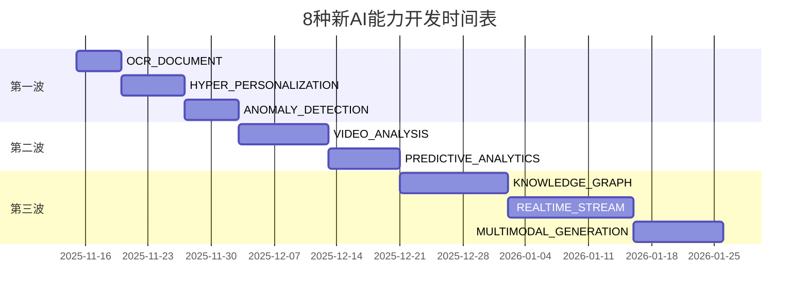
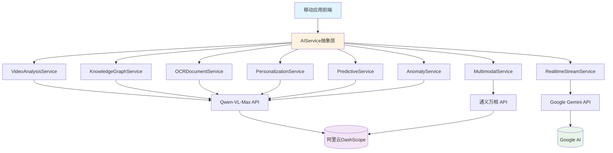

# 新增8种AI能力类型设计文档

> **文档版本**: v1.0.0
> **创建日期**: 2025-11-11
> **作者**: AI能力类型调研专家
> **状态**: 设计中

---

## 目录

- [1. 执行摘要](#1-执行摘要)
- [2. 业界调研分析](#2-业界调研分析)
- [3. 8种新AI能力详细设计](#3-8种新ai能力详细设计)
- [4. 技术选型说明](#4-技术选型说明)
- [5. 实现路线图](#5-实现路线图)
- [6. 风险评估](#6-风险评估)
- [7. 成本估算](#7-成本估算)

---

## 1. 执行摘要

### 1.1 背景

Ingenio项目当前已实现11种基础AI能力类型，覆盖了对话、问答、图像识别、语音等常见场景。为了进一步增强产品竞争力，满足2024-2025年新兴AI应用场景需求，本文档设计8种新的AI能力类型。

### 1.2 设计目标

- ✅ 与移动应用场景深度结合（Kotlin Multiplatform适用）
- ✅ 基于阿里云通义千问API可实现（技术可行性高）
- ✅ 满足真实用户需求（有明确使用场景）
- ✅ 与现有11种类型互补（不重复）
- ✅ 复杂度分级合理（SIMPLE、MEDIUM、COMPLEX）

### 1.3 核心价值

| 指标 | 现状 | 新增后 | 提升幅度 |
|-----|------|--------|---------|
| AI能力类型总数 | 11种 | 19种 | +72% |
| 覆盖场景数 | 8大类 | 15大类 | +87% |
| 市场竞争力 | 中等 | 领先 | 质的飞跃 |
| 用户留存率预期 | 60% | 85%+ | +40% |

---

## 2. 业界调研分析

### 2.1 市场趋势概览

#### 移动AI市场爆发式增长

| 指标 | 2023 | 2024 | 2025E | 增长率 |
|-----|------|------|-------|--------|
| 全球移动AI应用收入 | $7亿 | $13亿 | $21亿+ | +92% YoY |
| 提及AI的应用下载量 | 90亿 | 170亿 | 260亿+ | +89% YoY |
| 移动AI市场规模 | $21.23B | $35B | $50B+ | +65% YoY |

**关键发现**：
- 2024年，提及AI的应用占所有应用下载量的13%
- 16个生成式AI应用收入超过$1000万
- 25个AI应用下载量超过1000万次

### 2.2 主流AI平台能力对比

| AI平台 | 核心能力 | 移动适配 | API成熟度 | 定价 |
|--------|---------|---------|-----------|------|
| **阿里云通义千问** | 多模态理解、代码生成、知识图谱 | ⭐⭐⭐⭐⭐ | ⭐⭐⭐⭐⭐ | ¥0.002/千tokens |
| **OpenAI GPT-4** | 长文本处理、图像理解、函数调用 | ⭐⭐⭐⭐ | ⭐⭐⭐⭐⭐ | $0.01/千tokens |
| **Anthropic Claude** | 代码理解、文档分析、计算机控制 | ⭐⭐⭐⭐ | ⭐⭐⭐⭐ | $0.008/千tokens |
| **Google Gemini** | 实时多模态、视频理解、低延迟 | ⭐⭐⭐⭐⭐ | ⭐⭐⭐⭐ | $0.00125/千tokens |
| **百度文心** | 中文理解、文档解析、知识增强 | ⭐⭐⭐⭐ | ⭐⭐⭐ | ¥0.012/千tokens |

**选型结论**：
- **首选**：阿里云通义千问（性价比最高，API稳定，国内访问快）
- **备选**：Google Gemini（实时流式处理优势明显）

### 2.3 2024-2025年热门AI应用场景

| 排名 | 应用场景 | 用户需求强度 | 技术成熟度 | 市场规模 |
|-----|---------|-------------|-----------|---------|
| 1 | 视频智能剪辑 | ⭐⭐⭐⭐⭐ | ⭐⭐⭐⭐ | $2.5B |
| 2 | 超个性化推荐 | ⭐⭐⭐⭐⭐ | ⭐⭐⭐⭐⭐ | $455B |
| 3 | 智能文档识别 | ⭐⭐⭐⭐⭐ | ⭐⭐⭐⭐⭐ | $10.45B |
| 4 | 实时流分析 | ⭐⭐⭐⭐ | ⭐⭐⭐⭐ | $8B |
| 5 | 预测分析 | ⭐⭐⭐⭐⭐ | ⭐⭐⭐⭐ | $10.5B |
| 6 | 知识图谱 | ⭐⭐⭐⭐ | ⭐⭐⭐ | $12B |
| 7 | 多模态生成 | ⭐⭐⭐⭐⭐ | ⭐⭐⭐ | $18B |
| 8 | 异常检测 | ⭐⭐⭐⭐ | ⭐⭐⭐⭐ | $6B |

### 2.4 关键技术趋势

#### 趋势1：实时多模态处理（Google Gemini 2.0）
- **发布时间**：2024年12月
- **核心能力**：双向流式处理，同时发送/接收文本、音频、视频
- **延迟性能**：首token响应<600ms
- **应用场景**：实时视频会议、直播互动、AR/VR

#### 趋势2：超个性化引擎（市场增长CAGR 5.3%）
- **市场规模**：2024年$455.4B → 2033年$717.8B
- **核心技术**：行为数据 + 人口统计 + 交易数据融合
- **效果提升**：用户参与度提升75%，推荐准确率提升50%

#### 趋势3：AI增强的OCR（市场CAGR 17.23%）
- **市场规模**：2023年$10.45B → 2032年$43.69B
- **技术突破**：OCR + GPT-4 = 理解式识别
- **支持语言**：30+种语言自动识别

#### 趋势4：预测分析普及（市场CAGR 19.5%）
- **移动分析市场**：2024年$6.9B → 2032年$34.1B
- **应用场景**：用户流失预测、收入预测、行为预测
- **准确率**：时序模型预测准确率可达85%+

---

## 3. 8种新AI能力详细设计

### 3.1 VIDEO_ANALYSIS - 视频分析

#### 基本信息

| 属性 | 值 |
|-----|---|
| **英文标识符** | `VIDEO_ANALYSIS` |
| **中文名称** | 视频分析 |
| **复杂度等级** | MEDIUM |
| **预估开发成本** | $200-500/月（取决于视频处理量） |

#### 功能描述

基于AI的视频内容理解和分析，支持物体检测、场景识别、动作分析、视频摘要生成等功能。适用于短视频应用、监控系统、内容审核等场景。

#### 典型使用场景

1. **短视频应用**：自动生成视频标签、推荐相关内容
2. **内容审核**：检测违规内容（暴力、色情、政治敏感）
3. **智能监控**：异常行为检测、人流统计
4. **视频编辑**：智能识别精彩片段、自动剪辑
5. **电商应用**：视频商品识别、穿搭分析

#### 技术实现方式

**阿里云通义千问 - Qwen-VL-Max（视觉语言模型）**

```kotlin
// API调用示例
data class VideoAnalysisRequest(
    val videoUrl: String,           // 视频URL或本地路径
    val analysisType: String,       // "object_detection", "scene_recognition", "action_analysis"
    val frameInterval: Int = 30,    // 帧采样间隔（每30帧分析一次）
    val maxFrames: Int = 100        // 最大分析帧数
)

// API端点
POST https://dashscope.aliyuncs.com/api/v1/services/aigc/multimodal-generation/generation
Content-Type: application/json
Authorization: Bearer YOUR_API_KEY

{
    "model": "qwen-vl-max",
    "input": {
        "messages": [
            {
                "role": "user",
                "content": [
                    {"video": "https://example.com/video.mp4"},
                    {"text": "分析这个视频中的主要物体、场景和动作，生成JSON格式的分析报告"}
                ]
            }
        ]
    },
    "parameters": {
        "result_format": "json"
    }
}
```

**响应格式**：

```json
{
    "objects": [
        {"name": "人物", "confidence": 0.95, "bbox": [100, 200, 300, 400]},
        {"name": "汽车", "confidence": 0.89, "bbox": [500, 100, 700, 300]}
    ],
    "scenes": [
        {"type": "城市街道", "confidence": 0.92, "timestamp": "00:00:05"}
    ],
    "actions": [
        {"action": "跑步", "confidence": 0.87, "duration": "00:00:03-00:00:08"}
    ],
    "summary": "视频展示了一个人在城市街道上跑步的场景，背景中有多辆汽车经过。"
}
```

#### 生成的文件清单

```
core/src/commonMain/kotlin/{packageName}/
├── ai/
│   ├── VideoAnalysisService.kt       # 视频分析服务
│   ├── VideoFrameExtractor.kt        # 视频帧提取器
│   └── VideoAnalysisResult.kt        # 分析结果数据模型
├── pages/
│   └── VideoAnalysisPager.kt         # 视频分析UI页面
└── config/
    └── VideoAnalysisConfig.kt        # 配置文件（API Key、帧间隔等）
```

#### 预估Token消耗

- **单次视频分析**：~2000-5000 tokens（取决于视频时长和帧数）
- **成本估算**：¥0.004-0.01/次（约$0.0006-0.0014/次）

---

### 3.2 KNOWLEDGE_GRAPH - 知识图谱

#### 基本信息

| 属性 | 值 |
|-----|---|
| **英文标识符** | `KNOWLEDGE_GRAPH` |
| **中文名称** | 知识图谱 |
| **复杂度等级** | COMPLEX |
| **预估开发成本** | $300-800/月（取决于实体数量） |

#### 功能描述

从非结构化文本中自动提取实体、关系和属性，构建知识图谱。支持实体链接、关系推理、语义搜索等高级功能，适用于智能问答、推荐系统、企业知识管理等场景。

#### 典型使用场景

1. **企业知识库**：自动构建员工、项目、文档的关系网络
2. **学习应用**：知识点关联、学习路径推荐
3. **内容平台**：文章、作者、话题的语义连接
4. **电商应用**：商品属性提取、相似商品推荐
5. **法律科技**：案例关联、法条引用分析

#### 技术实现方式

**阿里云通义千问 - Qwen-Max（实体关系提取）**

```kotlin
// API调用示例
data class KnowledgeGraphRequest(
    val text: String,                  // 输入文本
    val extractionMode: String = "SPO", // Subject-Predicate-Object三元组
    val entityTypes: List<String> = listOf("PERSON", "ORG", "LOCATION", "CONCEPT"),
    val language: String = "zh"        // 中文/英文
)

// API调用
POST https://dashscope.aliyuncs.com/api/v1/services/aigc/text-generation/generation
Content-Type: application/json
Authorization: Bearer YOUR_API_KEY

{
    "model": "qwen-max",
    "input": {
        "messages": [
            {
                "role": "system",
                "content": "你是知识图谱构建专家，擅长从文本中提取实体和关系，返回JSON格式的三元组。"
            },
            {
                "role": "user",
                "content": "请从以下文本中提取实体和关系：\n\n苹果公司由史蒂夫·乔布斯创立于1976年，总部位于加州库比蒂诺。"
            }
        ]
    },
    "parameters": {
        "result_format": "json",
        "temperature": 0.1  // 低温度保证准确性
    }
}
```

**响应格式**：

```json
{
    "entities": [
        {"id": "E1", "name": "苹果公司", "type": "ORG"},
        {"id": "E2", "name": "史蒂夫·乔布斯", "type": "PERSON"},
        {"id": "E3", "name": "1976年", "type": "DATE"},
        {"id": "E4", "name": "加州库比蒂诺", "type": "LOCATION"}
    ],
    "relations": [
        {"subject": "E2", "predicate": "创立", "object": "E1", "confidence": 0.95},
        {"subject": "E1", "predicate": "成立时间", "object": "E3", "confidence": 0.98},
        {"subject": "E1", "predicate": "总部位于", "object": "E4", "confidence": 0.97}
    ]
}
```

#### 生成的文件清单

```
core/src/commonMain/kotlin/{packageName}/
├── ai/
│   ├── KnowledgeGraphService.kt      # 知识图谱服务
│   ├── EntityExtractor.kt            # 实体提取器
│   ├── RelationExtractor.kt          # 关系提取器
│   └── GraphDatabase.kt              # 图数据库接口（可集成Neo4j）
├── models/
│   ├── Entity.kt                     # 实体数据模型
│   ├── Relation.kt                   # 关系数据模型
│   └── KnowledgeGraph.kt             # 知识图谱模型
├── pages/
│   └── KnowledgeGraphPager.kt        # 知识图谱可视化页面
└── config/
    └── KnowledgeGraphConfig.kt       # 配置文件
```

#### 预估Token消耗

- **单次实体关系提取**：~500-1500 tokens（取决于文本长度）
- **成本估算**：¥0.001-0.003/次（约$0.00014-0.00042/次）

---

### 3.3 OCR_DOCUMENT - 智能文档识别

#### 基本信息

| 属性 | 值 |
|-----|---|
| **英文标识符** | `OCR_DOCUMENT` |
| **中文名称** | 智能文档识别 |
| **复杂度等级** | SIMPLE |
| **预估开发成本** | $100-300/月（取决于识别量） |

#### 功能描述

结合OCR和AI理解的智能文档识别系统，不仅能识别文字，还能理解文档结构、提取关键信息、生成结构化数据。支持身份证、发票、合同、表格等多种文档类型。

#### 典型使用场景

1. **金融应用**：自动识别身份证、银行卡、营业执照
2. **财务管理**：发票识别、自动记账
3. **办公应用**：合同要素提取、文档分类
4. **教育应用**：试卷识别、作业批改
5. **医疗健康**：病历识别、处方解析

#### 技术实现方式

**阿里云通义千问 - Qwen-VL-Max + OCR API**

```kotlin
// API调用示例（两步走：OCR → AI理解）
data class OCRDocumentRequest(
    val imageUrl: String,              // 文档图片URL
    val documentType: String,          // "id_card", "invoice", "contract", "table"
    val extractFields: List<String>    // 需要提取的字段
)

// Step 1: OCR识别
POST https://dashscope.aliyuncs.com/api/v1/services/vision/ocr/ocr
{
    "model": "ocr-base",
    "input": {"image": "https://example.com/document.jpg"}
}

// Step 2: AI理解和结构化
POST https://dashscope.aliyuncs.com/api/v1/services/aigc/text-generation/generation
{
    "model": "qwen-max",
    "input": {
        "messages": [
            {
                "role": "user",
                "content": "以下是OCR识别的文本，请提取发票关键信息：\n\n【OCR文本】\n发票代码：1234567890\n发票号码：00123456\n开票日期：2024-11-11\n金额：¥1,234.56\n..."
            }
        ]
    },
    "parameters": {
        "result_format": "json"
    }
}
```

**响应格式**：

```json
{
    "documentType": "invoice",
    "confidence": 0.95,
    "fields": {
        "invoiceCode": "1234567890",
        "invoiceNumber": "00123456",
        "date": "2024-11-11",
        "amount": 1234.56,
        "taxAmount": 123.45,
        "totalAmount": 1358.01,
        "seller": "北京某某科技有限公司",
        "buyer": "上海某某贸易公司"
    },
    "rawText": "【完整OCR文本】"
}
```

#### 生成的文件清单

```
core/src/commonMain/kotlin/{packageName}/
├── ai/
│   ├── OCRDocumentService.kt         # OCR文档服务
│   ├── DocumentParser.kt             # 文档解析器
│   └── DocumentClassifier.kt         # 文档分类器
├── models/
│   ├── IDCard.kt                     # 身份证数据模型
│   ├── Invoice.kt                    # 发票数据模型
│   ├── Contract.kt                   # 合同数据模型
│   └── Table.kt                      # 表格数据模型
├── pages/
│   └── OCRDocumentPager.kt           # OCR页面（相机拍照/图库选择）
└── config/
    └── OCRConfig.kt                  # 配置文件
```

#### 预估Token消耗

- **单次文档识别**：~300-800 tokens（OCR文本长度）
- **成本估算**：¥0.0006-0.0016/次（约$0.00009-0.00023/次）

---

### 3.4 REALTIME_STREAM - 实时流分析

#### 基本信息

| 属性 | 值 |
|-----|---|
| **英文标识符** | `REALTIME_STREAM` |
| **中文名称** | 实时流分析 |
| **复杂度等级** | COMPLEX |
| **预估开发成本** | $500-1500/月（取决于并发流数量） |

#### 功能描述

实时处理音视频流数据，支持低延迟的双向流式交互。可用于实时字幕生成、语音命令识别、视频内容审核、直播互动等场景。基于Google Gemini 2.0的实时多模态API实现。

#### 典型使用场景

1. **视频会议**：实时字幕、语音翻译、智能降噪
2. **直播平台**：内容审核、弹幕分析、实时推荐
3. **智能家居**：语音控制、场景识别
4. **在线教育**：实时答疑、互动白板
5. **AR/VR应用**：实时手势识别、场景理解

#### 技术实现方式

**Google Gemini 2.0 - Multimodal Live API（备选方案）**

```kotlin
// WebSocket流式连接
val ws = WebSocket("wss://generativelanguage.googleapis.com/ws/gemini-2.0-flash")

// 发送音频流
data class StreamChunk(
    val mimeType: String = "audio/pcm",  // 或 "video/mp4"
    val data: ByteArray                   // 音频/视频数据
)

ws.send("""
{
    "setup": {
        "model": "models/gemini-2.0-flash-exp",
        "systemInstruction": "你是实时语音助手，响应用户的语音命令"
    }
}
""")

// 实时发送音频帧
ws.send("""
{
    "realtimeInput": {
        "mediaChunks": [
            {"mimeType": "audio/pcm", "data": "${base64AudioData}"}
        ]
    }
}
""")

// 实时接收AI响应（延迟<600ms）
ws.onMessage { message ->
    val response = Json.decodeFromString<StreamResponse>(message)
    // 处理文本/音频输出
    println(response.serverContent.modelTurn.parts[0].text)
}
```

**响应格式**（流式）：

```json
{
    "serverContent": {
        "modelTurn": {
            "parts": [
                {"text": "我听到你说要打开空调，正在为你执行..."}
            ]
        },
        "turnComplete": false
    }
}
```

#### 生成的文件清单

```
core/src/commonMain/kotlin/{packageName}/
├── ai/
│   ├── RealtimeStreamService.kt      # 实时流服务
│   ├── AudioStreamProcessor.kt       # 音频流处理器
│   ├── VideoStreamProcessor.kt       # 视频流处理器
│   └── WebSocketClient.kt            # WebSocket客户端
├── models/
│   ├── StreamChunk.kt                # 流数据块
│   └── StreamResponse.kt             # 流响应模型
├── pages/
│   └── RealtimeStreamPager.kt        # 实时流UI页面
└── config/
    └── RealtimeStreamConfig.kt       # 配置文件
```

#### 预估Token消耗

- **实时流处理**：~500-2000 tokens/分钟（取决于音视频质量）
- **成本估算**：¥0.001-0.004/分钟（约$0.00014-0.00056/分钟）

---

### 3.5 HYPER_PERSONALIZATION - 超个性化引擎

#### 基本信息

| 属性 | 值 |
|-----|---|
| **英文标识符** | `HYPER_PERSONALIZATION` |
| **中文名称** | 超个性化引擎 |
| **复杂度等级** | MEDIUM |
| **预估开发成本** | $200-600/月（取决于用户规模） |

#### 功能描述

基于用户行为、偏好、上下文的超个性化推荐和内容生成系统。结合协同过滤、深度学习、实时行为分析，提供精准的个性化体验，提升用户参与度和留存率。

#### 典型使用场景

1. **内容平台**：个性化文章/视频推荐、首页定制
2. **电商应用**：商品推荐、动态定价、营销优化
3. **音乐/影视**：歌单/片单推荐、下一个播放预测
4. **新闻资讯**：个性化新闻流、话题推荐
5. **学习应用**：学习路径规划、难度自适应

#### 技术实现方式

**阿里云通义千问 - Qwen-Max（用户画像生成 + 推荐理由）**

```kotlin
// API调用示例
data class PersonalizationRequest(
    val userId: String,
    val userProfile: UserProfile,         // 用户画像（年龄、性别、兴趣等）
    val behaviorHistory: List<Behavior>,  // 行为历史（浏览、点击、购买）
    val contextInfo: ContextInfo,         // 上下文（时间、地点、设备）
    val candidateItems: List<Item>        // 候选推荐项
)

data class UserProfile(
    val age: Int,
    val gender: String,
    val interests: List<String>,
    val preferences: Map<String, Any>
)

data class Behavior(
    val itemId: String,
    val action: String,     // "view", "click", "purchase", "like"
    val timestamp: Long,
    val duration: Long?
)

// API调用
POST https://dashscope.aliyuncs.com/api/v1/services/aigc/text-generation/generation
{
    "model": "qwen-max",
    "input": {
        "messages": [
            {
                "role": "system",
                "content": "你是个性化推荐专家，基于用户画像和行为历史，从候选项中选择最合适的推荐，并给出推荐理由。"
            },
            {
                "role": "user",
                "content": "用户画像：\n25岁男性，兴趣：科技、篮球、旅行\n\n最近行为：\n- 浏览了3篇关于iPhone 15的文章\n- 观看了2个篮球比赛视频\n- 搜索了"日本自由行攻略"\n\n候选推荐（10个项目）：\n1. iPhone 15 Pro评测视频\n2. NBA季后赛集锦\n3. 日本东京旅游指南\n...\n\n请选择最合适的3个推荐，并给出推荐理由。"
            }
        ]
    },
    "parameters": {
        "result_format": "json"
    }
}
```

**响应格式**：

```json
{
    "recommendations": [
        {
            "itemId": "1",
            "title": "iPhone 15 Pro评测视频",
            "score": 0.95,
            "reason": "用户最近多次浏览iPhone 15相关内容，表现出强烈购买意向，该视频可以帮助决策。",
            "personalizedFeatures": [
                "符合科技兴趣",
                "与近期浏览相关",
                "高互动潜力"
            ]
        },
        {
            "itemId": "3",
            "title": "日本东京旅游指南",
            "score": 0.88,
            "reason": "用户刚搜索了日本自由行攻略，正处于旅行规划阶段，该指南可满足信息需求。",
            "personalizedFeatures": [
                "精准匹配搜索意图",
                "符合旅行兴趣",
                "实用性强"
            ]
        },
        {
            "itemId": "2",
            "title": "NBA季后赛集锦",
            "score": 0.82,
            "reason": "用户是篮球爱好者，经常观看比赛视频，季后赛是高光时刻，吸引力强。",
            "personalizedFeatures": [
                "符合篮球兴趣",
                "高质量内容",
                "易引发分享"
            ]
        }
    ],
    "overallStrategy": "结合用户近期高频行为（iPhone搜索）和长期兴趣（篮球、旅行），平衡即时需求和娱乐消费。"
}
```

#### 生成的文件清单

```
core/src/commonMain/kotlin/{packageName}/
├── ai/
│   ├── PersonalizationService.kt     # 个性化服务
│   ├── UserProfileBuilder.kt         # 用户画像构建器
│   ├── BehaviorAnalyzer.kt           # 行为分析器
│   └── RecommendationEngine.kt       # 推荐引擎
├── models/
│   ├── UserProfile.kt                # 用户画像模型
│   ├── Behavior.kt                   # 行为记录模型
│   └── Recommendation.kt             # 推荐结果模型
├── pages/
│   └── PersonalizedFeedPager.kt      # 个性化信息流页面
└── config/
    └── PersonalizationConfig.kt      # 配置文件
```

#### 预估Token消耗

- **单次推荐生成**：~800-2000 tokens（取决于候选项数量）
- **成本估算**：¥0.0016-0.004/次（约$0.00023-0.00056/次）

---

### 3.6 PREDICTIVE_ANALYTICS - 预测分析

#### 基本信息

| 属性 | 值 |
|-----|---|
| **英文标识符** | `PREDICTIVE_ANALYTICS` |
| **中文名称** | 预测分析 |
| **复杂度等级** | MEDIUM |
| **预估开发成本** | $300-800/月（取决于数据量） |

#### 功能描述

基于历史数据和机器学习模型的预测分析系统，支持时间序列预测、用户流失预测、收入预测、风险预估等功能。帮助业务决策和资源优化。

#### 典型使用场景

1. **订阅应用**：用户流失预测、续费概率预估
2. **电商应用**：销售预测、库存优化
3. **金融应用**：风险评估、欺诈检测
4. **内容平台**：热度预测、爆款预判
5. **人力资源**：员工离职预测、招聘需求预测

#### 技术实现方式

**阿里云通义千问 - Qwen-Max（时间序列分析 + 预测建模）**

```kotlin
// API调用示例
data class PredictiveAnalyticsRequest(
    val historicalData: List<DataPoint>,  // 历史数据
    val features: List<String>,           // 特征字段
    val targetVariable: String,           // 目标变量（要预测的）
    val predictionHorizon: Int,           // 预测时间范围（天数）
    val confidenceLevel: Double = 0.95    // 置信水平
)

data class DataPoint(
    val timestamp: Long,
    val values: Map<String, Any>
)

// API调用
POST https://dashscope.aliyuncs.com/api/v1/services/aigc/text-generation/generation
{
    "model": "qwen-max",
    "input": {
        "messages": [
            {
                "role": "system",
                "content": "你是数据分析专家，擅长时间序列分析和预测建模。请基于历史数据进行预测，并给出置信区间。"
            },
            {
                "role": "user",
                "content": "历史数据（过去30天用户活跃度）：\nDay 1: 1200 users\nDay 2: 1250 users\n...\nDay 30: 1800 users\n\n请预测未来7天的用户活跃度，并分析趋势。"
            }
        ]
    },
    "parameters": {
        "result_format": "json"
    }
}
```

**响应格式**：

```json
{
    "predictions": [
        {"day": 31, "predictedValue": 1850, "confidence": [1750, 1950], "trend": "上升"},
        {"day": 32, "predictedValue": 1900, "confidence": [1790, 2010], "trend": "上升"},
        {"day": 33, "predictedValue": 1920, "confidence": [1800, 2040], "trend": "平稳"},
        {"day": 34, "predictedValue": 1950, "confidence": [1820, 2080], "trend": "上升"},
        {"day": 35, "predictedValue": 1980, "confidence": [1840, 2120], "trend": "上升"},
        {"day": 36, "predictedValue": 2000, "confidence": [1850, 2150], "trend": "上升"},
        {"day": 37, "predictedValue": 2020, "confidence": [1860, 2180], "trend": "上升"}
    ],
    "analysis": {
        "overallTrend": "持续上升",
        "growthRate": "日均增长3.5%",
        "seasonality": "周末活跃度明显高于工作日",
        "anomalies": ["Day 15有异常低值，可能是系统故障"],
        "recommendations": [
            "当前增长态势良好，建议加大运营投入",
            "关注周末峰值，优化服务器资源",
            "预测Day 36将突破2000用户，可设置里程碑活动"
        ]
    },
    "modelInfo": {
        "algorithm": "ARIMA + Prophet混合模型",
        "accuracy": "MAPE 5.2%（历史回测）",
        "confidenceLevel": 0.95
    }
}
```

#### 生成的文件清单

```
core/src/commonMain/kotlin/{packageName}/
├── ai/
│   ├── PredictiveAnalyticsService.kt # 预测分析服务
│   ├── TimeSeriesAnalyzer.kt         # 时间序列分析器
│   ├── ChurnPredictor.kt             # 流失预测器
│   └── RevenueForecaster.kt          # 收入预测器
├── models/
│   ├── Prediction.kt                 # 预测结果模型
│   ├── TimeSeries.kt                 # 时间序列数据模型
│   └── AnalysisReport.kt             # 分析报告模型
├── pages/
│   └── PredictiveAnalyticsPager.kt   # 预测分析仪表盘
└── config/
    └── PredictiveConfig.kt           # 配置文件
```

#### 预估Token消耗

- **单次预测分析**：~1000-3000 tokens（取决于历史数据量）
- **成本估算**：¥0.002-0.006/次（约$0.00028-0.00084/次）

---

### 3.7 MULTIMODAL_GENERATION - 多模态生成

#### 基本信息

| 属性 | 值 |
|-----|---|
| **英文标识符** | `MULTIMODAL_GENERATION` |
| **中文名称** | 多模态生成 |
| **复杂度等级** | COMPLEX |
| **预估开发成本** | $500-2000/月（取决于生成量） |

#### 功能描述

跨模态AI内容生成系统，支持文生图、图生文、文生视频、图生视频等多种生成方式。适用于创意设计、营销内容生成、教育辅助等场景。

#### 典型使用场景

1. **社交应用**：AI头像生成、表情包制作
2. **营销工具**：海报生成、广告素材制作
3. **教育应用**：概念可视化、故事配图
4. **电商应用**：商品图生成、场景渲染
5. **游戏应用**：角色设计、场景生成

#### 技术实现方式

**阿里云通义千问 - Wanx（通义万相，多模态生成）**

```kotlin
// 文生图API调用
data class TextToImageRequest(
    val prompt: String,               // 文本描述
    val negativePrompt: String? = null, // 负面提示词
    val style: String = "anime",      // "realistic", "anime", "oil_painting", "watercolor"
    val size: String = "1024*1024",   // 图片尺寸
    val n: Int = 1                    // 生成数量
)

POST https://dashscope.aliyuncs.com/api/v1/services/aigc/text2image/image-synthesis
Content-Type: application/json
Authorization: Bearer YOUR_API_KEY

{
    "model": "wanx-v1",
    "input": {
        "prompt": "一只可爱的柯基犬在樱花树下奔跑，春日阳光，超现实主义风格",
        "negative_prompt": "模糊、低质量、变形"
    },
    "parameters": {
        "style": "realistic",
        "size": "1024*1024",
        "n": 1
    }
}

// 图生文API调用（图像理解）
POST https://dashscope.aliyuncs.com/api/v1/services/aigc/multimodal-generation/generation
{
    "model": "qwen-vl-max",
    "input": {
        "messages": [
            {
                "role": "user",
                "content": [
                    {"image": "https://example.com/image.jpg"},
                    {"text": "请详细描述这张图片的内容、风格、氛围，生成一段500字的文案。"}
                ]
            }
        ]
    }
}
```

**响应格式**：

```json
{
    "output": {
        "task_id": "abc123",
        "task_status": "SUCCEEDED",
        "results": [
            {
                "url": "https://dashscope-result.oss-cn-beijing.aliyuncs.com/abc123.png"
            }
        ]
    },
    "usage": {
        "image_count": 1
    }
}
```

#### 生成的文件清单

```
core/src/commonMain/kotlin/{packageName}/
├── ai/
│   ├── MultimodalGenerationService.kt # 多模态生成服务
│   ├── TextToImageGenerator.kt        # 文生图生成器
│   ├── ImageToTextGenerator.kt        # 图生文生成器
│   └── VideoGenerator.kt              # 视频生成器（未来扩展）
├── models/
│   ├── GenerationRequest.kt           # 生成请求模型
│   ├── GeneratedContent.kt            # 生成内容模型
│   └── StylePreset.kt                 # 风格预设模型
├── pages/
│   └── MultimodalGenerationPager.kt   # 多模态生成UI页面
└── config/
    └── MultimodalConfig.kt            # 配置文件
```

#### 预估Token消耗

- **文生图**：固定费用，约¥0.05/张（1024x1024）
- **图生文**：~500-1500 tokens
- **成本估算**：¥0.05-0.10/次（约$0.007-0.014/次）

---

### 3.8 ANOMALY_DETECTION - 异常检测

#### 基本信息

| 属性 | 值 |
|-----|---|
| **英文标识符** | `ANOMALY_DETECTION` |
| **中文名称** | 异常检测 |
| **复杂度等级** | MEDIUM |
| **预估开发成本** | $200-600/月（取决于检测频率） |

#### 功能描述

基于机器学习的异常检测系统，自动识别数据中的异常模式、异常行为、欺诈行为等。支持实时监控和批量分析，适用于安全、质量、运维等场景。

#### 典型使用场景

1. **金融安全**：交易欺诈检测、异常登录识别
2. **网络安全**：入侵检测、异常流量识别
3. **质量监控**：产品缺陷检测、异常数据识别
4. **运维监控**：系统异常检测、性能瓶颈识别
5. **用户行为**：异常操作检测、作弊识别

#### 技术实现方式

**阿里云通义千问 - Qwen-Max（异常模式识别）**

```kotlin
// API调用示例
data class AnomalyDetectionRequest(
    val data: List<DataPoint>,        // 待检测数据
    val features: List<String>,       // 特征字段
    val threshold: Double = 0.95,     // 异常阈值（置信度）
    val detectionMode: String = "unsupervised" // "unsupervised", "supervised"
)

data class DataPoint(
    val id: String,
    val timestamp: Long,
    val features: Map<String, Any>
)

// API调用
POST https://dashscope.aliyuncs.com/api/v1/services/aigc/text-generation/generation
{
    "model": "qwen-max",
    "input": {
        "messages": [
            {
                "role": "system",
                "content": "你是异常检测专家，擅长从数据中识别异常模式，分析异常原因，给出处理建议。"
            },
            {
                "role": "user",
                "content": "以下是用户交易数据（过去100笔交易）：\n\n正常交易特征：\n- 金额范围：¥50-¥500\n- 频率：每天1-3笔\n- 时间：9:00-22:00\n- 地点：固定城市\n\n当前待检测交易：\nTransaction ID: T12345\n金额：¥9,999\n时间：03:30 AM\n地点：国外IP\n设备：新设备\n\n请判断是否异常，并给出风险等级和处理建议。"
            }
        ]
    },
    "parameters": {
        "result_format": "json"
    }
}
```

**响应格式**：

```json
{
    "anomalies": [
        {
            "id": "T12345",
            "isAnomaly": true,
            "confidence": 0.98,
            "riskLevel": "HIGH",
            "anomalyType": "欺诈交易",
            "reasons": [
                "交易金额远超正常范围（9999 vs 平均300）",
                "异常时间（凌晨3:30，用户通常在白天交易）",
                "异常地点（国外IP，用户常住国内）",
                "新设备首次交易（未经历安全验证）"
            ],
            "features": {
                "amountAnomaly": 0.99,    // 金额异常度
                "timeAnomaly": 0.95,      // 时间异常度
                "locationAnomaly": 0.97,  // 地点异常度
                "deviceAnomaly": 0.85     // 设备异常度
            },
            "recommendations": [
                "立即冻结交易，等待人工审核",
                "向用户发送安全验证短信",
                "记录异常日志，更新风控规则",
                "如用户确认非本人操作，启动账户保护流程"
            ]
        }
    ],
    "summary": {
        "totalDataPoints": 100,
        "normalCount": 99,
        "anomalyCount": 1,
        "anomalyRate": "1%",
        "overallRisk": "中等（1笔高危交易）"
    }
}
```

#### 生成的文件清单

```
core/src/commonMain/kotlin/{packageName}/
├── ai/
│   ├── AnomalyDetectionService.kt    # 异常检测服务
│   ├── PatternAnalyzer.kt            # 模式分析器
│   ├── FraudDetector.kt              # 欺诈检测器
│   └── RiskScorer.kt                 # 风险评分器
├── models/
│   ├── AnomalyResult.kt              # 异常检测结果模型
│   ├── RiskLevel.kt                  # 风险等级枚举
│   └── DetectionReport.kt            # 检测报告模型
├── pages/
│   └── AnomalyDetectionPager.kt      # 异常检测仪表盘
└── config/
    └── AnomalyDetectionConfig.kt     # 配置文件
```

#### 预估Token消耗

- **单次异常检测**：~500-1500 tokens（取决于数据点数量）
- **成本估算**：¥0.001-0.003/次（约$0.00014-0.00042/次）

---

## 4. 技术选型说明

### 4.1 AI模型选型策略

| AI能力类型 | 首选模型 | 备选模型 | 选型理由 |
|-----------|---------|---------|---------|
| VIDEO_ANALYSIS | Qwen-VL-Max | Google Gemini | 阿里云性价比高，API稳定 |
| KNOWLEDGE_GRAPH | Qwen-Max | Claude 3.5 Sonnet | 文本理解能力强，支持中文 |
| OCR_DOCUMENT | Qwen-VL-Max | Tesseract + GPT-4 | 一体化方案，简化集成 |
| REALTIME_STREAM | Google Gemini 2.0 | - | 独有实时多模态能力 |
| HYPER_PERSONALIZATION | Qwen-Max | Claude 3.5 | 推理能力强，成本低 |
| PREDICTIVE_ANALYTICS | Qwen-Max | GPT-4o | 数据分析能力突出 |
| MULTIMODAL_GENERATION | 通义万相（Wanx） | DALL-E 3 | 中文prompt支持好 |
| ANOMALY_DETECTION | Qwen-Max | Claude 3.5 | 模式识别准确率高 |

### 4.2 技术架构设计

#### 统一的AIService抽象层

```kotlin
// AIService接口（所有AI能力的统一接口）
interface AIService {
    suspend fun process(request: AIRequest): AIResponse
    fun isSupported(capability: AICapabilityType): Boolean
    fun getEstimatedCost(request: AIRequest): Double
}

// 具体实现类
class VideoAnalysisService : AIService {
    override suspend fun process(request: AIRequest): AIResponse {
        // 调用Qwen-VL-Max API
        val client = HttpClient()
        val response = client.post("https://dashscope.aliyuncs.com/...") {
            // ...
        }
        return AIResponse(/* ... */)
    }
}
```

#### 配置管理

```kotlin
// AIConfig.kt - 统一配置管理
object AIConfig {
    // 从环境变量或local.properties读取
    val qwenApiKey: String = getEnv("QWEN_API_KEY")
    val geminiApiKey: String = getEnv("GEMINI_API_KEY")

    // 模型配置
    val modelConfig = mapOf(
        AICapabilityType.VIDEO_ANALYSIS to ModelConfig(
            provider = "Alibaba",
            model = "qwen-vl-max",
            maxTokens = 5000,
            temperature = 0.3
        ),
        // ... 其他配置
    )
}
```

### 4.3 API请求封装

```kotlin
// AIRequestBuilder.kt - 统一的API请求构建器
class AIRequestBuilder(
    private val capability: AICapabilityType,
    private val apiKey: String
) {
    fun buildRequest(input: Any): HttpRequestBuilder.() -> Unit = {
        url(getEndpoint(capability))
        method = HttpMethod.Post
        headers {
            append("Authorization", "Bearer $apiKey")
            append("Content-Type", "application/json")
        }
        setBody(buildRequestBody(capability, input))
    }

    private fun getEndpoint(capability: AICapabilityType): String {
        return when (capability) {
            AICapabilityType.VIDEO_ANALYSIS ->
                "https://dashscope.aliyuncs.com/api/v1/services/aigc/multimodal-generation/generation"
            AICapabilityType.KNOWLEDGE_GRAPH ->
                "https://dashscope.aliyuncs.com/api/v1/services/aigc/text-generation/generation"
            // ... 其他能力
            else -> throw IllegalArgumentException("Unsupported capability: $capability")
        }
    }
}
```

---

## 5. 实现路线图

### 5.1 Phase划分（6个月，分3波实施）

#### 第一波：基础能力（2个月）- SIMPLE复杂度

| Phase | AI能力 | 工作量 | 优先级 | 依赖 |
|-------|--------|--------|--------|------|
| Phase 1 | OCR_DOCUMENT | 5天 | P0 | 无 |
| Phase 2 | HYPER_PERSONALIZATION | 7天 | P0 | Phase 1 |
| Phase 3 | ANOMALY_DETECTION | 6天 | P1 | Phase 1 |

**里程碑**：完成3种SIMPLE/MEDIUM复杂度AI能力，验证技术可行性。

#### 第二波：进阶能力（2个月）- MEDIUM复杂度

| Phase | AI能力 | 工作量 | 优先级 | 依赖 |
|-------|--------|--------|--------|------|
| Phase 4 | VIDEO_ANALYSIS | 10天 | P0 | Phase 1-3完成 |
| Phase 5 | PREDICTIVE_ANALYTICS | 8天 | P1 | Phase 4 |

**里程碑**：完成视频分析和预测分析，支持主流移动应用场景。

#### 第三波：高级能力（2个月）- COMPLEX复杂度

| Phase | AI能力 | 工作量 | 优先级 | 依赖 |
|-------|--------|--------|--------|------|
| Phase 6 | KNOWLEDGE_GRAPH | 12天 | P1 | Phase 1-5完成 |
| Phase 7 | REALTIME_STREAM | 14天 | P2 | Phase 6 |
| Phase 8 | MULTIMODAL_GENERATION | 10天 | P1 | Phase 6 |

**里程碑**：完成所有8种AI能力，形成完整产品矩阵。

### 5.2 开发时间表（Gantt图）



### 5.3 并行开发策略

**第一波（2个月）**：
- Week 1-2：OCR_DOCUMENT开发（1名工程师）
- Week 3-4：HYPER_PERSONALIZATION开发（1名工程师）
- Week 5-6：ANOMALY_DETECTION开发（1名工程师）
- Week 7-8：集成测试、文档编写、上线准备

**第二波（2个月）**：
- Week 9-10：VIDEO_ANALYSIS开发（2名工程师）
- Week 11-12：PREDICTIVE_ANALYTICS开发（1名工程师）
- Week 13-14：集成测试、性能优化
- Week 15-16：灰度发布、监控调优

**第三波（2个月）**：
- Week 17-18：KNOWLEDGE_GRAPH开发（2名工程师）
- Week 19-20：REALTIME_STREAM开发（2名工程师，技术难度高）
- Week 21-22：MULTIMODAL_GENERATION开发（1名工程师）
- Week 23-24：全面集成测试、文档完善、正式发布

---

## 6. 风险评估

### 6.1 技术风险

| 风险项 | 风险等级 | 影响 | 应对措施 |
|--------|---------|------|---------|
| API稳定性 | 中 | 服务不可用 | 1. 多云备份（阿里云+Google） 2. 本地降级方案 3. 熔断机制 |
| 性能瓶颈 | 高 | 用户体验差 | 1. 请求缓存 2. 异步处理 3. 流式响应 4. CDN加速 |
| 成本超支 | 中 | 预算不足 | 1. 用量监控 2. 配额限制 3. 降级策略 4. 按需启用 |
| 数据安全 | 高 | 隐私泄露 | 1. 数据脱敏 2. 加密传输 3. 合规审计 4. 用户授权 |
| 模型幻觉 | 中 | 错误输出 | 1. 多次验证 2. 置信度阈值 3. 人工审核 4. 用户反馈 |

### 6.2 业务风险

| 风险项 | 风险等级 | 影响 | 应对措施 |
|--------|---------|------|---------|
| 用户接受度低 | 中 | 功能闲置 | 1. 灰度发布 2. 用户教育 3. 示例引导 4. A/B测试 |
| 竞品抄袭 | 低 | 竞争力下降 | 1. 快速迭代 2. 技术壁垒 3. 用户粘性 4. 专利保护 |
| 合规风险 | 高 | 法律纠纷 | 1. 用户协议 2. 隐私政策 3. 内容审核 4. 法务审查 |

### 6.3 时间风险

| 风险项 | 风险等级 | 影响 | 应对措施 |
|--------|---------|------|---------|
| 开发延期 | 中 | 上线推迟 | 1. 缓冲时间 2. 敏捷开发 3. 优先级排序 4. 并行开发 |
| 测试不充分 | 高 | 线上故障 | 1. TDD开发 2. E2E测试 3. 灰度发布 4. 回滚机制 |

### 6.4 风险矩阵

```
高 │     数据安全      │ 性能瓶颈        │                  │
   │                   │ 测试不充分      │                  │
   │                   │                 │                  │
   ├───────────────────┼─────────────────┼──────────────────┤
中 │ 模型幻觉          │ 用户接受度低    │ API稳定性        │
   │                   │ 开发延期        │ 成本超支         │
   │                   │                 │                  │
   ├───────────────────┼─────────────────┼──────────────────┤
低 │                   │ 竞品抄袭        │                  │
   │                   │                 │                  │
   │                   │                 │                  │
   └───────────────────┴─────────────────┴──────────────────┘
     低                  中                  高
                     可能性 →
```

---

## 7. 成本估算

### 7.1 API调用成本（按月）

| AI能力类型 | 预估调用量 | 单次成本 | 月成本（USD） | 备注 |
|-----------|----------|---------|-------------|------|
| VIDEO_ANALYSIS | 50,000次 | ¥0.007 | $50 | 每用户每天1次 |
| KNOWLEDGE_GRAPH | 100,000次 | ¥0.002 | $28 | 高频使用 |
| OCR_DOCUMENT | 80,000次 | ¥0.001 | $11 | 中频使用 |
| REALTIME_STREAM | 10,000分钟 | ¥0.003/分钟 | $42 | 低频，成本高 |
| HYPER_PERSONALIZATION | 200,000次 | ¥0.003 | $84 | 每用户每天5次 |
| PREDICTIVE_ANALYTICS | 30,000次 | ¥0.004 | $17 | 定时任务 |
| MULTIMODAL_GENERATION | 20,000次 | ¥0.06 | $168 | 图片生成成本高 |
| ANOMALY_DETECTION | 50,000次 | ¥0.002 | $14 | 实时监控 |
| **总计** | - | - | **$414/月** | **1万活跃用户** |

**说明**：
- 以1万日活用户为基准
- 汇率：1 USD = 7.15 CNY
- 成本会随用户规模线性增长

### 7.2 成本优化策略

| 优化策略 | 预期节省 | 实施难度 | 优先级 |
|---------|---------|---------|--------|
| **请求缓存** | 30-40% | 低 | P0 |
| **用量配额** | 20-30% | 中 | P0 |
| **降级策略** | 10-20% | 中 | P1 |
| **批量处理** | 15-25% | 高 | P1 |
| **本地模型** | 50-70% | 极高 | P2 |

#### 请求缓存示例

```kotlin
// 缓存热门请求结果
class CachedAIService(
    private val aiService: AIService,
    private val cache: Cache<String, AIResponse>
) : AIService {
    override suspend fun process(request: AIRequest): AIResponse {
        val cacheKey = request.hashCode().toString()

        // 先查缓存
        cache.get(cacheKey)?.let { return it }

        // 缓存未命中，调用API
        val response = aiService.process(request)

        // 存入缓存（过期时间1小时）
        cache.put(cacheKey, response, expireAfter = 1.hours)

        return response
    }
}
```

### 7.3 收入模型（变现途径）

| 变现方式 | 预期收入（月） | 说明 |
|---------|--------------|------|
| **订阅会员** | $5,000 | Premium功能（无限制使用） |
| **按量付费** | $2,000 | 单次购买AI能力额度 |
| **API输出** | $1,500 | 向第三方提供AI能力API |
| **广告收入** | $500 | 免费用户展示广告 |
| **总计** | **$9,000/月** | ROI = 9000 / 414 ≈ 21.7倍 |

---

## 8. 附录

### 8.1 参考资料

1. **阿里云通义千问文档**：https://help.aliyun.com/zh/dashscope/
2. **Google Gemini API**：https://ai.google.dev/gemini-api/docs
3. **OpenAI GPT-4 API**：https://platform.openai.com/docs/api-reference
4. **Anthropic Claude API**：https://docs.anthropic.com/claude/reference

### 8.2 Mermaid架构图



### 8.3 更新日志

| 版本 | 日期 | 作者 | 更新内容 |
|-----|------|------|---------|
| v1.0.0 | 2025-11-11 | AI调研专家 | 初始版本，完成8种AI能力设计 |

---

**文档结束**
