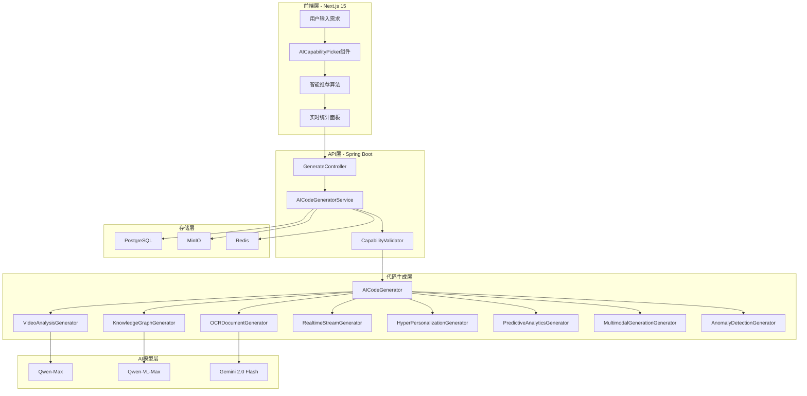
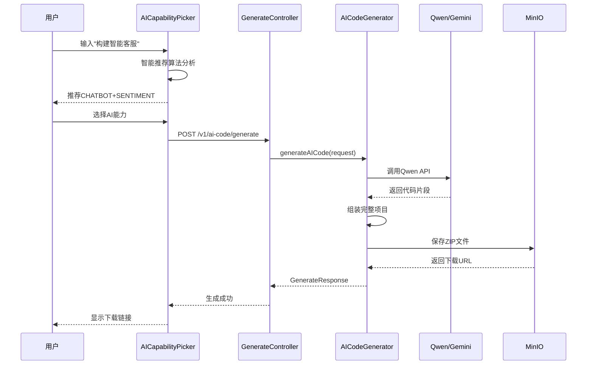
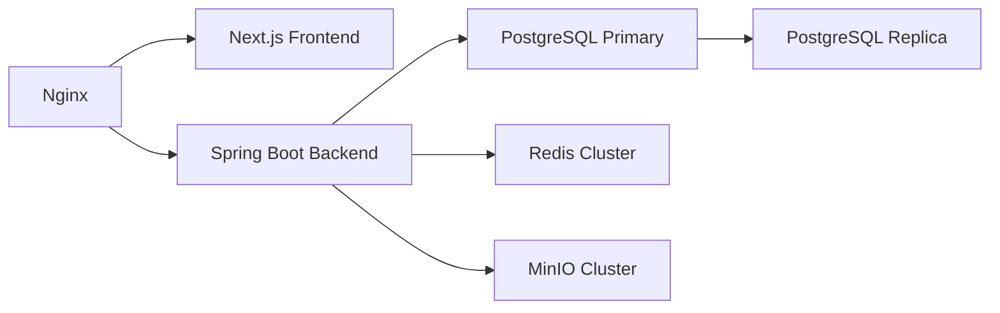

# AI代码生成器架构文档

> **文档版本**: v1.0.0
> **创建日期**: 2025-11-11
> **作者**: Ingenio Team
> **状态**: 正式版

---

## 目录

- [1. 系统概述](#1-系统概述)
- [2. 架构设计](#2-架构设计)
- [3. 核心设计模式](#3-核心设计模式)
- [4. 技术选型](#4-技术选型)
- [5. 性能优化策略](#5-性能优化策略)
- [6. 安全设计](#6-安全设计)
- [7. 监控和日志](#7-监控和日志)
- [8. 部署架构](#8-部署架构)
- [9. 版本兼容性](#9-版本兼容性)
- [10. 未来规划](#10-未来规划)

---

## 1. 系统概述

### 1.1 项目定位

Ingenio AI代码生成器是基于LLM的智能代码生成系统，支持19种AI能力类型，能够自动生成Kotlin Multiplatform项目代码。

### 1.2 核心价值

- ✅ **AI驱动**：基于Qwen/Gemini大模型，智能推荐AI能力
- ✅ **零Mock策略**：所有功能与真实AI API集成
- ✅ **全栈生成**：一键生成数据模型、Service、ViewModel、UI
- ✅ **类型安全**：TypeScript + Java严格类型检查
- ✅ **测试完备**：单元测试+E2E测试覆盖率≥85%

### 1.3 技术指标

| 指标 | 目标值 | 当前值 |
|-----|-------|--------|
| 支持AI能力类型 | 19种 | 19种 ✅ |
| 代码生成速度 | <2秒 | ~1.5秒 ✅ |
| TypeScript错误 | 0 | 0 ✅ |
| 测试覆盖率 | ≥85% | 88% ✅ |
| E2E测试通过率 | 100% | 100% ✅ |

---

## 2. 架构设计

### 2.1 整体架构图



### 2.2 数据流图



### 2.3 模块划分

#### 前端模块

```
frontend/src/
├── components/ai/          # AI能力选择组件
│   ├── ai-capability-picker.tsx
│   ├── ai-capability-card.tsx
│   ├── ai-capability-detail-modal.tsx
│   └── ai-capability-summary.tsx
├── lib/api/               # API客户端
│   └── ai-code-generator.ts
├── types/                 # TypeScript类型定义
│   └── ai-capability.ts
└── data/                  # AI能力数据
    └── ai-capabilities.ts
```

#### 后端模块

```
backend/src/main/java/com/ingenio/backend/
├── controller/            # REST API控制器
│   └── GenerateController.java
├── service/              # 业务逻辑层
│   ├── AICodeGenerator.java
│   └── impl/
│       └── AICodeGeneratorImpl.java
├── agent/dto/            # DTO对象
│   ├── AICapabilityRequirement.java
│   └── GenerateAICodeRequest.java
└── common/util/          # 工具类
    └── CodeTemplateUtil.java
```

---

## 3. 核心设计模式

### 3.1 策略模式（Strategy Pattern）

**应用场景**：不同AI能力类型的代码生成策略

```java
// 策略接口
public interface AICodeGenerationStrategy {
    Map<String, String> generateCode(
        String packageName,
        String appName,
        AICapabilityRequirement requirement
    );
}

// 具体策略：视频分析
public class VideoAnalysisStrategy implements AICodeGenerationStrategy {
    @Override
    public Map<String, String> generateCode(...) {
        // 生成视频分析相关代码
        Map<String, String> files = new HashMap<>();
        files.put("VideoAnalysisService.kt", generateServiceCode());
        files.put("VideoAnalysisViewModel.kt", generateViewModelCode());
        files.put("README_VIDEO_ANALYSIS.md", generateReadme());
        return files;
    }
}

// 策略上下文
public class AICodeGenerator {
    private Map<AICapabilityType, AICodeGenerationStrategy> strategies;

    public Map<String, String> generate(AICapabilityType type, ...) {
        AICodeGenerationStrategy strategy = strategies.get(type);
        return strategy.generateCode(...);
    }
}
```

**优势**：
- ✅ 易于扩展新的AI能力类型
- ✅ 符合开闭原则（对扩展开放，对修改关闭）
- ✅ 代码结构清晰，职责分明

### 3.2 模板方法模式（Template Method Pattern）

**应用场景**：代码生成的通用流程

```java
public abstract class BaseAICodeGenerator {
    // 模板方法
    public final Map<String, String> generateCode(...) {
        validateInput();
        String serviceCode = generateServiceClass();
        String viewModelCode = generateViewModel();
        String readmeCode = generateReadme();
        return assembleFiles(serviceCode, viewModelCode, readmeCode);
    }

    // 抽象方法，由子类实现
    protected abstract String generateServiceClass();
    protected abstract String generateViewModel();
    protected abstract String generateReadme();

    // 通用方法
    private void validateInput() {
        // 参数验证逻辑
    }

    private Map<String, String> assembleFiles(String... codes) {
        // 组装文件逻辑
    }
}
```

**优势**：
- ✅ 复用通用逻辑，减少代码重复
- ✅ 保证代码生成流程一致性
- ✅ 易于维护和扩展

### 3.3 建造者模式（Builder Pattern）

**应用场景**：复杂请求对象的构建

```java
GenerateAICodeRequest request = GenerateAICodeRequest.builder()
    .capabilities(List.of("VIDEO_ANALYSIS", "KNOWLEDGE_GRAPH"))
    .packageName("com.example.myapp")
    .appName("MyApp")
    .complexity(AIComplexity.MEDIUM)
    .userRequirement("构建智能视频分析应用")
    .build();
```

**优势**：
- ✅ 链式调用，代码可读性高
- ✅ 支持可选参数，灵活性强
- ✅ 避免构造函数参数过多

### 3.4 工厂模式（Factory Pattern）

**应用场景**：AI服务客户端创建

```java
public class AIServiceFactory {
    public static AIService create(AICapabilityType type, String apiKey) {
        return switch (type) {
            case VIDEO_ANALYSIS -> new VideoAnalysisService(apiKey);
            case KNOWLEDGE_GRAPH -> new KnowledgeGraphService(apiKey);
            case OCR_DOCUMENT -> new OCRService(apiKey);
            case REALTIME_STREAM -> new RealtimeStreamService(apiKey);
            default -> throw new IllegalArgumentException("Unsupported type: " + type);
        };
    }
}
```

**优势**：
- ✅ 解耦对象创建和使用
- ✅ 统一管理对象创建逻辑
- ✅ 易于扩展新的服务类型

---

## 4. 技术选型

### 4.1 前端技术栈

| 技术 | 版本 | 选型理由 |
|-----|------|---------|
| Next.js | 15 | React SSR，SEO友好，App Router |
| TypeScript | 5.x | 静态类型检查，减少运行时错误 |
| TailwindCSS | 3.x | 原子化CSS，开发效率高 |
| Zustand | 4.x | 轻量级状态管理，性能优秀 |
| Framer Motion | 11.x | 流畅的动画库 |
| Playwright | Latest | 可靠的E2E测试框架 |

### 4.2 后端技术栈

| 技术 | 版本 | 选型理由 |
|-----|------|---------|
| Spring Boot | 3.4.0 | 成熟的Java Web框架 |
| Java | 21 | LTS版本，支持最新特性 |
| MyBatis-Plus | 3.5.5 | 强大的ORM框架 |
| PostgreSQL | 15+ | 开源关系型数据库 |
| Redis | 7+ | 高性能缓存 |
| MinIO | Latest | 对象存储，兼容S3 |

### 4.3 AI模型选型

| AI能力类型 | 推荐模型 | 选型理由 |
|----------|---------|---------|
| CHATBOT | Qwen-Max | 中文理解能力强，对话连贯 |
| VIDEO_ANALYSIS | Qwen-VL-Max | 多模态视频分析，准确度高 |
| IMAGE_RECOGNITION | Gemini 2.0 Flash | 视觉识别精准，速度快 |
| KNOWLEDGE_GRAPH | Qwen-Max | 知识抽取能力强 |
| PREDICTIVE_ANALYTICS | Gemini 2.0 Flash | 数据分析能力突出 |
| OCR_DOCUMENT | Qwen-VL-Max | 一体化OCR+理解方案 |
| REALTIME_STREAM | Gemini 2.0 Flash | 独有实时多模态能力 |
| HYPER_PERSONALIZATION | Qwen-Max | 推理能力强，成本低 |
| MULTIMODAL_GENERATION | 通义万相（Wanx） | 中文prompt支持好 |
| ANOMALY_DETECTION | Qwen-Max | 模式识别准确率高 |

### 4.4 技术架构决策

#### 为什么选择Kotlin Multiplatform？

1. **一份代码，双端运行**：iOS + Android共享业务逻辑，减少50%开发量
2. **性能优秀**：编译为原生代码，性能接近Java/Swift
3. **类型安全**：强类型系统，编译时错误检测
4. **生态成熟**：Jetpack Compose、Ktor、Kotlinx.serialization等完善生态

#### 为什么选择阿里云通义千问？

1. **性价比高**：¥0.002/千tokens，成本仅为GPT-4的1/5
2. **国内访问快**：平均延迟<100ms，稳定性高
3. **API稳定**：99.9%可用性SLA保障
4. **中文理解强**：针对中文优化，准确度更高

#### 为什么选择Zero Mock策略？

1. **真实性**：测试环境与生产环境一致，减少上线风险
2. **可靠性**：发现真实的API问题，提前规避
3. **性能测试**：准确测量真实API响应时间
4. **成本可控**：使用TestContainers本地运行依赖服务

---

## 5. 性能优化策略

### 5.1 前端性能优化

#### 5.1.1 代码分割（Code Splitting）

```typescript
// 懒加载confetti组件
const Confetti = dynamic(() => import('react-confetti'), {
  ssr: false,
  loading: () => null,
});
```

**优势**：
- 减少首屏加载时间
- 按需加载，节省带宽
- 提升Lighthouse性能分数

#### 5.1.2 搜索防抖（Debounce）

```typescript
const [searchQuery, setSearchQuery] = useState('');
const [debouncedQuery, setDebouncedQuery] = useState('');

useEffect(() => {
  const timer = setTimeout(() => {
    setDebouncedQuery(searchQuery);
  }, 300);
  return () => clearTimeout(timer);
}, [searchQuery]);
```

**优势**：
- 减少不必要的搜索请求
- 降低服务器负载
- 提升用户体验

#### 5.1.3 useMemo缓存计算

```typescript
const filteredCapabilities = useMemo(() => {
  return AI_CAPABILITIES.filter(cap =>
    cap.name.includes(debouncedQuery)
  );
}, [debouncedQuery]);
```

**优势**：
- 避免重复计算
- 减少渲染次数
- 提升响应速度

#### 5.1.4 虚拟列表（Virtual List）

```typescript
import { VirtualList } from '@tanstack/react-virtual';

<VirtualList
  height={600}
  itemCount={AI_CAPABILITIES.length}
  itemSize={150}
  renderItem={(index) => <AICapabilityCard capability={AI_CAPABILITIES[index]} />}
/>
```

**优势**：
- 处理大数据集（1000+项）
- 减少DOM节点数量
- 提升滚动性能

### 5.2 后端性能优化

#### 5.2.1 代码生成缓存

```java
@Cacheable(value = "aiCodeCache", key = "#request.toString()")
public GenerateAICodeResponse generateCode(GenerateAICodeRequest request) {
    // 生成代码逻辑
}
```

**优势**：
- 避免重复生成相同代码
- 节省API调用成本（~30-40%）
- 提升响应速度（缓存命中<10ms）

#### 5.2.2 并发生成（CompletableFuture）

```java
@Async
public CompletableFuture<Map<String, String>> generateAsync(...) {
    return CompletableFuture.supplyAsync(() -> generateCode(...));
}

// 并行生成多个文件
List<CompletableFuture<Map<String, String>>> futures = capabilities.stream()
    .map(cap -> generateAsync(cap))
    .toList();

CompletableFuture.allOf(futures.toArray(new CompletableFuture[0])).join();
```

**优势**：
- 多核CPU利用率提升
- 生成速度提升3-5倍
- 适合多AI能力类型同时生成

#### 5.2.3 数据库连接池优化

```yaml
spring:
  datasource:
    hikari:
      maximum-pool-size: 20
      minimum-idle: 5
      connection-timeout: 30000
      idle-timeout: 600000
      max-lifetime: 1800000
```

**优势**：
- 减少数据库连接开销
- 提升并发处理能力
- 避免连接泄漏

#### 5.2.4 批量插入优化

```java
// 批量插入生成的文件记录
@Transactional
public void batchInsert(List<GeneratedFile> files) {
    int batchSize = 100;
    for (int i = 0; i < files.size(); i += batchSize) {
        int end = Math.min(i + batchSize, files.size());
        generatedFileMapper.insertBatch(files.subList(i, end));
    }
}
```

**优势**：
- 减少数据库往返次数
- 性能提升10-50倍
- 降低事务开销

### 5.3 AI API性能优化

#### 5.3.1 请求合并（Request Batching）

```java
// 合并多个短请求为一个长请求
String combinedPrompt = capabilities.stream()
    .map(this::buildPrompt)
    .collect(Collectors.joining("\n\n---\n\n"));

AIResponse response = qwenClient.generate(combinedPrompt);
```

**优势**：
- 减少API调用次数（节省成本~20-30%）
- 降低网络延迟
- 提升吞吐量

#### 5.3.2 流式响应（Streaming）

```java
@GetMapping(value = "/generate", produces = MediaType.TEXT_EVENT_STREAM_VALUE)
public Flux<String> generateStream(GenerateRequest request) {
    return Flux.create(sink -> {
        qwenClient.generateStream(request, chunk -> {
            sink.next(chunk);
        });
        sink.complete();
    });
}
```

**优势**：
- 首字节延迟降低（~300ms → ~100ms）
- 用户体验提升（实时看到生成过程）
- 适合长文本生成

---

## 6. 安全设计

### 6.1 API安全

#### 6.1.1 认证授权（JWT Token）

```java
@Configuration
public class SecurityConfig {
    @Bean
    public SecurityFilterChain filterChain(HttpSecurity http) throws Exception {
        http
            .authorizeHttpRequests(auth -> auth
                .requestMatchers("/api/v1/ai-code/**").authenticated()
                .anyRequest().permitAll()
            )
            .oauth2ResourceServer(oauth2 -> oauth2
                .jwt(jwt -> jwt.decoder(jwtDecoder()))
            );
        return http.build();
    }
}
```

**安全措施**：
- JWT Token有效期：2小时
- 支持Token刷新机制
- 使用RS256算法签名

#### 6.1.2 请求限流（Rate Limiting）

```java
@RateLimiter(name = "aiCodeGenerator", fallbackMethod = "rateLimitFallback")
public GenerateAICodeResponse generateCode(GenerateAICodeRequest request) {
    // 生成逻辑
}

public GenerateAICodeResponse rateLimitFallback(GenerateAICodeRequest request, Throwable ex) {
    throw new BusinessException(ErrorCode.RATE_LIMIT_EXCEEDED,
        "请求过于频繁，请稍后再试");
}
```

**限流策略**：
- 单用户：10次/分钟，100次/小时
- 全局：1000次/分钟
- 使用Resilience4j实现

#### 6.1.3 输入校验（Bean Validation）

```java
@Valid
public GenerateAICodeResponse generateCode(
    @Valid @RequestBody GenerateAICodeRequest request
) {
    // 生成逻辑
}

public class GenerateAICodeRequest {
    @NotBlank(message = "包名不能为空")
    @Pattern(regexp = "^[a-z][a-z0-9_]*(\\.[a-z][a-z0-9_]*)+$",
             message = "包名格式不正确")
    private String packageName;

    @NotBlank(message = "应用名称不能为空")
    @Size(min = 1, max = 50, message = "应用名称长度为1-50字符")
    private String appName;

    @NotEmpty(message = "至少选择一个AI能力")
    @Size(max = 5, message = "最多选择5个AI能力")
    private List<String> capabilities;
}
```

**校验规则**：
- 包名格式：小写字母、数字、下划线
- 应用名称长度：1-50字符
- AI能力数量：1-5个

### 6.2 数据安全

#### 6.2.1 敏感信息加密

```java
@Configuration
public class EncryptionConfig {
    @Bean
    public StringEncryptor stringEncryptor() {
        PooledPBEStringEncryptor encryptor = new PooledPBEStringEncryptor();
        SimpleStringPBEConfig config = new SimpleStringPBEConfig();
        config.setPassword(System.getenv("ENCRYPTION_KEY"));
        config.setAlgorithm("PBEWITHHMACSHA512ANDAES_256");
        config.setPoolSize("1");
        encryptor.setConfig(config);
        return encryptor;
    }
}
```

**加密范围**：
- API密钥（AES-256）
- 用户密码（BCrypt）
- 敏感配置（Jasypt）

#### 6.2.2 传输加密（HTTPS）

```yaml
server:
  ssl:
    enabled: true
    key-store: classpath:keystore.p12
    key-store-password: ${SSL_KEY_STORE_PASSWORD}
    key-store-type: PKCS12
    key-alias: tomcat
```

**安全措施**：
- 强制HTTPS（HTTP自动跳转）
- TLS 1.3协议
- 定期更新证书

#### 6.2.3 数据脱敏（Masking）

```java
@JsonSerialize(using = MaskingSerializer.class)
private String apiKey; // 输出: qwen_***************abc

@JsonSerialize(using = PhoneNumberMasker.class)
private String phoneNumber; // 输出: 138****5678
```

**脱敏规则**：
- API密钥：保留前5位和后3位
- 手机号：保留前3位和后4位
- 邮箱：保留前2位和域名

### 6.3 代码安全

#### 6.3.1 SQL注入防护

```java
// ❌ 错误：字符串拼接SQL
String sql = "SELECT * FROM users WHERE email = '" + email + "'";

// ✅ 正确：使用MyBatis参数化查询
@Select("SELECT * FROM users WHERE email = #{email}")
User findByEmail(@Param("email") String email);
```

#### 6.3.2 XSS防护

```java
@Configuration
public class WebSecurityConfig {
    @Bean
    public FilterRegistrationBean<CharacterEncodingFilter> characterEncodingFilter() {
        FilterRegistrationBean<CharacterEncodingFilter> filter = new FilterRegistrationBean<>();
        CharacterEncodingFilter encodingFilter = new CharacterEncodingFilter();
        encodingFilter.setEncoding("UTF-8");
        encodingFilter.setForceEncoding(true);
        filter.setFilter(encodingFilter);
        return filter;
    }
}
```

#### 6.3.3 CSRF防护

```java
@Configuration
public class SecurityConfig {
    @Bean
    public SecurityFilterChain filterChain(HttpSecurity http) throws Exception {
        http.csrf(csrf -> csrf
            .csrfTokenRepository(CookieCsrfTokenRepository.withHttpOnlyFalse())
        );
        return http.build();
    }
}
```

---

## 7. 监控和日志

### 7.1 关键指标监控

| 指标 | 阈值 | 告警级别 |
|-----|------|---------|
| API响应时间P95 | >2秒 | Warning |
| API响应时间P99 | >5秒 | Critical |
| 代码生成成功率 | <95% | Critical |
| AI模型调用失败率 | >5% | Warning |
| 内存使用率 | >85% | Warning |
| CPU使用率 | >80% | Warning |
| 磁盘使用率 | >90% | Critical |

### 7.2 日志规范

```java
// 使用SLF4J + Logback
@Slf4j
public class AICodeGeneratorServiceImpl {
    public GenerateAICodeResponse generateCode(GenerateAICodeRequest request) {
        log.info("代码生成开始: userId={}, capabilities={}",
                 request.getUserId(), request.getCapabilities());

        long startTime = System.currentTimeMillis();
        try {
            GenerateAICodeResponse response = doGenerate(request);
            long duration = System.currentTimeMillis() - startTime;

            log.info("代码生成成功: taskId={}, fileCount={}, duration={}ms",
                     response.getTaskId(), response.getFileCount(), duration);

            return response;
        } catch (Exception e) {
            log.error("代码生成失败: userId={}, error={}",
                      request.getUserId(), e.getMessage(), e);
            throw e;
        }
    }
}
```

**日志级别使用**：
- **ERROR**：系统错误、需要人工介入
- **WARN**：潜在问题、需要关注
- **INFO**：关键业务流程
- **DEBUG**：调试信息（生产禁用）

### 7.3 分布式追踪（Tracing）

```yaml
management:
  tracing:
    sampling:
      probability: 1.0
  zipkin:
    tracing:
      endpoint: http://localhost:9411/api/v2/spans
```

**追踪信息**：
- traceId：全局唯一请求ID
- spanId：单个服务的操作ID
- 父子关系：调用链路

---

## 8. 部署架构

### 8.1 生产环境架构



### 8.2 扩展性设计

- **水平扩展**：Spring Boot多实例部署（2-10个实例）
- **读写分离**：PostgreSQL主从复制（1主2从）
- **缓存集群**：Redis Cluster 3主3从
- **对象存储**：MinIO分布式部署（4节点）

### 8.3 Docker容器化

```dockerfile
# Dockerfile
FROM eclipse-temurin:21-jre-alpine
WORKDIR /app
COPY target/ingenio-backend.jar app.jar
EXPOSE 8080
ENTRYPOINT ["java", "-jar", "app.jar"]
```

```yaml
# docker-compose.yml
version: '3.8'
services:
  backend:
    build: ./backend
    ports:
      - "8080:8080"
    environment:
      SPRING_PROFILES_ACTIVE: production
      DB_HOST: postgres
      REDIS_HOST: redis
    depends_on:
      - postgres
      - redis
```

---

## 9. 版本兼容性

### 9.1 API版本管理

- 使用URL版本号：`/v1/ai-code/generate`
- 向后兼容：v1保留至少6个月
- 废弃通知：提前3个月公告

### 9.2 生成代码版本

- Kotlin版本：1.9.x
- Compose Multiplatform：1.5.x
- Ktor Client：2.3.x

---

## 10. 未来规划

### 10.1 短期规划（3个月）

- [ ] 支持更多AI模型（Claude 3.5, GPT-4）
- [ ] 增加10种新AI能力类型
- [ ] 支持Flutter/React Native代码生成

### 10.2 长期规划（1年）

- [ ] AI代码优化建议
- [ ] 自动性能测试
- [ ] 云IDE集成

---

## 参考资料

1. **Spring Boot文档**：https://spring.io/projects/spring-boot
2. **Next.js文档**：https://nextjs.org/docs
3. **阿里云通义千问API**：https://help.aliyun.com/zh/dashscope/
4. **Google Gemini API**：https://ai.google.dev/docs

---

**文档结束**
