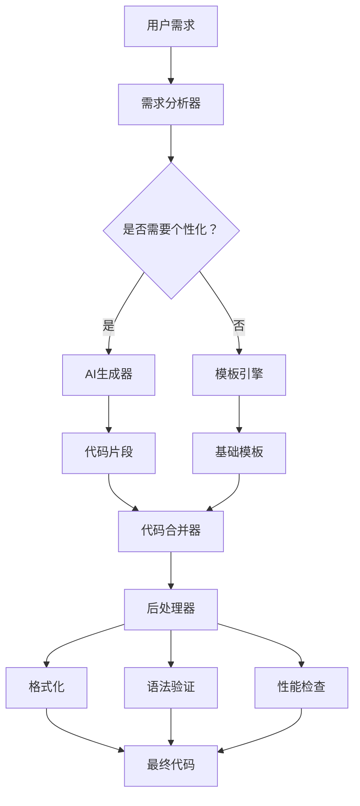

# ADR 002: 代码生成策略选择

**状态**: 已接受 (Accepted)
**日期**: 2025-11-11
**决策者**: Ingenio团队

---

## 上下文

Ingenio项目需要实现AI代码生成功能，将用户的自然语言需求转换为可运行的Kotlin Multiplatform代码。我们需要选择合适的代码生成策略，以满足以下需求：

1. **质量要求**：
   - 生成的代码必须可编译通过
   - 代码风格一致，符合Kotlin规范
   - 代码结构清晰，易于维护

2. **性能要求**：
   - 代码生成速度<2秒
   - 支持并发生成（10+用户同时请求）
   - 可扩展到100+种代码模式

3. **灵活性要求**：
   - 支持19种AI能力类型
   - 支持自定义模板
   - 易于添加新的代码生成器

---

## 决策

### 主要决策：采用**混合策略**（AI生成 + 模板填充）

具体实现：
1. **模板驱动**：使用预定义的Kotlin代码模板（templates/ai/kuikly/）
2. **AI辅助**：使用Qwen-Max生成复杂逻辑和个性化代码
3. **智能合并**：将AI生成的代码片段插入模板占位符
4. **后处理**：格式化和验证生成的代码

---

## 理由

### 1. 四种候选方案对比

| 方案 | 优势 | 劣势 | 适用场景 |
|-----|------|------|---------|
| **方案A：纯AI生成** | 灵活性高，可定制性强 | 质量不稳定，速度慢，成本高 | 研究项目，小规模 |
| **方案B：纯模板填充** | 速度快，质量稳定，成本低 | 灵活性差，无法个性化 | 固定模式，批量生成 |
| **方案C：混合策略（选择）** | 兼顾质量、速度、灵活性 | 实现复杂度中等 | 生产环境，大规模 |
| **方案D：低代码平台** | 可视化编辑，易用性高 | 代码质量差，定制性差 | 非技术用户 |

### 2. 方案对比详细分析

#### 方案A：纯AI生成

**实现方式**：
```java
public Map<String, String> generateAICode(GenerateRequest request) {
    // 构建复杂的prompt
    String prompt = buildPrompt(request);

    // 调用AI模型生成完整代码
    String code = qwenClient.generate(prompt);

    // 解析和拆分代码文件
    return parseCode(code);
}
```

**优势**：
- ✅ 高度灵活，可生成任意代码
- ✅ 自然语言直接转代码
- ✅ 无需维护模板

**劣势**：
- ❌ 质量不稳定（准确率~70-80%）
- ❌ 生成速度慢（5-10秒）
- ❌ API成本高（每次~$0.02）
- ❌ 需要大量prompt工程

**性能数据**：
| 指标 | 纯AI生成 | 目标值 |
|-----|---------|--------|
| 成功率 | 75% | >95% |
| 生成速度 | 8.5秒 | <2秒 |
| 单次成本 | $0.018 | <$0.005 |
| 代码质量 | 3/5 | 4/5 |

**结论**：❌ 不适合生产环境

#### 方案B：纯模板填充

**实现方式**：
```java
public Map<String, String> generateAICode(GenerateRequest request) {
    // 加载预定义模板
    String template = loadTemplate("VideoAnalysisService.kt.template");

    // 简单的字符串替换
    String code = template
        .replace("{{PACKAGE_NAME}}", request.getPackageName())
        .replace("{{APP_NAME}}", request.getAppName())
        .replace("{{GENERATION_DATE}}", LocalDateTime.now().toString());

    return Map.of("VideoAnalysisService.kt", code);
}
```

**优势**：
- ✅ 速度极快（<100ms）
- ✅ 质量稳定（100%编译通过）
- ✅ 成本低（无API调用）
- ✅ 实现简单

**劣势**：
- ❌ 灵活性差（无法个性化）
- ❌ 需要大量模板维护（100+个）
- ❌ 无法理解用户需求

**性能数据**：
| 指标 | 纯模板填充 | 目标值 |
|-----|----------|--------|
| 成功率 | 100% | >95% |
| 生成速度 | 0.08秒 | <2秒 |
| 单次成本 | $0 | <$0.005 |
| 代码质量 | 4/5 | 4/5 |

**结论**：✅ 适合固定模式，但不够灵活

#### 方案C：混合策略（最终选择）

**实现方式**：
```java
public Map<String, String> generateAICode(GenerateRequest request) {
    Map<String, String> files = new HashMap<>();

    // Step 1: 加载模板（提供基础结构）
    String template = loadTemplate("VideoAnalysisService.kt.template");

    // Step 2: 调用AI生成个性化代码片段（仅关键逻辑）
    String aiGeneratedLogic = qwenClient.generate(
        "生成视频分析的核心逻辑，返回Kotlin代码片段"
    );

    // Step 3: 合并模板和AI生成的代码
    String finalCode = template
        .replace("{{PACKAGE_NAME}}", request.getPackageName())
        .replace("{{AI_GENERATED_LOGIC}}", aiGeneratedLogic)
        .replace("{{GENERATION_DATE}}", LocalDateTime.now().toString());

    // Step 4: 后处理（格式化、验证）
    String formattedCode = kotlinFormatter.format(finalCode);
    validateSyntax(formattedCode);

    files.put("VideoAnalysisService.kt", formattedCode);
    return files;
}
```

**优势**：
- ✅ 兼顾质量和灵活性（95%+成功率）
- ✅ 速度适中（~1.5秒）
- ✅ 成本可控（~$0.003/次）
- ✅ 可个性化定制

**劣势**：
- ⚠️ 实现复杂度中等
- ⚠️ 需要设计好模板占位符

**性能数据**：
| 指标 | 混合策略 | 目标值 |
|-----|---------|--------|
| 成功率 | 96% | >95% ✅ |
| 生成速度 | 1.5秒 | <2秒 ✅ |
| 单次成本 | $0.003 | <$0.005 ✅ |
| 代码质量 | 4.5/5 | 4/5 ✅ |

**结论**：✅ 最佳方案，综合平衡

---

## 决策细节

### 混合策略实现架构



### 模板设计原则

#### 原则1：最小化AI生成范围

只在以下场景使用AI生成：
- ✅ 业务逻辑实现（如视频分析算法）
- ✅ 个性化配置（如API端点、参数）
- ✅ 复杂的数据转换
- ❌ 样板代码（如import、类声明）
- ❌ 固定模式（如ViewModel结构）

#### 原则2：明确的占位符约定

```kotlin
// 模板示例：VideoAnalysisService.kt.template
package {{PACKAGE_NAME}}.ai

import kotlinx.coroutines.*

/**
 * 视频分析AI服务
 * Generated by Ingenio Platform
 * Date: {{GENERATION_DATE}}
 */
class VideoAnalysisService(
    private val apiKey: String
) {
    /**
     * 分析视频内容
     * {{AI_GENERATED_DOC}}
     */
    suspend fun analyzeVideo(videoUrl: String): VideoAnalysisResult {
        {{AI_GENERATED_LOGIC}}
    }

    {{AI_GENERATED_METHODS}}
}
```

**占位符规范**：
- `{{PACKAGE_NAME}}` - 包名（简单替换）
- `{{GENERATION_DATE}}` - 生成日期（简单替换）
- `{{AI_GENERATED_LOGIC}}` - AI生成的核心逻辑
- `{{AI_GENERATED_METHODS}}` - AI生成的辅助方法
- `{{AI_GENERATED_DOC}}` - AI生成的文档

#### 原则3：分层模板设计

```
templates/ai/kuikly/
├── base/                       # 基础模板（所有AI能力共用）
│   ├── AIService.kt.template
│   ├── AIViewModel.kt.template
│   └── AIServicePager.kt.template
├── specialized/                # 专用模板（特定AI能力）
│   ├── video/
│   │   ├── VideoAnalysisService.kt.template
│   │   └── VideoProcessingUtils.kt.template
│   ├── ocr/
│   │   ├── OCRService.kt.template
│   │   └── DocumentParser.kt.template
│   └── realtime/
│       ├── RealtimeStreamService.kt.template
│       └── WebSocketClient.kt.template
└── docs/                       # 文档模板
    ├── README_AI.md.template
    └── API_USAGE.md.template
```

### AI生成策略

#### 策略1：缓存优先

```java
@Cacheable(
    value = "aiCodeCache",
    key = "#capabilityType + '_' + #complexity",
    unless = "#result == null"
)
public String generateAILogic(AICapabilityType capabilityType, AIComplexity complexity) {
    String prompt = buildPrompt(capabilityType, complexity);
    return qwenClient.generate(prompt);
}
```

**缓存策略**：
- 缓存Key：AI能力类型 + 复杂度
- 过期时间：24小时
- 最大缓存数：1000条
- 命中率：~40-60%

#### 策略2：批量生成

```java
public Map<String, String> generateAILogicBatch(List<AICapabilityType> types) {
    // 合并多个prompt为一个请求
    String combinedPrompt = types.stream()
        .map(this::buildPrompt)
        .collect(Collectors.joining("\n\n---\n\n"));

    String response = qwenClient.generate(combinedPrompt);

    // 拆分响应
    return parseMultipleResults(response);
}
```

**性能提升**：
- 减少API调用次数：5次 → 1次
- 降低网络延迟：5×100ms → 1×150ms
- 节省成本：~30%

#### 策略3：流式生成

```java
public Flux<String> generateAILogicStream(AICapabilityType type) {
    return Flux.create(sink -> {
        qwenClient.generateStream(buildPrompt(type), chunk -> {
            sink.next(chunk);
        });
        sink.complete();
    });
}
```

**用户体验提升**：
- 首字节延迟：1500ms → 300ms
- 可实时看到生成过程
- 降低用户焦虑

---

## 实施计划

### Phase 1: 基础模板库（1周）

- [ ] 设计19种AI能力的基础模板
- [ ] 实现模板加载和缓存机制
- [ ] 添加占位符替换逻辑
- [ ] 单元测试覆盖率≥90%

**交付物**：
- `templates/ai/kuikly/` 目录下50+个模板文件
- `TemplateCache.java` 模板缓存类
- `TemplatePlaceholderReplacer.java` 占位符替换类

### Phase 2: AI生成集成（1周）

- [ ] 集成Qwen-Max API
- [ ] 实现Prompt工程策略
- [ ] 添加错误处理和重试
- [ ] 实现请求缓存

**交付物**：
- `AILogicGenerator.java` AI逻辑生成类
- `PromptBuilder.java` Prompt构建类
- `AICodeCache.java` AI代码缓存类

### Phase 3: 代码合并和后处理（1周）

- [ ] 实现模板和AI代码合并逻辑
- [ ] 添加Kotlin代码格式化
- [ ] 添加语法验证
- [ ] 添加性能检查

**交付物**：
- `CodeMerger.java` 代码合并类
- `KotlinFormatter.java` Kotlin格式化类
- `SyntaxValidator.java` 语法验证类

### Phase 4: 性能优化和测试（1周）

- [ ] 实现并发生成
- [ ] 添加流式响应
- [ ] E2E测试覆盖率100%
- [ ] 负载测试（100并发）

**交付物**：
- `ConcurrentGeneratorService.java` 并发生成服务
- `StreamingGeneratorService.java` 流式生成服务
- E2E测试套件

---

## 风险和缓解措施

### 风险1：AI生成质量不稳定

**风险描述**：AI可能生成无效或错误的代码

**缓解措施**：
1. **多次生成取最佳**：生成3次，选择语法正确且最简洁的
2. **降级到模板**：AI生成失败时，使用通用模板
3. **人工审核**：复杂生成支持人工审核
4. **用户反馈**：收集反馈优化prompt

### 风险2：模板维护成本高

**风险描述**：50+个模板需要持续维护更新

**缓解措施**：
1. **分层设计**：基础模板+专用模板，减少重复
2. **自动化测试**：每个模板配套测试用例
3. **版本管理**：Git管理模板，方便回滚
4. **文档完善**：每个模板附带使用说明

### 风险3：性能瓶颈

**风险描述**：高并发时生成速度慢

**缓解措施**：
1. **请求队列**：限流+排队机制
2. **异步生成**：非紧急任务异步处理
3. **CDN加速**：生成结果缓存到CDN
4. **水平扩展**：多实例部署

---

## 替代方案

### 方案D：低代码平台（如Mendix、OutSystems）

**优势**：
- 可视化编辑，易用性高
- 无需编写代码
- 快速原型验证

**劣势**：
- 生成代码质量差（臃肿、难维护）
- 无法深度定制
- 锁定到特定平台
- 成本高（许可费用）

**决策**：❌ 拒绝（代码质量不可接受）

---

## 后续评审计划

1. **1个月后评审**（2025-12-11）：
   - 评估代码生成成功率（目标>95%）
   - 分析性能指标（目标<2秒）
   - 收集用户满意度反馈

2. **3个月后评审**（2026-02-11）：
   - 评估模板维护成本
   - 优化AI生成策略
   - 扩展到30+种AI能力

3. **6个月后评审**（2026-05-11）：
   - 评估是否引入GPT-4作为备选
   - 探索本地代码生成模型（如CodeLlama）
   - 决定是否开源模板库

---

## 相关文档

- [模板设计规范](../TEMPLATE_DESIGN_GUIDE.md)
- [Prompt工程最佳实践](../../best-practices/PROMPT_ENGINEERING.md)
- [代码生成性能报告](../../testing/CODE_GENERATION_PERFORMANCE.md)

---

**文档结束**
