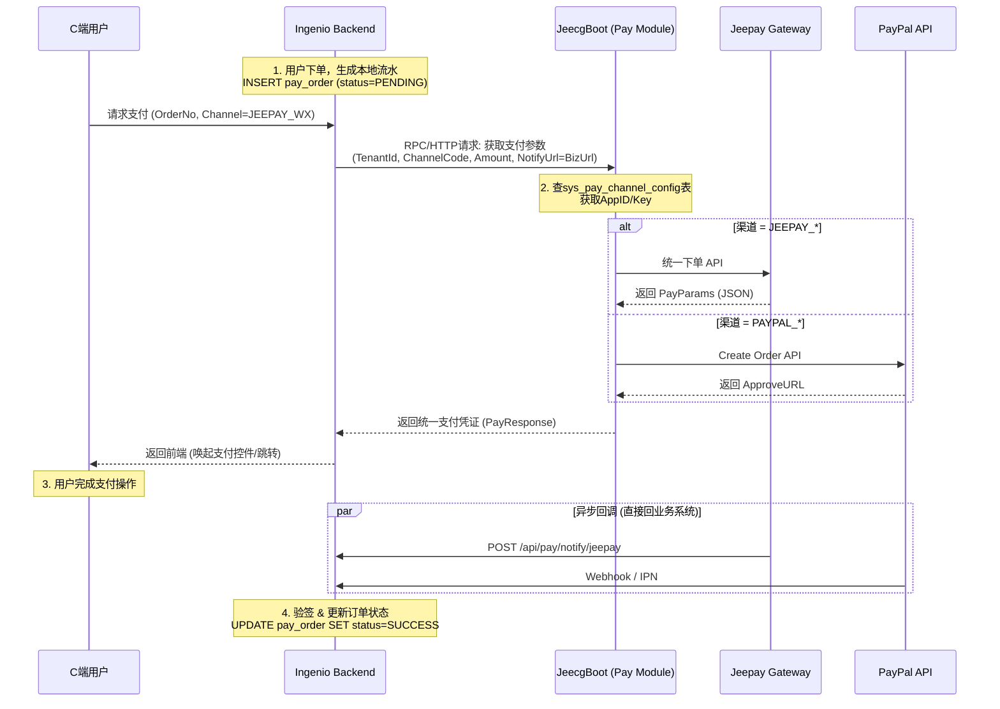

# Ingenio 支付体系集成方案 (JeecgBoot 适配器模式)

> **版本**: v2.0 (修正版)
> **日期**: 2025-12-28
> **核心思想**: JeecgBoot 作为“无状态支付适配器”与“配置中心”，Ingenio 业务系统负责“订单流水与状态流转”。

---

## 1. 架构定位

| 系统模块 | 角色 | 职责 | 数据持有 |
| :--- | :--- | :--- | :--- |
| **Ingenio Backend**<br>(业务系统) | **支付发起方** | 1. 创建业务订单<br>2. 记录支付流水 (`pay_order`)<br>3. 处理支付回调 (Webhook)<br>4. 更新订单状态 | `pay_order`<br>`biz_order` |
| **JeecgBoot**<br>(Jeecg-Module-Pay) | **支付配置与适配中心** | 1. 管理商户/渠道配置 (AppID, Keys)<br>2. 封装 Jeepay/IJPay SDK<br>3. 提供“获取支付参数”的统一 API | `sys_pay_channel_config` |
| **Jeepay / PayPal** | **支付网关/渠道** | 实际执行资金扣款 | - |

---

## 2. 业务流程 (时序图)



---

## 3. JeecgBoot 侧设计 (jeecg-module-pay)

### 3.1 数据库设计 (配置表)

仅存储连接配置，���存业务流水。

```sql
CREATE TABLE `sys_pay_channel_config` (
  `id` varchar(32) NOT NULL COMMENT '主键',
  `tenant_id` int(11) DEFAULT 0 COMMENT '租户ID (0为平台通用)',
  `channel_code` varchar(32) NOT NULL COMMENT '渠道编码: JEEPAY_WX, PAYPAL_SANDBOX',
  `channel_name` varchar(50) DEFAULT NULL COMMENT '配置名称',
  `adapter_type` varchar(20) NOT NULL COMMENT '适配器类型: JEEPAY, IJPAY',
  
  -- 核心配置 (JSON存储)
  -- JEEPAY示例: {"appId":"...", "apiKey":"...", "mchNo":"...", "gatewayUrl":"..."}
  -- IJPAY示例:  {"clientId":"...", "clientSecret":"...", "mode":"sandbox"}
  `config_params` text COMMENT '配置参数(JSON)',
  
  `is_enable` tinyint(1) DEFAULT 1 COMMENT '是否启用',
  `create_by` varchar(32) DEFAULT NULL,
  `create_time` datetime DEFAULT NULL,
  PRIMARY KEY (`id`),
  UNIQUE KEY `uk_tenant_channel` (`tenant_id`, `channel_code`)
) ENGINE=InnoDB DEFAULT CHARSET=utf8mb4 COMMENT='支付渠道配置表';
```

### 3.2 接口定义 (API)

**URL**: `/sys/pay/api/unifiedParams`
**Method**: `POST`
**权限**: 需通过 `@SaCheckLogin` 或 API 签名验证 (服务间调用)

**请求体 (Request)**:
```json
{
  "tenantId": 1001,
  "channelCode": "JEEPAY_WX_NATIVE",
  "orderNo": "BIZ20251228001",
  "amount": 100.00,
  "currency": "CNY",
  "subject": "Ingenio Pro订阅",
  "notifyUrl": "https://api.ingenio.com/hooks/pay/jeepay", // 关键：指向业务系统
  "extra": "{}" 
}
```

**响应体 (Response)**:
```json
{
  "code": 200,
  "data": {
    "payDataType": "URL", // URL, FORM, JSON, APP
    "payData": "weixin://wxpay/bizpayurl?pr=..." // 用于前端展示二维码或跳转
  }
}
```

### 3.3 适配器模式代码结构

```java
// 统一适配接口
public interface PayAdapter {
    boolean support(String adapterType);
    PayResponse generateParams(JSONObject config, PayRequest req);
}

// Jeepay 实现
@Component
public class JeepayAdapter implements PayAdapter {
    public PayResponse generateParams(JSONObject config, PayRequest req) {
        Jeepay.setApiBase(config.getString("gatewayUrl"));
        // ... 调用 Jeepay SDK
        // 注意：request.setNotifyUrl(req.getNotifyUrl()); 
        // 必须透传业务系统的 NotifyUrl
    }
}

// IJPay 实现
@Component
public class IJPayAdapter implements PayAdapter {
    public PayResponse generateParams(JSONObject config, PayRequest req) {
        // ... 调用 PayPal API
    }
}
```

---

## 4. Ingenio Backend 侧设计 (业务系统)

### 4.1 数据库设计 (流水表)

```sql
CREATE TABLE `pay_order` (
  `id` varchar(32) PRIMARY KEY,
  `tenant_id` int NOT NULL,
  `biz_order_id` varchar(64) NOT NULL COMMENT '关联业务单号',
  `channel_code` varchar(32) NOT NULL,
  `amount` decimal(10,2) NOT NULL,
  `currency` varchar(10) DEFAULT 'CNY',
  `status` varchar(20) NOT NULL COMMENT 'PENDING, SUCCESS, FAIL',
  `transaction_id` varchar(64) COMMENT '第三方支付流水号',
  `create_time` datetime DEFAULT CURRENT_TIMESTAMP,
  `pay_time` datetime
);
```

### 4.2 回调接口 (Controller)

```java
@RestController
@RequestMapping("/api/v1/pay/notify")
public class PayNotifyController {

    // 接收 Jeepay 通知
    @PostMapping("/jeepay")
    public String jeepayNotify(HttpServletRequest request) {
        // 1. 验签 (使用 Jeepay SDK 验证参数)
        // 2. 查找 pay_order
        // 3. 幂等更新状态
        // 4. 触发业务逻辑 (如开通会员)
        return "success";
    }

    // 接收 PayPal Webhook
    @PostMapping("/paypal")
    public void paypalWebhook(@RequestBody String body) {
        // 处理 PayPal 事件
    }
}
```

---

## 5. 实施步骤

1.  **Phase 1 (JeecgBoot)**: 
    *   在 JeecgBoot 中新建 `jeecg-module-pay`。
    *   引入 `jeepay-sdk-java` 和 `IJPay` 依赖。
    *   创建配置表 `sys_pay_channel_config`。
    *   实现适配器逻辑与统一 API。

2.  **Phase 2 (Ingenio)**:
    *   设计收银台前端页面 (选择支付方式)。
    *   后端调用 JeecgBoot 接口获取支付参数。
    *   实现支付回调处理逻辑。

3.  **Phase 3 (联调)**:
    *   部署 Jeepay 网关 (Docker)。
    *   配置 JeecgBoot 连接 Jeepay。
    *   跑通“下单 -> 支付 -> 回调 -> 业务闭环”流程。
