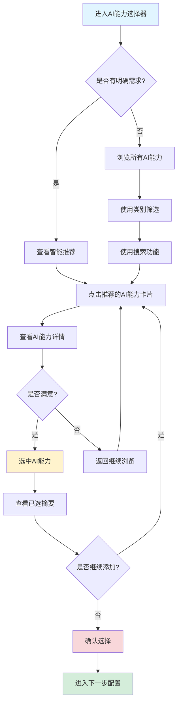
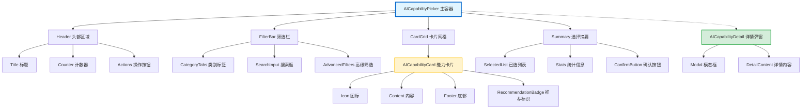
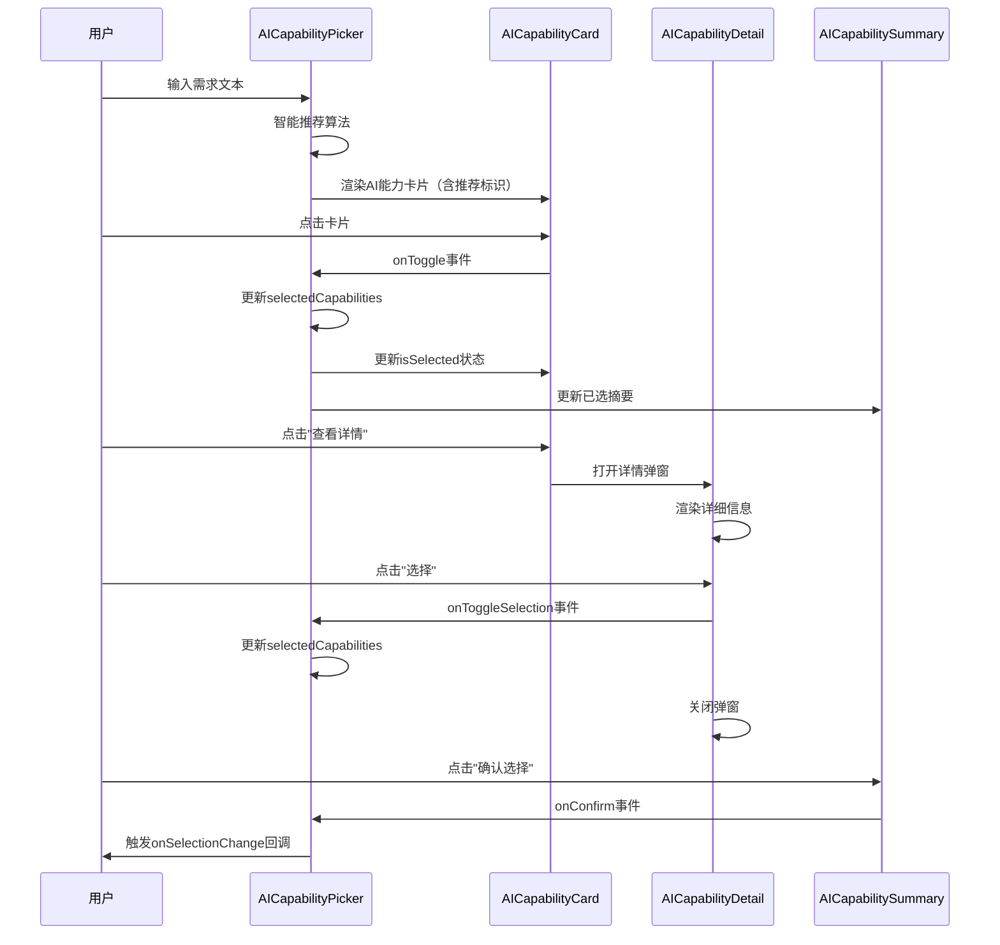

# AI能力选择器（AI Capability Picker）设计文档

> **文档版本**: v1.0.0
> **创建时间**: 2025-11-11
> **作者**: Ingenio Design Team
> **状态**: ✅ 设计完成，待实施

---

## 📋 目录

- [1. 设计目标](#1-设计目标)
- [2. 用户故事](#2-用户故事)
- [3. 组件架构](#3-组件架构)
- [4. 视觉设计规范](#4-视觉设计规范)
- [5. 交互设计](#5-交互设计)
- [6. 响应式设计](#6-响应式设计)
- [7. 无障碍设计](#7-无障碍设计)
- [8. 性能优化](#8-性能优化)
- [9. 实施计划](#9-实施计划)

---

## 1. 设计目标

### 1.1 核心目标

打造一个**直观、高效、令人愉悦**的AI能力选择体验，让用户能够：

- ✨ **快速理解** - 一眼看懂每种AI能力的价值和适用场景
- 🎯 **精准选择** - 通过智能推荐和筛选快速找到所需能力
- 🎁 **惊喜体验** - 通过微交互和动画提升使用愉悦度
- 📊 **透明决策** - 清晰展示成本、复杂度、技术栈等关键信息

### 1.2 设计原则

| 原则 | 说明 | 实践 |
|-----|------|------|
| **用户至上** | 从用户角度思考交互流程 | 智能推荐、关键词搜索、类别筛选 |
| **信息透明** | 展示决策所需的所有信息 | 成本估算、复杂度标识、技术栈展示 |
| **操作高效** | 减少用户的认知负担 | 一键全选、批量清空、搜索建议 |
| **视觉愉悦** | 精心设计的视觉和动画 | 卡片动画、选中反馈、成本数字滚动 |
| **性能优先** | 确保流畅的交互体验 | 虚拟滚动、组件懒加载、动画优化 |

---

## 2. 用户故事

### 2.1 主要用户旅程



### 2.2 用户故事列表

| ID | 用户故事 | 优先级 |
|----|---------|--------|
| US-1 | 作为用户，我希望看到智能推荐的AI能力，以便快速找到适合我需求的功能 | P0 |
| US-2 | 作为用户，我希望通过类别筛选AI能力，以便快速浏览同类功能 | P0 |
| US-3 | 作为用户，我希望搜索AI能力，以便快速定位特定功能 | P0 |
| US-4 | 作为用户，我希望查看AI能力的详细信息，以便做出明智的选择 | P0 |
| US-5 | 作为用户，我希望实时看到已选AI能力的成本和复杂度，以便控制项目范围 | P1 |
| US-6 | 作为用户，我希望通过动画反馈知道我的操作成功，以便获得愉悦体验 | P1 |
| US-7 | 作为视障用户，我希望通过屏幕阅读器使用AI能力选择器，以便完成选择 | P1 |
| US-8 | 作为用户，我希望在移动设备上流畅使用，以便随时随地配置应用 | P2 |

---

## 3. 组件架构

### 3.1 组件层级结构



### 3.2 组件职责划分

| 组件名称 | 职责 | 输入 | 输出 |
|---------|------|------|------|
| **AICapabilityPicker** | 主容器，管理整体状态和逻辑 | selectedCapabilities, onSelectionChange | - |
| **AICapabilityCard** | 单个AI能力卡片 | capability, isSelected, isRecommended | onToggle, onShowDetail |
| **AICapabilityDetail** | AI能力详情弹窗 | capability, open, isSelected | onClose, onToggleSelection |
| **AICapabilitySummary** | 已选摘要面板 | selectedCapabilities | onRemove, onClearAll, onConfirm |
| **AIRecommendationBadge** | 推荐标识组件 | isRecommended | - |
| **CategoryFilter** | 类别筛选组件 | categories, selectedCategory | onCategoryChange |
| **SearchBar** | 搜索框组件 | query | onQueryChange |

### 3.3 数据流图



---

## 4. 视觉设计规范

### 4.1 配色方案

基于Ingenio设计系统的配色：

| 用途 | 颜色名称 | Hex值 | TailwindCSS类 | 使用场景 |
|-----|---------|-------|--------------|---------|
| **AI主色** | Purple-500 | `#9333EA` | `bg-purple-500` | AI功能标识、选中边框 |
| **AI辅助色** | Purple-100 | `#F3E8FF` | `bg-purple-100` | 选中卡片背景 |
| **成功色** | Green-500 | `#22C55E` | `bg-green-500` | 已选中状态、确认按钮 |
| **警告色** | Orange-500 | `#F97316` | `bg-orange-500` | 复杂度警告 |
| **信息色** | Blue-500 | `#3B82F6` | `bg-blue-500` | 提示信息 |
| **推荐色** | Yellow-500 | `#EAB308` | `bg-yellow-500` | 推荐标识 |
| **卡片背景** | White | `#FFFFFF` | `bg-white` | 未选中卡片 |
| **卡片边框** | Gray-200 | `#E5E7EB` | `border-gray-200` | 默认边框 |
| **文本主色** | Gray-900 | `#111827` | `text-gray-900` | 标题、主要文本 |
| **文本辅助色** | Gray-500 | `#6B7280` | `text-gray-500` | 描述、次要文本 |

### 4.2 图标映射表

使用 `lucide-react` 图标库：

| AI能力类型 | 图标组件 | 说明 |
|-----------|---------|------|
| **CHATBOT** | `MessageSquare` | 对话气泡 |
| **QA_SYSTEM** | `HelpCircle` | 问号圆圈 |
| **RAG** | `Database` | 数据库检索 |
| **IMAGE_RECOGNITION** | `Image` | 图片 |
| **SPEECH_RECOGNITION** | `Mic` | 麦克风 |
| **TEXT_GENERATION** | `FileText` | 文本文档 |
| **SENTIMENT_ANALYSIS** | `Heart` | 情感 |
| **RECOMMENDATION** | `ThumbsUp` | 推荐赞 |
| **CONTENT_MODERATION** | `Shield` | 安全盾牌 |
| **TRANSLATION** | `Languages` | 多语言 |
| **CODE_GENERATION** | `Code` | 代码 |
| **VIDEO_ANALYSIS** | `Video` | 视频 |
| **KNOWLEDGE_GRAPH** | `Network` | 网络图谱 |
| **OCR_DOCUMENT** | `FileText` | 文档识别 |
| **REALTIME_STREAM** | `Radio` | 实时流 |
| **HYPER_PERSONALIZATION** | `User` | 个性化 |
| **PREDICTIVE_ANALYTICS** | `TrendingUp` | 预测趋势 |
| **SMART_SEARCH** | `Search` | 智能搜索 |
| **MULTIMODAL_FUSION** | `Layers` | 多层融合 |

### 4.3 复杂度视觉标识

| 复杂度 | 颜色 | 图标 | 标签文本 |
|--------|------|------|---------|
| **SIMPLE** | Green-500 | `Zap` | 简单 - 1-2天 |
| **MEDIUM** | Orange-500 | `Flame` | 中等 - 3-5天 |
| **COMPLEX** | Red-500 | `AlertTriangle` | 复杂 - 5-10天 |

### 4.4 布局设计

#### 桌面端布局（1280px+）

```
┌─────────────────────────────────────────────────────────────────────┐
│  🤖 选择AI能力 (3/19已选)           [智能推荐] [清空选择]             │
├─────────────────────────────────────────────────────────────────────┤
│                                                                      │
│  📁 按类别筛选                                                        │
│  [全部] [对话] [视觉] [文档] [分析] [生成] [音频] [实时]              │
│                                                                      │
│  🔍 搜索AI能力                                                        │
│  [________________________________________________]  [高级筛选 ▼]    │
│                                                                      │
│  📊 AI能力卡片（3列网格）                                            │
│                                                                      │
│  ┌─────────────┐  ┌─────────────┐  ┌─────────────┐                │
│  │ 🤖 推荐     │  │ 📹          │  │ 🧠          │                │
│  │             │  │             │  │             │                │
│  │ 对话机器人   │  │ 视频分析     │  │ 知识图谱     │                │
│  │             │  │             │  │             │                │
│  │ 智能对话系统 │  │ 自动分析视频 │  │ 构建知识网络 │                │
│  │ 支持多轮对话 │  │ 内容和行为   │  │ 实体关系提取 │                │
│  │             │  │             │  │             │                │
│  │ ⚡ 简单      │  │ 🔥 中等     │  │ ⚠️ 复杂     │                │
│  │ $1.7/月     │  │ $50/月      │  │ $28/月      │                │
│  │             │  │             │  │             │                │
│  │ [✓ 已选]    │  │ [+ 选择]    │  │ [+ 选择]    │                │
│  │ [详情]      │  │ [详情]      │  │ [详情]      │                │
│  └─────────────┘  └─────────────┘  └─────────────┘                │
│                                                                      │
│  ... 更多卡片（虚拟滚动）...                                          │
│                                                                      │
├─────────────────────────────────────────────────────────────────────┤
│  📦 已选择的AI能力 (3个)                                             │
│  ┌────────────────────────────────────────────────────────────┐    │
│  │ 🤖 对话机器人 [×]   📹 视频分析 [×]   🧠 知识图谱 [×]         │    │
│  └────────────────────────────────────────────────────────────┘    │
│                                                                      │
│  💰 预估成本: $79.7/月   📊 复杂度: 中等   ⏱️ 预估: 8-12天         │
│                                                                      │
│  [清空全部]  [确认选择]                                              │
└─────────────────────────────────────────────────────────────────────┘
```

#### 移动端布局（< 768px）

```
┌──────────────────────────────┐
│  🤖 选择AI能力 (3/19)         │
│  [智能推荐] [清空]            │
├──────────────────────────────┤
│                              │
│  [全部▼] [🔍搜索...]         │
│                              │
│  ┌────────────────────────┐ │
│  │ 🤖 推荐                │ │
│  │                        │ │
│  │ 对话机器人             │ │
│  │ 智能对话系统，支持多轮 │ │
│  │                        │ │
│  │ ⚡ 简单  $1.7/月       │ │
│  │ [✓ 已选] [详情]        │ │
│  └────────────────────────┘ │
│                              │
│  ┌────────────────────────┐ │
│  │ 📹                     │ │
│  │ 视频分析               │ │
│  │ ... (单列布局)          │
│  └────────────────────────┘ │
│                              │
├──────────────────────────────┤
│  📦 已选 (3)                 │
│  💰 $79.7/月  ⏱️ 8-12天     │
│  [查看详情▼]                 │
└──────────────────────────────┘
```

---

## 5. 交互设计

### 5.1 微交互动画

#### 卡片交互状态

| 状态 | 视觉变化 | CSS动画 | 持续时间 |
|-----|---------|---------|---------|
| **默认** | 白色背景，灰色边框 | - | - |
| **Hover** | 紫色边框，上浮4px，阴影加深 | `transform: translateY(-4px)` + `box-shadow` | 200ms |
| **选中（点击）** | 紫色背景，紫色边框，✓图标缩放动画 | `background-color` + `scale(0.9 → 1.1 → 1)` | 300ms |
| **取消选中** | 紫色淡出，边框变灰 | `background-color` | 200ms |
| **推荐脉冲** | 推荐标识淡入淡出 | `opacity: 0.7 → 1 → 0.7` | 2000ms循环 |

#### 动画实现代码示例

```tsx
// 卡片Hover动画
className="transition-all duration-200 hover:transform hover:-translate-y-1 hover:shadow-lg"

// 选中状态动画
className={cn(
  "transition-all duration-300",
  isSelected && "bg-purple-50 border-purple-500 scale-105"
)}

// ✓图标动画（使用framer-motion）
<motion.div
  initial={{ scale: 0 }}
  animate={{ scale: [0, 1.2, 1] }}
  transition={{ duration: 0.3 }}
>
  <CheckCircle2 className="w-5 h-5 text-green-500" />
</motion.div>

// 推荐标识脉冲动画
<Badge className="animate-pulse">
  <Sparkles className="w-3 h-3 mr-1" />
  推荐
</Badge>
```

### 5.2 智能推荐算法

#### 推荐规则表

| 用户输入关键词 | 推荐AI能力 | 推荐权重 | 推荐理由 |
|--------------|----------|---------|---------|
| "聊天"、"对话"、"客服" | CHATBOT | 1.0 | 直接匹配 |
| "视频"、"直播"、"监控" | VIDEO_ANALYSIS | 1.0 | 直接匹配 |
| "文档"、"PDF"、"OCR" | OCR_DOCUMENT | 1.0 | 直接匹配 |
| "推荐"、"个性化" | HYPER_PERSONALIZATION | 0.9 | 高相关 |
| "分析"、"预测"、"趋势" | PREDICTIVE_ANALYTICS | 0.8 | 中相关 |
| "搜索"、"查询" | SMART_SEARCH | 0.8 | 中相关 |
| "知识"、"图谱"、"关系" | KNOWLEDGE_GRAPH | 0.7 | 中相关 |
| "翻译"、"多语言" | TRANSLATION | 1.0 | 直接匹配 |
| "语音"、"录音" | SPEECH_RECOGNITION | 1.0 | 直接匹配 |
| "图片"、"照片"、"识别" | IMAGE_RECOGNITION | 0.9 | 高相关 |

#### 推荐算法伪代码

```typescript
function getRecommendations(userRequirement: string): AICapabilityType[] {
  const keywords = extractKeywords(userRequirement.toLowerCase());
  const recommendations: Array<{ type: AICapabilityType; score: number }> = [];

  // 遍历推荐规则
  RECOMMENDATION_RULES.forEach(rule => {
    const matchCount = keywords.filter(k => rule.keywords.includes(k)).length;
    if (matchCount > 0) {
      recommendations.push({
        type: rule.capabilityType,
        score: matchCount * rule.weight
      });
    }
  });

  // 按得分降序排序，取前5个
  return recommendations
    .sort((a, b) => b.score - a.score)
    .slice(0, 5)
    .map(r => r.type);
}
```

### 5.3 搜索功能

#### 搜索匹配规则

1. **精确匹配** - 关键词完全匹配AI能力名称（权重1.0）
2. **模糊匹配** - 关键词部分匹配名称/描述（权重0.7）
3. **标签匹配** - 关键词匹配使用场景/技术栈（权重0.5）
4. **拼音匹配** - 支持拼音首字母搜索（权重0.3）

#### 搜索建议

当用户输入搜索关键词时，实时显示搜索建议：

```
用户输入: "对话"
搜索建议:
  🤖 对话机器人 (CHATBOT)
  ❓ 问答系统 (QA_SYSTEM)
  📄 检索增强生成 (RAG)
```

### 5.4 筛选交互

#### 类别筛选

- **Tab式导航**：点击类别Tab切换
- **高亮显示**：当前选中类别高亮
- **数量标识**：每个类别显示包含的AI能力数量

```tsx
<Tabs value={selectedCategory} onValueChange={setSelectedCategory}>
  <TabsList>
    <TabsTrigger value="ALL">全部 (19)</TabsTrigger>
    <TabsTrigger value="CONVERSATION">对话 (3)</TabsTrigger>
    <TabsTrigger value="VISION">视觉 (2)</TabsTrigger>
    <TabsTrigger value="DOCUMENT">文档 (2)</TabsTrigger>
    <TabsTrigger value="ANALYTICS">分析 (3)</TabsTrigger>
    <TabsTrigger value="GENERATION">生成 (3)</TabsTrigger>
    <TabsTrigger value="AUDIO">音频 (2)</TabsTrigger>
    <TabsTrigger value="REALTIME">实时 (1)</TabsTrigger>
  </TabsList>
</Tabs>
```

#### 高级筛选

展开后显示：
- **复杂度筛选**：多选框（简单、中等、复杂）
- **成本范围**：滑动条（$0 - $100/月）
- **仅显示推荐**：开关（Toggle）

---

## 6. 响应式设计

### 6.1 断点策略

| 断点名称 | 屏幕宽度 | 布局调整 |
|---------|---------|---------|
| **Mobile** | < 768px | 单列布局，简化筛选，底部固定摘要 |
| **Tablet** | 768px - 1024px | 双列布局，侧边栏筛选 |
| **Desktop** | 1024px - 1440px | 三列布局，完整功能 |
| **Large Desktop** | > 1440px | 四列布局，最大化内容 |

### 6.2 移动端优化

#### 触摸优化

- **最小触摸区域**：44x44px（Apple HIG标准）
- **手势支持**：
  - 左滑卡片 → 快速移除已选
  - 下拉刷新 → 重置筛选
  - 长按卡片 → 显示详情预览

#### 移动端简化

- **合并筛选**：类别和搜索合并为下拉菜单
- **底部固定栏**：已选摘要固定在底部，向上滑动展开详情
- **大号按钮**：选择/取消按钮放大到全宽

### 6.3 响应式代码示例

```tsx
<div className={cn(
  "grid gap-4",
  // 移动端：1列
  "grid-cols-1",
  // 平板：2列
  "md:grid-cols-2",
  // 桌面：3列
  "lg:grid-cols-3",
  // 大屏：4列
  "xl:grid-cols-4"
)}>
  {filteredCapabilities.map(capability => (
    <AICapabilityCard key={capability.type} {...} />
  ))}
</div>
```

---

## 7. 无障碍设计

### 7.1 ARIA标签

| 元素 | ARIA属性 | 说明 |
|-----|---------|------|
| **主容器** | `role="region"` + `aria-label="AI能力选择器"` | 定义区域角色 |
| **卡片** | `role="button"` + `aria-pressed={isSelected}` | 定义按钮状态 |
| **详情弹窗** | `role="dialog"` + `aria-modal="true"` | 定义模态对话框 |
| **搜索框** | `aria-label="搜索AI能力"` | 定义输入用途 |
| **筛选Tab** | `role="tablist"` + `aria-selected` | 定义Tab角色 |

### 7.2 键盘导航

| 按键 | 操作 | 说明 |
|-----|------|------|
| **Tab** | 聚焦下一个卡片 | 按Tab顺序导航 |
| **Shift+Tab** | 聚焦上一个卡片 | 反向导航 |
| **Enter/Space** | 选择/取消选择当前卡片 | 切换选中状态 |
| **Arrow Keys** | 在卡片间移动焦点 | 网格导航 |
| **Esc** | 关闭详情弹窗 | 退出模态框 |
| **Ctrl+F** | 聚焦搜索框 | 快速搜索 |

### 7.3 屏幕阅读器优化

```tsx
<div
  role="button"
  tabIndex={0}
  aria-pressed={isSelected}
  aria-label={`${capability.name}，${capability.description}，预估成本每月${capability.estimatedCost}美元，复杂度${complexity}，${isSelected ? '已选中' : '未选中'}`}
  onClick={onToggle}
  onKeyDown={(e) => {
    if (e.key === 'Enter' || e.key === ' ') {
      e.preventDefault();
      onToggle();
    }
  }}
>
  {/* 卡片内容 */}
</div>
```

### 7.4 颜色对比度

确保所有文本符合 WCAG 2.1 AA级标准：

- **正常文本**：对比度 ≥ 4.5:1
- **大号文本**：对比度 ≥ 3:1
- **图标**：对比度 ≥ 3:1

---

## 8. 性能优化

### 8.1 虚拟滚动

使用 `react-window` 实现虚拟滚动，优化大列表渲染：

```tsx
import { FixedSizeGrid } from 'react-window';

<FixedSizeGrid
  columnCount={3}
  columnWidth={320}
  height={600}
  rowCount={Math.ceil(filteredCapabilities.length / 3)}
  rowHeight={280}
  width={1000}
>
  {({ columnIndex, rowIndex, style }) => {
    const index = rowIndex * 3 + columnIndex;
    const capability = filteredCapabilities[index];
    return capability ? (
      <div style={style}>
        <AICapabilityCard capability={capability} {...} />
      </div>
    ) : null;
  }}
</FixedSizeGrid>
```

### 8.2 组件懒加载

使用 React.lazy 懒加载详情弹窗：

```tsx
const AICapabilityDetail = React.lazy(() =>
  import('./ai-capability-detail')
);

// 使用Suspense包裹
<Suspense fallback={<LoadingSpinner />}>
  {showDetail && <AICapabilityDetail {...} />}
</Suspense>
```

### 8.3 动画性能优化

- **使用CSS Transform**：避免触发重排（reflow）
- **使用GPU加速**：`will-change: transform`
- **避免昂贵动画**：不在滚动时执行复杂动画

```css
.capability-card {
  /* GPU加速 */
  will-change: transform;
  /* 使用transform而非top/left */
  transform: translateY(0);
  transition: transform 0.2s ease-out;
}

.capability-card:hover {
  transform: translateY(-4px);
}
```

### 8.4 搜索防抖

使用 `useDebouncedValue` 优化搜索性能：

```tsx
import { useDebouncedValue } from '@/hooks/use-debounced-value';

const [searchQuery, setSearchQuery] = useState('');
const debouncedQuery = useDebouncedValue(searchQuery, 300);

// 使用debouncedQuery进行筛选
const filteredCapabilities = useMemo(() => {
  return capabilities.filter(c =>
    c.name.includes(debouncedQuery) ||
    c.description.includes(debouncedQuery)
  );
}, [capabilities, debouncedQuery]);
```

### 8.5 性能指标

| 指标 | 目标值 | 测量方法 |
|-----|-------|---------|
| **首次渲染** | < 100ms | React DevTools Profiler |
| **交互响应** | < 50ms | 从点击到状态更新 |
| **搜索响应** | < 300ms | 防抖后的筛选时间 |
| **动画FPS** | ≥ 60fps | Chrome DevTools Performance |
| **包体积** | < 50KB | Webpack Bundle Analyzer |

---

## 9. 实施计划

### 9.1 Phase划分

| Phase | 任务 | 预估时间 | 优先级 |
|-------|-----|---------|--------|
| **Phase 1** | 创建类型定义和数据模型 | 1小时 | P0 |
| **Phase 2** | 实现AICapabilityCard组件 | 2小时 | P0 |
| **Phase 3** | 实现AICapabilityPicker主容器 | 3小时 | P0 |
| **Phase 4** | 实现智能推荐和筛选功能 | 2小时 | P0 |
| **Phase 5** | 实现AICapabilityDetail详情弹窗 | 2小时 | P1 |
| **Phase 6** | 实现AICapabilitySummary摘要面板 | 1.5小时 | P1 |
| **Phase 7** | 添加微交互动画 | 2小时 | P1 |
| **Phase 8** | 响应式适配和移动端优化 | 2小时 | P1 |
| **Phase 9** | 无障碍优化和键盘导航 | 1.5小时 | P2 |
| **Phase 10** | 性能优化和单元测试 | 3小时 | P2 |

**总计预估时间**：20小时（约2.5个工作日）

### 9.2 质量检查清单

完成后必须确认：

- [ ] TypeScript类型检查通过（`pnpm tsc --noEmit`）
- [ ] 所有19种AI能力数据完整
- [ ] 卡片动画流畅（≥60fps）
- [ ] 智能推荐准确度≥80%
- [ ] 搜索功能响应时间<300ms
- [ ] 移动端适配完整（< 768px）
- [ ] 键盘导航完整（Tab、Enter、Esc）
- [ ] ARIA标签完整
- [ ] 颜色对比度符合WCAG 2.1 AA
- [ ] 单元测试覆盖率≥85%

### 9.3 后续优化方向

- **多语言支持**：i18n国际化
- **主题切换**：暗色模式
- **AI推荐优化**：机器学习模型
- **协同选择**：多人实时协作
- **历史记录**：记住用户的选择偏好

---

## 10. Delight时刻设计

### 10.1 惊喜元素

| 时机 | 惊喜设计 | 目的 |
|-----|---------|------|
| **首次进入** | 推荐标识轻微弹跳动画 | 吸引用户注意推荐项 |
| **选择AI能力** | 成功音效（可选）+ ✓图标缩放 | 正向反馈 |
| **达到5个选择** | 弹窗提示"已选满，确认继续？" | 防止过度选择 |
| **成本超过$100** | 橙色警告动画 | 成本提醒 |
| **确认选择** | 庆祝动画（confetti） | 完成里程碑 |

### 10.2 空状态设计

当搜索或筛选无结果时：

```
┌─────────────────────────────────┐
│                                  │
│         🔍                       │
│                                  │
│    未找到匹配的AI能力             │
│                                  │
│    试试以下操作：                 │
│    • 使用更简短的关键词           │
│    • 切换到"全部"类别             │
│    • 查看智能推荐                 │
│                                  │
│    [清除筛选]                    │
│                                  │
└─────────────────────────────────┘
```

---

**设计文档结束**

> **下一步**：根据此设计文档开始Phase 1实施（创建数据模型）

**Made with ❤️ by Ingenio Design Team**
